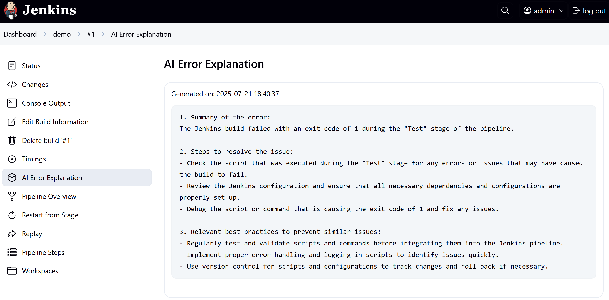

As the title says, I recently launched my first Jenkins plugin! 🎉

The main function of this plugin is to eliminate the need to copy error messages from Jenkins builds into AI tools like ChatGPT for analysis. Instead, it **provides a button directly in the Jenkins build log**. Clicking this button automatically sends the error information to OpenAI for analysis. You can also add an `explainError()` step in your pipeline to get error explanations, helping developers locate and solve problems faster.

This is my first plugin project in the Jenkins community.  Previously, I hadn't attempted this because I believed many functionalities could be implemented via pipeline scripts, making a separate plugin unnecessary.

However, with the increasing popularity of AI, I discovered that the Jenkins Plugin Center surprisingly lacked a similar plugin.  So, I decided to implement this functionality myself.  With the help of AI, and utilizing my evenings for development and testing, along with thorough code reviews from the Jenkins Hoster, I finally submitted it to the Jenkins Plugin Center last weekend, and it's **officially online**.

## Plugin Introduction

**Explain Error Plugin** is a Jenkins plugin based on OpenAI. It automatically parses build failure log information and generates readable error explanations, suitable for common Jenkins job types such as Pipeline and Freestyle.

* 🔍 One-click analysis of errors in console output
* ⚙️ Usable in Pipelines with a simple `explainError()` step
* 💡 AI-powered intelligent explanations based on the OpenAI GPT model
* 🌐 Provides two Web UI options to display AI-generated analysis results
* 🎯 Customizable: Supports setting the model, API address, log filters, and more

## Plugin Highlights

| Feature | Description |
|------|------|
| ✅ One-click console analysis | Adds an "Explain Error" button to the top of the console page |
| ✅ Pipeline support | Provides the `explainError()` step, automatically triggered on failure |
| ✅ Model configuration support | Customize to use GPT-3.5 or other models |
| ✅ Jenkins CasC support | Supports Configuration as Code |
| ✅ Log filtering | Supports regular expression filtering of logs to focus on error content |


## Prerequisites

- Jenkins version ≥ **2.479.3**
- Java version ≥ **17**
- An **OpenAI API Key** (available at [OpenAI website](https://platform.openai.com/account/api-keys))

## Quick Installation

You can install it through the Jenkins Plugin Manager:

Manage Jenkins → Manage Plugins → Available → Search for "Explain Error Plugin"

## Plugin Configuration

After installation, find **Explain Error Plugin Configuration** under `Manage Jenkins → Configure System` to configure your OpenAI API key and model:

| Setting | Description | Default Value |
|--------|------|--------|
| Enable Explanation | Enable AI analysis functionality | ✅ Enabled |
| API Key | Your OpenAI Key | Required |
| API URL | OpenAI API address | `https://api.openai.com/v1/chat/completions` |
| AI Model | Model to use | `gpt-3.5-turbo` |


You can also manage these settings through Jenkins Configuration as Code, for example:

```yaml
unclassified:
  explainError:
    enableExplanation: true
    apiKey: "${AI_API_KEY}"
    apiUrl: "https://api.openai.com/v1/chat/completions"
    model: "gpt-3.5-turbo"
```

## How to Use

### Using in Pipelines

It's recommended to call `explainError()` within the `post { failure { ... } }` statement to automatically analyze errors on build failure:

```groovy
post {
  failure {
    explainError()
  }
}
```

You can also set the log length and matching keywords:

```groovy
explainError(
  maxLines: 500,
  logPattern: '(?i)(error|failed|exception)'
)
```

### Using in the Console

Suitable for any type of Jenkins job:

1. Open the console output page of the failed build
2. Click the "Explain Error" button at the top
3. The AI analysis results will be displayed below the button

## Preview

After a build failure, a sidebar entry will appear on the job page. Clicking it will display the AI analysis results:



Or directly click "Explain Error" on the console page to view the analysis:


## Future Plans

- **Error caching**: Avoid repeated calls to OpenAI when analyzing the same error multiple times to save calls. (Already implemented, awaiting merge)
- **Multi-model support**: Support other AI platforms, such as Google Gemini, Claude, DeepSeek, etc.

These features are still under development, conception, and refinement. Your feedback and suggestions are highly welcome.

## In Closing

The plugin is completely open-source. Feel free to try it out and contribute code!

If you encounter any problems during use or have suggestions, please submit an issue or pull request on GitHub:

GitHub address: [https://github.com/jenkinsci/explain-error-plugin](https://github.com/jenkinsci/explain-error-plugin)

If you find this plugin helpful, please share this article; you can also give it a Star ⭐ on GitHub to show your support!

**This is the most direct support for open-source projects** 🙌

<!--如果你觉得这篇文章对你有帮助，记得【点赞】【在看】支持一下我 🙌～-->

---

Please indicate the author and source when reprinting this article, and do not use it for any commercial purposes. Welcome to follow the WeChat official account "DevOps攻城狮"