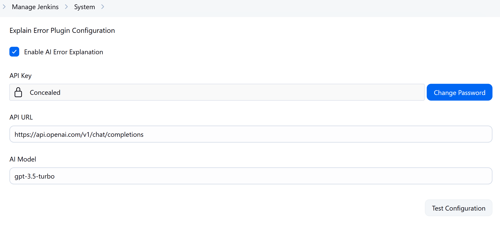
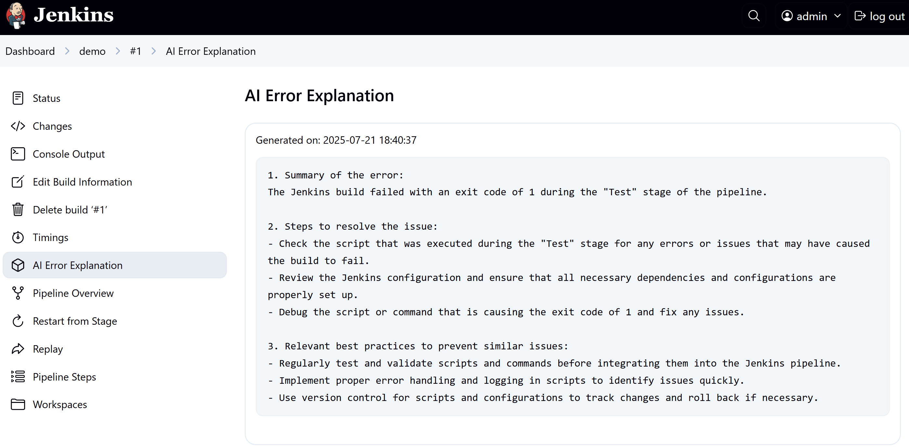
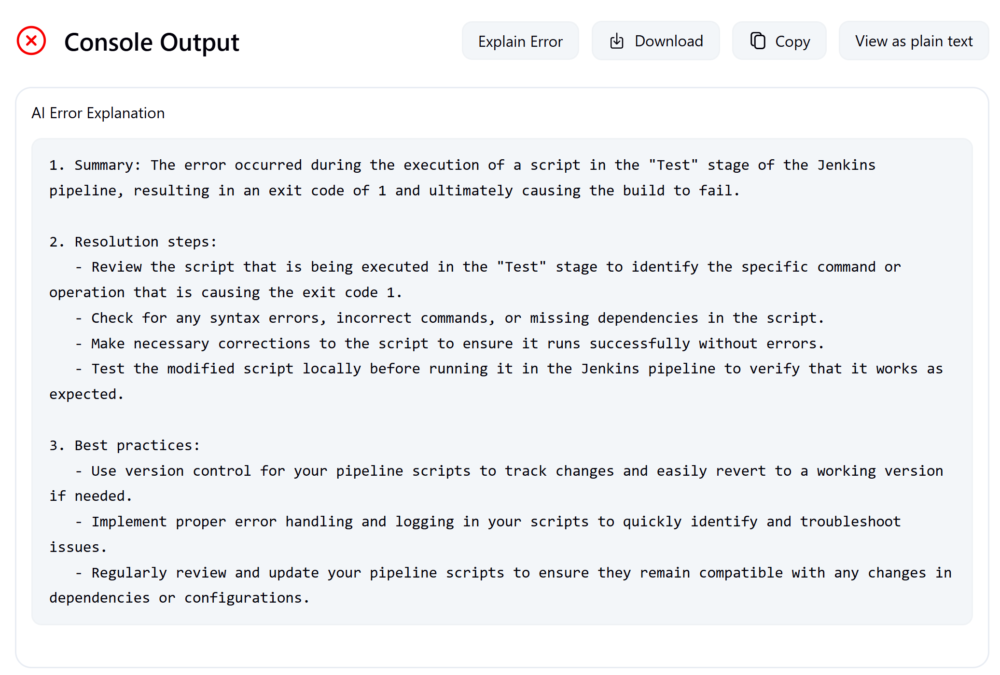

正如标题所说，我最近上线了我的第一个 Jenkins 插件！🎉

这个插件的主要功能，是让 Jenkins 构建过程中遇到的错误不再需要复制错误信息到 ChatGPT 等 AI 工具中进行分析，而是**直接在 Jenkins 的构建日志中提供一个按钮**，点击后可以自动将错误信息发送到 OpenAI 进行分析。你也可以在 pipeline 中添加 `explainError()` 步骤来对错误进行解释，从而帮助开发者更快地定位和解决问题。

这是我在 Jenkins 社区的第一个插件项目。之前之所以没有尝试，是因为我认为很多功能完全可以通过 pipeline 脚本来实现，没必要单独开发插件。

但随着 AI 的使用越来越普及，我发现 Jenkins 插件中心居然还没有类似的插件，于是决定自己动手实现这个功能。在 AI 的加持下，利用晚上时间断断续续地开发与测试，以及 Jenkins Hoster 多轮认真细致的 Code Review，终于在上周末提交到了 Jenkins 插件中心，**正式上线**。

## 插件介绍

**Explain Error Plugin** 是一个基于 OpenAI 的 Jenkins 插件，它可以自动解析构建失败的日志信息，并生成可读性强的错误解释，适用于流水线（Pipeline）和自由风格（Freestyle）等常见的 Jenkins 作业类型。

* 🔍 一键分析控制台输出中的错误
* ⚙️ 可在 Pipeline 中使用，只需一个简单的 `explainError()` 步骤
* 💡 基于 OpenAI GPT 模型的 AI 智能解释
* 🌐 提供两种 Web UI 展示 AI 生成的分析结果
* 🎯 可定制：支持设置模型、API 地址、日志过滤器等配置

## 插件亮点功能

| 功能 | 说明 |
|------|------|
| ✅ 控制台一键分析 | 控制台页面顶部新增 “Explain Error” 按钮 |
| ✅ 流水线支持 | 提供 `explainError()` 步骤，可自动在失败时触发 |
| ✅ 支持模型配置 | 自定义使用 GPT-3.5 或其他模型 |
| ✅ 支持 Jenkins CasC | 支持配置即代码（Configuration as Code） |
| ✅ 日志筛选 | 支持正则过滤日志，聚焦报错内容 |


## 使用前提

- Jenkins 版本 ≥ **2.479.3**
- Java 版本 ≥ **17**
- 拥有一个 **OpenAI API Key**（可在 [OpenAI官网](https://platform.openai.com/account/api-keys) 申请）

## 快速安装

你可以通过 Jenkins 插件管理器安装：

Manage Jenkins → Manage Plugins → Available → 搜索 “Explain Error Plugin”

## 插件配置

安装后，在 `Manage Jenkins → Configure System` 页面下找到 **Explain Error Plugin Configuration**，配置你的 OpenAI API key 和模型即可：

| 设置项 | 描述 | 默认值 |
|--------|------|--------|
| Enable Explanation | 是否启用 AI 解析功能 | ✅ 启用 |
| API Key | 你的 OpenAI Key | 必填 |
| API URL | OpenAI 接口地址 | `https://api.openai.com/v1/chat/completions` |
| AI Model | 使用的模型 | `gpt-3.5-turbo` |



也可以通过 Jenkins Configuration as Code 管理这部分配置，例如：

```yaml
unclassified:
  explainError:
    enableExplanation: true
    apiKey: "${AI_API_KEY}"
    apiUrl: "https://api.openai.com/v1/chat/completions"
    model: "gpt-3.5-turbo"
```

## 如何使用

### 在流水线中使用

推荐在 `post { failure { ... } }` 语句中调用 `explainError()`，在构建失败时自动分析错误：

```groovy
post {
  failure {
    explainError()
  }
}
```

也支持设置日志长度和匹配关键词：

```groovy
explainError(
  maxLines: 500,
  logPattern: '(?i)(error|failed|exception)'
)
```

### 在控制台中使用

适用于任意类型的 Jenkins 作业：

1. 打开失败构建的控制台输出页面
2. 点击顶部的 “Explain Error” 按钮
3. AI 分析结果会展示在按钮下方

## 效果预览

构建失败后，在作业页面会出现一个侧边栏入口，点击即可查看 AI 分析结果：



或者直接在控制台页面中点击“Explain Error”来查看分析内容：



## 未来计划

- **错误缓存**：同一个错误多次分析时避免重复调用 OpenAI，节省调用次数。（已经实现，等待合并）
- **多模型支持**：支持其他 AI 平台，例如 Google Gemini、Claude、DeepSeek 等

这些功能仍在开发、构思和完善中，也非常欢迎你的反馈和建议。

## 写在最后

插件是完全开源的，欢迎试用和贡献代码！

如果你在使用过程中遇到任何问题，或者有好的建议，欢迎在 GitHub 上提交 issue 或 pull request：

GitHub 地址：[https://github.com/jenkinsci/explain-error-plugin](https://github.com/jenkinsci/explain-error-plugin)

如果你觉得这个插件对你有帮助，欢迎转发文章；也可以在 GitHub 上点个 Star ⭐ 支持一下！

**这是对开源项目最直接的支持** 🙌

<!--如果你觉得这篇文章对你有帮助，记得【点赞】【在看】支持一下我 🙌～-->

---

转载本站文章请注明作者和出处，请勿用于任何商业用途。欢迎关注公众号「DevOps攻城狮」
