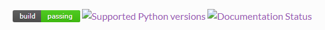
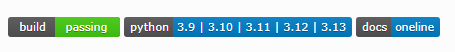

## Issue

I have set up documentation publishing on Jenkins using the following Groovy code:

```groovy
publishHTML([
    allowMissing: false,
    alwaysLinkToLastBuild: false,
    keepAll: false,
    reportDir: "docs/build/html/",
    reportFiles: 'index.html',
    reportName: "Documentation",
    useWrapperFileDirectly: true
])
```

However, some badges from Shields.io do not display properly within the published documentation.



# How to fix it

✅ Working Script to Update Jenkins CSP in Script Console

Here’s the correct and minimal Groovy script you should run in Manage Jenkins → Script Console:

```groovy
System.setProperty(
  "hudson.model.DirectoryBrowserSupport.CSP",
  "default-src 'self'; img-src * data:;"
)
```


This allows images from any domain (img-src *), which includes Shields.io. If you want to restrict it more safely:

```groovy
System.setProperty(
  "hudson.model.DirectoryBrowserSupport.CSP",
  "default-src 'self'; img-src 'self' https://img.shields.io data:;"
)
```

> 🟡 Note: This change is temporary (in-memory only). It will reset if Jenkins restarts.


✅ To Make It Permanent

1. Modify Jenkins startup arguments (depends on how you run Jenkins):

If using `/etc/default/jenkins` (Debian/Ubuntu):

```bash
JENKINS_JAVA_OPTIONS="-Dhudson.model.DirectoryBrowserSupport.CSP=\"default-src 'self'; img-src 'self' https://img.shields.io data:;\""
```

If using systemd service unit (CentOS/Red Hat-based or modern setups):

Edit or override your jenkins.service file:

```bash
Environment="JAVA_OPTS=-Dhudson.model.DirectoryBrowserSupport.CSP=default-src 'self'; img-src 'self' https://img.shields.io data:;"
```

2. Then restart Jenkins:

```bash
sudo systemctl restart jenkins
```

## Results

The issue with Shields.io badges not displaying on Jenkins has now been resolved.



---

Please credit the author and source when reposing this article. Commercial use is not permitted. You're welcome to subscribe to my blog via RSS.
