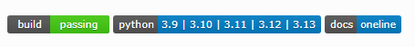

## 问题

我在 Jenkins 中使用以下 Groovy 代码发布文档：

```groovy
publishHTML([
    allowMissing: false,
    alwaysLinkToLastBuild: false,
    keepAll: false,
    reportDir: "docs/build/html/",
    reportFiles: 'index.html',
    reportName: "Documentation",
    useWrapperFileDirectly: true
])
````

然而，一些来自 Shields.io 的徽章在已发布的文档中无法正常显示。


# 解决方法

✅ **在 Script Console 中更新 Jenkins CSP 的可用脚本**

以下是应在 “Manage Jenkins → Script Console” 中运行的精简且正确的 Groovy 脚本：

```groovy
System.setProperty(
  "hudson.model.DirectoryBrowserSupport.CSP",
  "default-src 'self'; img-src * data:;"
)
```

该设置允许从任意域加载图片（`img-src *`），包括 Shields.io。
如果你希望更安全地限制来源，可以这样设置：

```groovy
System.setProperty(
  "hudson.model.DirectoryBrowserSupport.CSP",
  "default-src 'self'; img-src 'self' https://img.shields.io data:;"
)
```

> 🟡 **注意**：此更改是临时的（仅在内存中生效），Jenkins 重启后会失效。

---

✅ **永久生效的方法**

1. **修改 Jenkins 启动参数**（取决于你的 Jenkins 运行方式）：

如果使用 `/etc/default/jenkins`（Debian/Ubuntu）：

```bash
JENKINS_JAVA_OPTIONS="-Dhudson.model.DirectoryBrowserSupport.CSP=\"default-src 'self'; img-src 'self' https://img.shields.io data:;\""
```

如果使用 **systemd**（CentOS/Red Hat 或现代系统）：

编辑或覆写 `jenkins.service` 文件：

```bash
Environment="JAVA_OPTS=-Dhudson.model.DirectoryBrowserSupport.CSP=default-src 'self'; img-src 'self' https://img.shields.io data:;"
```

2. **重启 Jenkins**：

```bash
sudo systemctl restart jenkins
```

---

## 结果

现在，Shields.io 徽章在 Jenkins 中可以正常显示了。



---

转载本文时请注明作者与出处。禁止商业用途。你可以通过 RSS 订阅我的博客。
