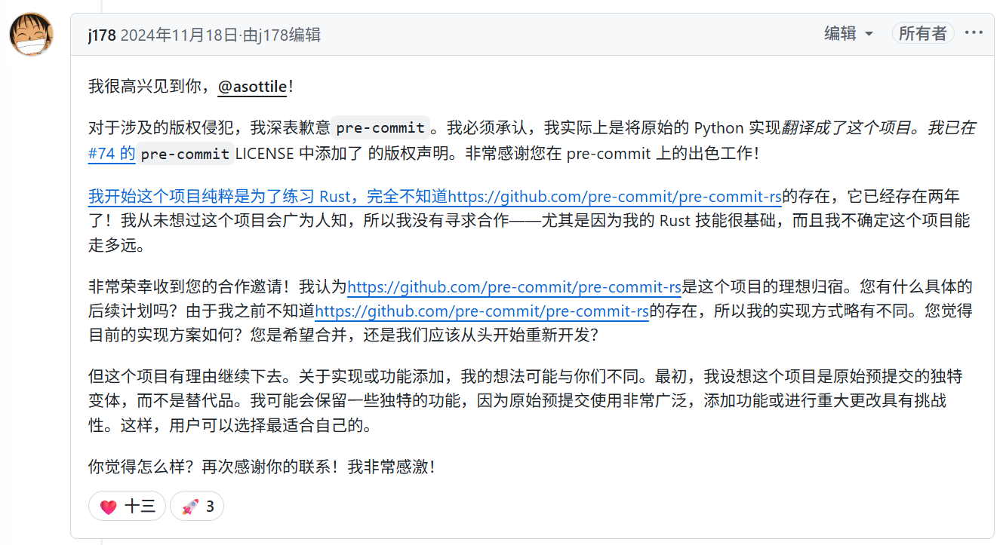
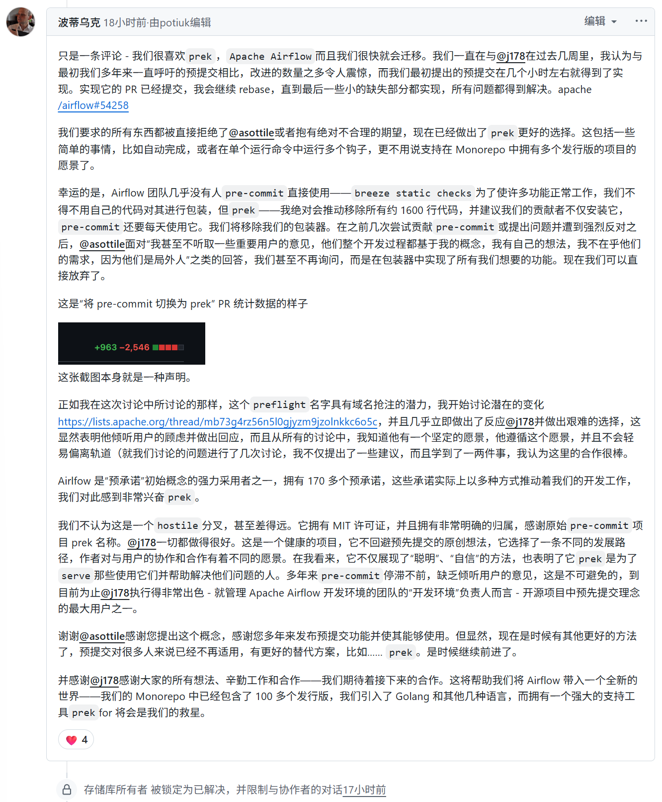

昨天在网上冲浪，突然看到了一个仓库叫 `prek`，一看介绍是 —— ⚡ Better `pre-commit`, re-engineered in Rust。这就引起了我的兴趣，毕竟 `pre-commit` 作为非常广泛的预提交的工具，如果能改进，尤其是性能方面的改进，肯定是好事。

最最有意思的是 `pre-commit` 的作者也来到这个项目的 Issue 里发帖了，他先表示要合作，然后提到该项目违反了版权（已修复），再后面说这是一个恶意的、不道德，以及抄袭。

让我们一起来看看这个帖子是怎么回事，我这里直接用 Google 翻译，带大家过一遍。

最终，在 Airflow Maintainer 留言之后，作者点了一个 ❤ 然后锁了这个帖子。（这个操作可谓恰到好处）

> 链接在这里：https://github.com/j178/prek/issues/73

这件事有点像 uv 取代 pip 的故事，只不过我没看到像这次一样的争议。原因或许在于 pip 是由众多社区志愿者共同维护的项目，而 `pre-commit` 更像是 Anthony Sottile 的“个人”项目。虽然它是开源的，但原作者对项目拥有绝对的控制权。

此外，它的衍生项目 pre-commit.ci 对开源项目免费，但对私有仓库（$10/月）、初创公司（$20/月）和大型组织（$100/月）则收取费用。如果出现有竞争力的替代方案，可能会对其收入造成影响。

这里简单介绍一下 Anthony Sottile —— 他是 `pre-commit` 的作者，同时也是 `pytest-dev`、`tox-dev` 的核心开发者，维护 `flake8`，PyCQA 成员，GitHub Star 等等。只要你使用 Python，就很可能接触到他参与的项目。此外，他还是一名 YouTuber，会进行编程直播。我最初是因为使用 `pre-commit` 才了解到他，也看过他的视频，专业能力确实很强。不过，正如上文所提到的，他在 `pre-commit` 社区的互动方式，确实让部分人感到不适甚至不愉快。

## 我的看法

除非 `pre-commit` 原作者 Anthony Sottile 能够更积极、更开放地推进，并加快 `pre-commit-rs` 的开发进度，否则 `prek` 对它的威胁将持续增加。从目前的趋势来看，`prek` 已经展现出强劲的势头。

基于以下几点，我认为它很有可能走得很远：

* **作者影响力：** `prek` 作者是活跃且有影响力的开源贡献者，参与并贡献了 `encode/httpx`、`astral-sh/uv`、`astral-sh/rye` 等知名项目，具备长期获得社区信任与背书的能力。
* **重量级背书：** `prek` 已经获得知名贡献者如 Jarek Potiuk 的积极背书——他是 Apache Airflow 的贡献者与 PMC 成员，Airflow 正在积极筹备切换到 `prek`。
* **社群形象差异：** 与 `pre-commit` 原作者相比，其“高冷”风格可能限制了外部贡献者的参与意愿；反观 `prek`，作者听取的社区的建议将这个项目名字从 `prefligit` 改为 `prek`，我认为这个一个更好的名字，即简短，从发音上也更容易获得好感，这样也为替代方案的崛起创造了空间。
* **社区需求：** 社区需要一个像 `prek` 这样积极推动 Rust 重写的项目，来打破 `pre-commit` 的现状。

除非 Anthony Sottile 做出 180 度转变，主动邀请外部贡献者共同加速 `pre-commit-rs` 的开发，并改变现有的社区互动方式，否则这种趋势短期内难以逆转。综合来看，我对 `prek` 的未来持乐观态度。

在我截稿时，还看到作者将上述对话内容发布在 V2EX 和 Twitter 上，引发了更多关注。

这部分我不作过多评价——开源社区本就是一个不断交流、切磋和竞争的舞台。

---

转载本站文章请注明作者和出处，请勿用于任何商业用途。欢迎关注公众号「DevOps攻城狮」
