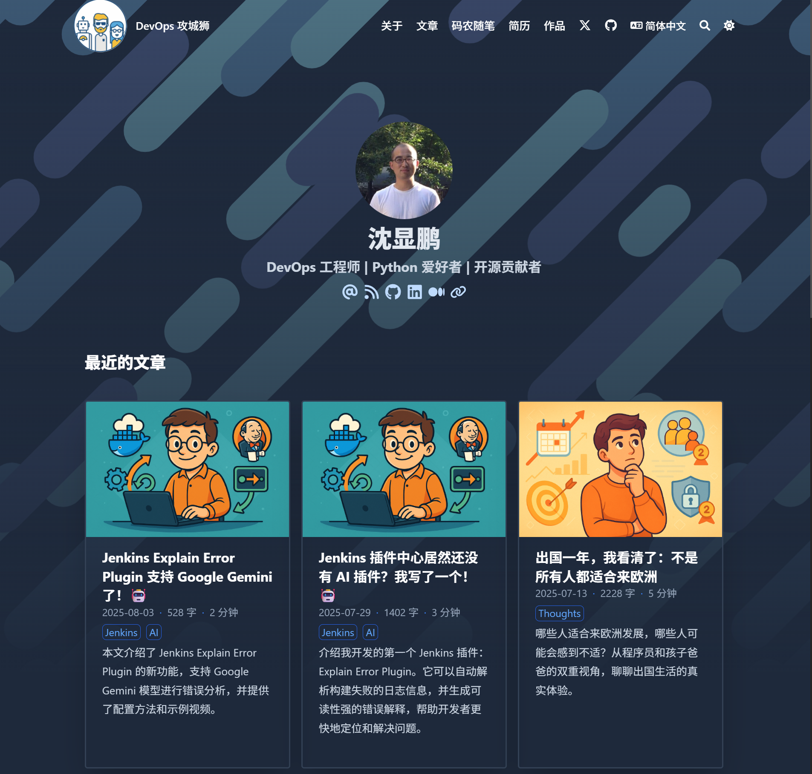
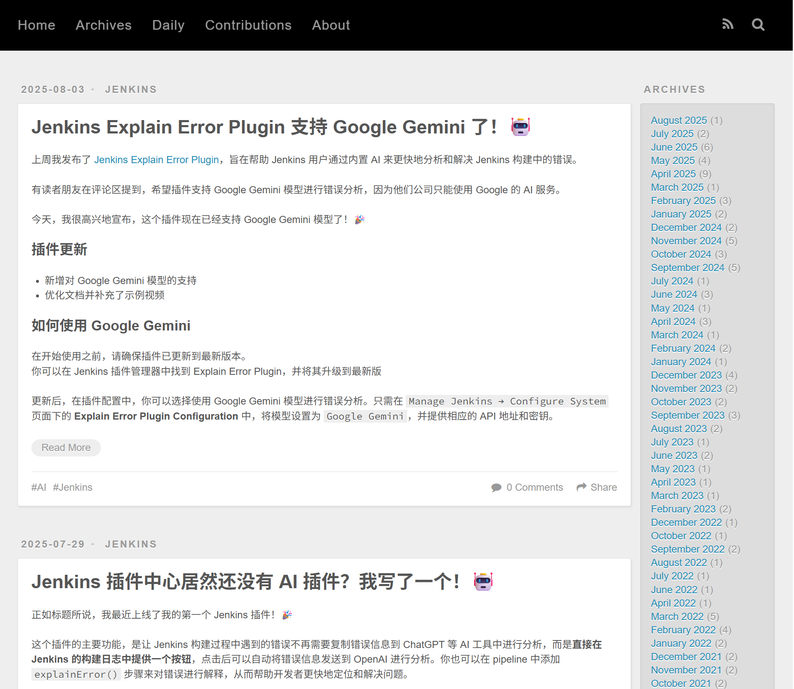
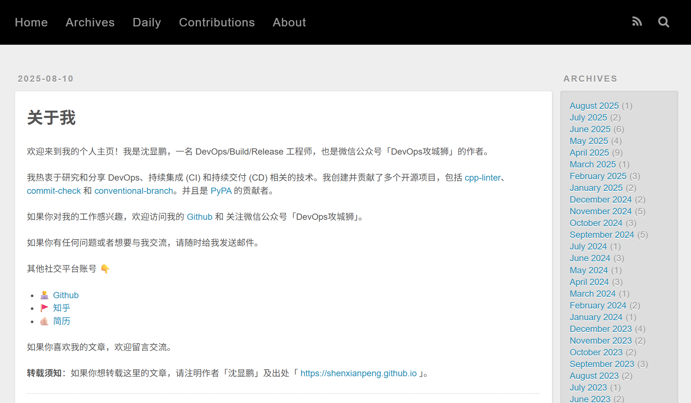
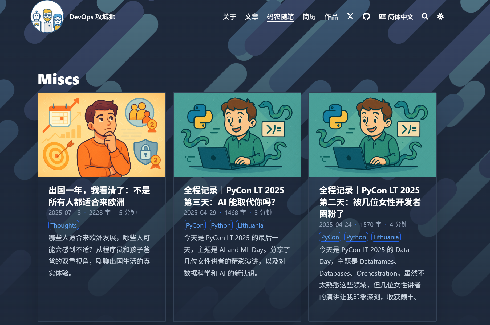

八年前，我使用了 Hexo + landscape 主题搭建了我的博客，从 2017 年一直记录到了今天的技术文章和少量的生活点滴，共计 236 篇。

随着时间的推移，Hexo 似乎已经不是最好的选择，一些限制和不便逐渐显现出来，比如：

- 对多语言支持的不足
- 目前的主题不能满足我的需求，比如列出作品、简历等
- 很多功能需要自己找插件来实现，比如评论、阅读时间、字数等
- 文章的内容和图片不在同一个目录下，管理不便

之前有过短暂的尝试翻新，但效果不是很理想，就不了了之了。

直到最近，看到 Hugo + Blowfish 的主题，让我眼前一亮，再加上有 GitHub Copilot 以及我的 OpenAI Plus 的加持，我决定彻底翻新我的博客，迁移到 Hugo 上。

> 每个月 30 欧的 AI 订阅费咱不能白花呀！

虽然有这么多的工具和资源可以帮助我，但还是花了我三个晚上才基本完成了比较满意的迁移。来对比看一下效果：

### 主页对比

之前的主页（没有做本地化处理）

### 关于页面对比

### 新增页面

## 升级注意事项

1. 如果你像我一样文章数量很大，建议新建一个仓库，比如 new-blog，然后使用 Hugo + Blowfish 主题，先把网站搭建起来
2. 再把 Hexo 的文章迁移过来，我让 Copilot 帮我写了一个脚本，自动把 Hexo 的文章转换成 Hugo 的格式
3. 使用 ChatGPT 等 AI 帮助生成文章封面
4. 使用 Copilot 根据不同的文章主题把生成的文章封面复制到对应的目录下

## 升级的得与失

升级后，我的博客有了以下改进：

1. 解决了多语言支持不足的问题
2. 支持了内置的文章搜索功能
3. 提供了更好的导航和页面布局
4. 文章的内容和图片都在同一个目录下，方便管理
5. Blowfish 主题提供了很多内置功能，比如评论、阅读时间、字数等，无需再找插件来实现

当然，升级也有一些损失：

1. 之前文章的 URL 没有与新 URL 进行映射，SEO 受到影响
2. 丢失了之前的评论数据
3. 需要花时间来迁移和调整

总之，升级后的效果还是很不错的，整体上比之前的主题要好很多。

## 最后

这次迁移的过程如果没有 AI 的加持，可能会花费更多的时间和精力。

但与此同时，随着对搜索引擎依赖的减少，写一些技术文章似乎被看到的机会也变少了，可能仅仅作为 AI 的学习语料出现了。

但无论如何，IT 从业者有一个自己的写作后花园还是很有必要的，不管是记录也好，总结也罢，还是有一定价值的。

我会在这里继续分享我的学习和工作心得；另外再记录一下作为一个旅居在东欧的程序员的所思、所见、所想，也许还有一些价值。

---

转载本文请注明作者与出处，禁止商业用途。欢迎关注公众号「DevOps攻城狮」。
