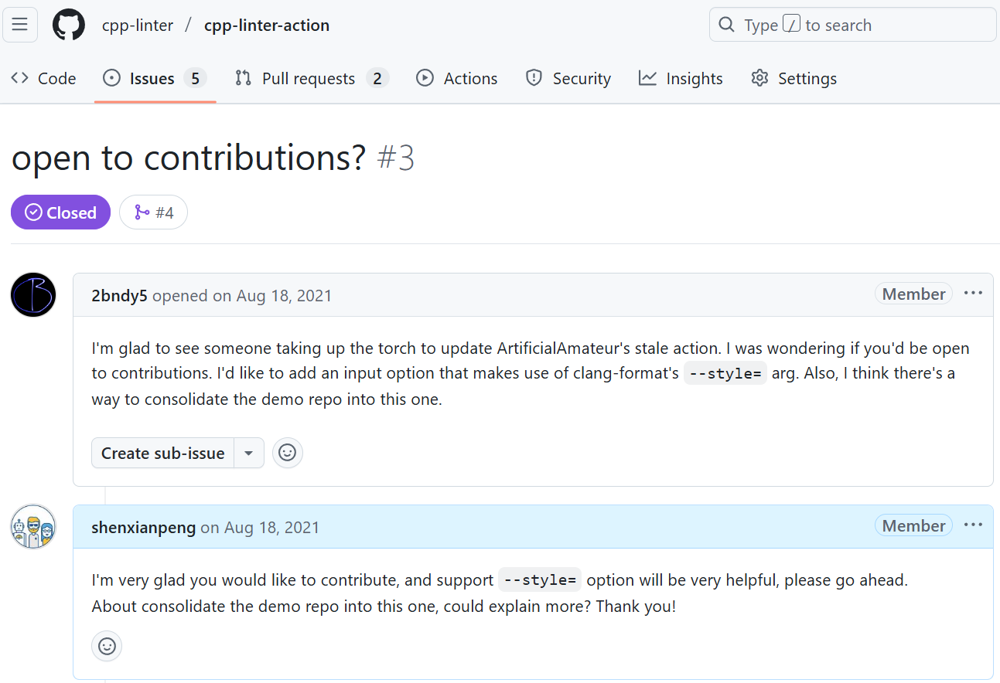

有人问过我：为什么要在业余时间坚持做开源？尤其是有了孩子之后，还愿意投入其中？

坦白说，开源对我来说已经不只是兴趣爱好，而是一份长期的价值积累。  
虽然直接的经济回报几乎没有，但它带给我的收获，却远比金钱更长远。  
今天，我想分享三点：这三点不只是给开源人用的，每个开发者、甚至每个职场人，都能借鉴。

---

## 1. 让你的工作被真正看到

在公司里，我们的成果通常只有同事或上级知道。  
而开源项目不同，它能把能力和成果展示给更广阔的技术社区。  
这种“被看见”，在职业发展中往往比简历上的几行字更有说服力。

👉 借鉴方法：即使不做开源，也可以通过写博客、输出技术文档、在社区分享，让别人看见你的价值。这也是一种无形资产。

---

## 2. 接触到更优秀的人和项目

闭门造车写 CRUD，可能职业生涯 35 岁就停滞。开源则让我不断接触到趋势、最佳实践，以及来自世界各地的优秀开发者。  
比如我会经常 watch **CPython** 仓库，学习他们如何写 PR、如何提出 PEP、如何做 CI/CD。  
光是学习这些流程，就让我受益匪浅。长期参与英文社区，也让我顺带提升了英语。

👉 借鉴方法：即使不参与开源，也可以多关注优秀项目或大厂工程实践，把其中的经验应用到日常工作中。

---

## 3. 一份长期的价值积累

过去四年，我创建了几个 GitHub 组织和十多个项目，积累了上万用户和数百 star。  
这些成果都是业余时间慢慢积累起来的。

虽然没有直接的经济回报，但这就是一种**长期资产**。  
开源的经验和思路，可以帮助我在工作中更快成长，而工作中的经验，也能反过来反哺开源。  
更重要的是，它让我保持持续学习和探索的状态。

👉 借鉴方法：不论是开源、写文章，还是副业尝试，都可以看作是一种长期积累。它可能不会马上变现，但能积累声誉、技能和机会。

---

## 我的开源故事（简版）

2021 年，我在 [**cpp-linter-action**](https://github.com/cpp-linter/cpp-linter-action) 上迈出了开源的第一步。没想到很快有人在 Issue 里主动提出贡献，那一刻点燃了我的开源之路。  

后来我和 Brendan (2bndy5) 一起维护了多个项目，并从他身上学到了很多。  
我们也创建了 [**cpp-linter**](https://github.com/cpp-linter)，逐渐发展成 GitHub 上重要的 C/C++ linter 项目之一。

之后我又写了 [**commit-check**](https://github.com/commit-check/commit-check) 和 [**conventional-branch**](https://github.com/conventional-branch/conventional-branch)，收获了一批用户。

2024 年，AI 工具迎来爆发。我一度担心它会不会取代一些开发者的工作，但很快发现：AI 能帮人快速写出可运行的代码，却不足以打造一个大型、可维护的项目。  
比如在写 [**Jenkins Explain Error Plugin**](https://github.com/jenkinsci/explain-error-plugin) 时，AI 帮我很快实现了初版，但真正让项目能进入 Jenkins 官方生态的，还是 Reviewer 的反馈和人工打磨。  
这让我更加确信：**AI 是强大的工具，但最终价值，仍然来自人的思考和判断。**

---

## 最后

开源让我：  

* 被更多人看见；  
* 接触到更优秀的人和实践；  
* 保持学习和成长的状态。  

哪怕没有直接的经济回报，我依然觉得，这是一件值得坚持的事。  

至于 AI 会不会取代我们？或许终有一天会发生。

但至少现在，还远没到“躺平”的时候。

**保持学习和不断适应，就能在这个快速变化的时代中保持价值和竞争力。**
