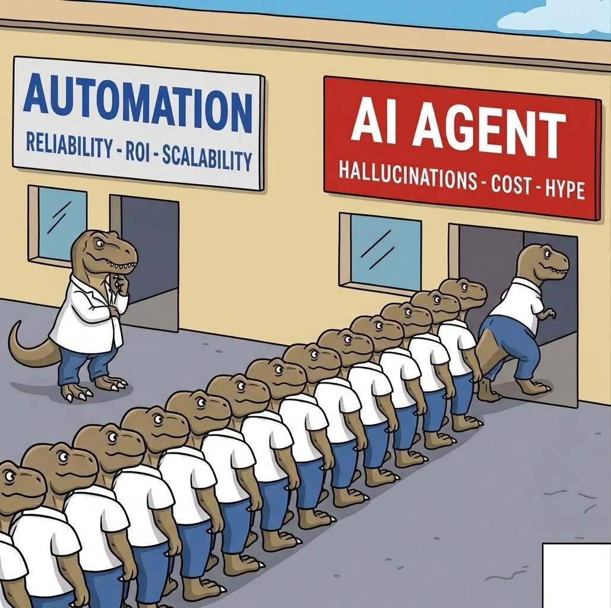

### 01. Sober Reflection Behind the Frenzy

I saw an image online that looked like this:

It made me think of how the current workplace and tech industry have fallen into an AI frenzy. No matter what you're doing—writing tests, optimizing quality, or maintaining your existing stable automation—someone will ask:

1.  Can we introduce AI capabilities?
2.  Can we use an AI Agent?
3.  Can we write a Skill?

Sometimes my head buzzes, especially when encountering those who don't understand, don't research, and just come straight to ask. It's as if AI is a magic bullet.

But I want to say, we cannot blindly let AI handle everything and overlook one of our most important capabilities: Automation.

So next, I want to discuss when AI should be used, and when deterministic automation should still be employed. Because in some scenarios, traditional automation is not only sufficient but perfect.

### 02. The Deterministic World: Automation is King

If a process is **repetitive, well-defined, and low-variance**, then Deterministic Automation is not only sufficient but perfect.

*   **Speed:** Millisecond-level triggers, no need to wait for large model Token output.
*   **Low Cost:** Requires almost no expensive computing power or Token fees.
*   **Auditable:** The logic is fixed, every step is traceable, and errors can be located immediately.
*   **Robustness:** Will not hallucinate due to slight deviations in the Prompt.

> **Conclusion:** As long as the task is "Rule-based," you don't need AI. Hardcode it with code; that is the ultimate efficiency.

---

### 03. The Fuzzy World: The Domain of AI Agents

If a process is **fuzzy, requires context understanding, and involves edge cases**, then an AI Agent would be a more suitable choice.

Where AI Agents truly shine is in areas where **context can drift, edge cases exist, and "interpretation" rather than mere "execution" is required.**

*   **Contextual Understanding:** A customer sends an emotionally charged and logically chaotic complaint, which cannot be handled with simple IF-ELSE statements.
*   **Decision Trade-offs:** When rules conflict, an optimal solution needs to be determined based on the objective.
*   **Unstructured Data:** Extracting core intent from disorganized documents.

> **Conclusion:** As long as the task is "Intent-based," you can consider using an AI Agent. Let it understand, judge, and even create.

---

### 04. Decision Model: AI Agent or Automation?

How to decide which technology to use? You can refer to this simple decision criterion:

| Dimension             | Automation                | AI Agent                      |
| :-------------------- | :------------------------ | :---------------------------- |
| **Logic Foundation**  | Rule-based (If-Then)      | Probabilistic                 |
| **Input Data**        | Structured, Clear         | Fuzzy, Unstructured           |
| **Tolerance for Error** | Zero Tolerance (Must be precise) | Higher (Allows fine-tuning) |
| **Core Advantage**    | Stable, Extremely Fast, Cheap | Flexible, Can Handle Complex Intent |
| **Applicable Scenarios** | Financial Reconciliation, Data Transfer | Creative Planning, Complex Customer Service, Decision Support |

---

Combining your insights into the essence of business and your considerations for architectural design, here's an optimal solution that is **both insightful, professional, and logically elegant.**

---

### 05. The Biggest Misconception: Using Technical Complexity to Mask Process Ambiguity

Many companies often make a fatal mistake when deploying AI: **attempting to use system complexity to compensate for unclear business processes.**

If the underlying business logic itself is chaotic, directly applying an AI Agent will only create an expensive and uncontrollable "black box." This is like building a skyscraper on a pile of sand—a weak foundation means AI's assistance won't improve efficiency; instead, it will amplify the probability of errors.

**We should first "stabilize the foundation," then "enhance efficiency."**

Facing a problematic, poorly written, and unstable automation system, fantasizing about adding an AI layer to automatically analyze root causes is an unrealistic pipe dream. Instead of expecting AI to be a silver bullet, it's better to first leverage AI's code generation capabilities to re-organize and refactor existing automation logic.

> **Core Premise:** AI must be driven by "those who understand the business." If the user doesn't grasp the core business, even the most powerful AI will only accelerate the production of garbage code.

**First, let deterministic processes return to stability, then discuss intelligent enhancements for uncertainty.** Attempting to pursue "product quality" on a turbulent foundation is like climbing a tree to catch fish. True top-tier judgment lies in precisely dissecting "certainty" and "possibility":

*   **Securing the Baseline (Hardcore Automation):** Responsible for repetitive segments with rigid logic and low error tolerance, ensuring the system's lower bound with determinism.
*   **Striving for the Upper Limit (Intelligent AI):** Responsible for dissecting fuzzy intent and flexible decision-making, breaking through business upper limits with intelligence.

Modern complex business architectures are no longer black and white. The pinnacle of practice is **precise collaboration between "Automation + Agent"**: allowing AI to act as the "brain" for intent recognition and path decision-making, calling upon fixed automation processes as "limbs" for precise execution.

**Only on a stable foundation can AI's flexibility be transformed into true productivity.**

### Conclusion

In the "all-in-AI" wave, clarity is more important than speed. Distinguishing the boundaries between "automation" and "AI Agent" is a mandatory lesson for architects and managers.

**Automation builds efficiency, AI builds capability, and your judgment determines how the two chemically react.**

When holding a hammer, it's easy to see everything as a nail, but a true master knows when to use a hammer and when to use a screwdriver.