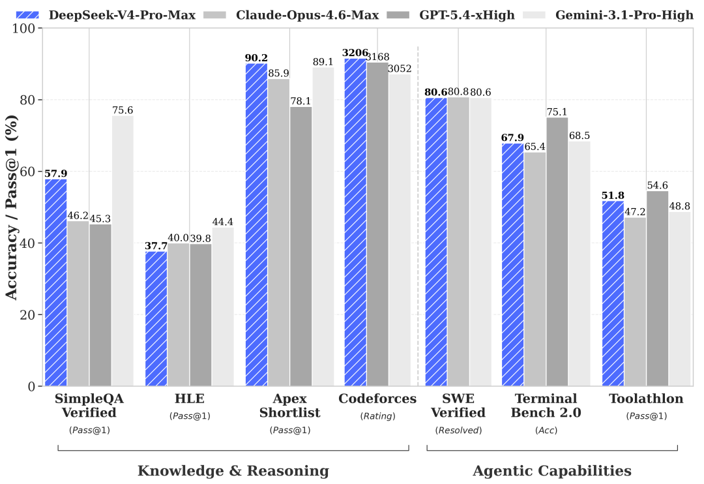

Codex accidentally renewed again this month.

I didn't actively renew it; I just forgot to cancel the subscription. When I saw the debit notification, my first reaction was:

**This money isn't well spent.**

I wasn't really planning on continuing my Codex subscription. I also can't subscribe to GitHub Copilot for now, so my original thought was either to subscribe to Claude and give it a try, or simply not subscribe to anything at all.

> A side note here: I don't recommend annual subscriptions. Code Agents are constantly updating, and using different ones allows you to experience the differences.

But since the money was already spent, I continued to use it for a while.

After using it, I became even more certain of one thing:

**Codex is pretty good, but it's no longer the indispensable tool for my daily coding.**

## Codex is Okay, But Not Irreplaceable

There have been many articles about Codex recently.

Tutorials, reviews, comparisons, best practices—you can basically stumble upon one every few days. Many people are saying how powerful and good it is, even better than Claude Code.

I don't deny Codex's capabilities.

Its interactive experience, desktop application, and task execution abilities are all good. But from my own use cases, Pi + DeepSeek V4 series is incredibly strong and irreplaceable.

I mainly use AI for these tasks:

- Maintaining open-source projects
- Refactoring code
- Writing tests
- Solving bugs
- Modifying CI/CD configurations
- Writing documentation and READMEs
- Understanding unfamiliar projects

Most of these tasks are now completed using Pi + DeepSeek V4 series.

Overall, DeepSeek gives me the feeling that it's:

**Abundant, satisfying, and good enough to use.**

I used to think that the main difference among AI coding tools lay in their model capabilities.

Now, I actually feel that model capability is just the foundation. What truly impacts daily use are cost, quotas, speed, and toolchain adaptation.

## The Cost Difference is Obvious

First, let's talk about DeepSeek.

I started using DeepSeek quite frequently from late April. So far, I've topped up a few times, each time 10 RMB, totaling about 40 RMB.

My feeling can be summed up in one sentence:

**I simply can't use it all up.**

Now, let's look at Codex.

Since I already renewed this month, it would be a waste not to use it, so I deliberately look for projects to give tasks to Codex.

But the problem is also obvious: if I focus on one project, the quota can easily run out in about an hour. My weekly limit is already used up, and I have to wait another day to use it.

If I want a higher quota, I have to consider the more expensive Pro tier. For me personally, that's not very cost-effective.

## What I Care About More Now is Continuous Availability

Once a Coding Agent enters your workflow, it's not just about asking a few questions occasionally.

It continuously reads code, writes code, runs tests, modifies documentation, analyzes errors, and understands context.

All of these consume tokens.

If a tool is very powerful, but every time you use it you have to think about "saving it," its value in actual work will be discounted.

Conversely, if a model is cheaper and its quality is good enough, I'm more willing to integrate it into my daily workflow.

This is how I feel about using DeepSeek now.

If an idea comes to mind, I let it analyze it directly.

If code needs to be modified, I let it do it directly.

If the result isn't satisfactory, I continue to ask questions.

This kind of guilt-free usage experience is very important for Coding Agents.

## Why did ds4 suddenly become popular?

Recently, there's been a very popular project on GitHub called ds4.

It's a local inference engine for DeepSeek V4 Flash created by Redis author antirez, also known as Salvatore Sanfilippo. The project quickly gained popularity, now boasting over 6k stars on GitHub.

I think there are several reasons why this project became popular.

Firstly, the author himself is very influential.

antirez is the creator of Redis, so projects he works on naturally attract a lot of developer attention.

Secondly, unlike ollma, ds4 focuses solely on the DeepSeek V4 Flash model.

This indicates that DeepSeek V4 Flash is no longer just an ordinary "cheap model." It has reached a point where influential system-level developers are willing to build dedicated inference engines around it.

Thirdly, local inference is a very attractive direction.

If these types of models can run more stably on local machines in the future, the API call costs for Coding Agents will significantly decrease. Although hardware, memory, electricity, and maintenance costs still exist, for many developers, this is already a very promising direction.

So, the popularity of ds4 also indicates that: **developers recognize high-performance, cost-effective models like DeepSeek V4 Flash.**

## What about Copilot?

If GitHub Copilot becomes available for smooth subscription again in the future, I might still consider continuing to use it.

The reason is simple: Copilot's native GitHub integration is too good.

You can open a repository and have Copilot analyze issues, modify code, and submit PRs. This experience is currently hard for other tools to fully replicate.

Copilot's advantage isn't just about a powerful model; it's that it's embedded within the GitHub workflow.

For developers, this is extremely important.

However, Copilot also has its own issues. Its billing and quota rules are also changing. For those who frequently use AI coding tools, future costs and restrictions still need careful consideration.

That's why I'm also working on my own attempt recently.

## RepoKeeper: My Own Attempt

This is also one of the reasons why I've been working on [RepoKeeper](https://github.com/shenxianpeng/repokeeper) recently.

I hope it can become a more flexible entry point for GitHub Coding Agents.

Compared to Copilot, RepoKeeper's biggest advantage isn't that it's more native, but that it's more free.

For example:

1.  **Backend can be customized**

    Currently, it can connect to Pi, and later it can also connect to OpenCode, or other Agent backends.

2.  **Models can be chosen by yourself**

    You can use DeepSeek, or Qwen, Kimi, or other more cost-effective models.

3.  **Cost is more controllable**

    You don't necessarily have to be tied to the subscription and quota of a specific platform.

Of course, RepoKeeper isn't as out-of-the-box as Copilot yet.

Copilot is a native GitHub product and can start working immediately in any repository. RepoKeeper still requires configuring workflows, tokens, and backends first.

But these are one-time tasks.

Once configured, it can become a freer AI coding entry point.

This is also the direction I want to continue exploring:

**AI Coding Agents don't necessarily have to be bound to a single platform.**

In the future, developers may need a more flexible way to connect different models, different agents, and different repository workflows.

## Finally

If you also use AI for coding frequently, and at this stage, model inference capabilities are all very strong, the most important questions have become:

**Who can let me keep using it.**

**Whose cost can I accept.**

**Who can stably integrate into my daily development process.**

From this perspective, the DeepSeek V4 series is very much worth serious consideration.

It's powerful enough, cheap enough, and suitable enough for high-frequency use.

Especially for friends in China, if accessing Claude is inconvenient, subscribing to Codex is inconvenient, or you don't want to be constrained by various quota limits, then you can definitely try a combination like this:

**A handy AI coding tool + DeepSeek V4 series models.**

> Of course, cost-effective models like Qwen, Kimi, and GLM also seem good. I will try to use them as the brain for my Coding Agent later.

My feeling is:

**Model capability is no longer the sole barrier.**

What truly matters is whether you can integrate AI into your daily development process and use it long-term, stably, and at a low cost.

At least for me, the DeepSeek V4 series has achieved this.

So next month, I'll most likely cancel Codex.

I'd rather continue to top up models like DeepSeek, Qwen, GLM, and Kimi with that money.