<!-- 备选标题： 和 Claude 结对改版：我出想法，它写 CSS，几轮之后超出预期 -->

昨晚我给自己维护的一个开源项目 [GitStats](https://github.com/shenxianpeng/gitstats) 做了一次重大的升级——UI 全面现代化，图表引擎彻底替换。

说实话，动手之前我没想到效果会有这么大的飞跃——改完之后对比一看，旧版本的界面真的有点"上古感"。

## GitStats 是什么？

我之前也写过一篇介绍 GitStats 的文章，简单来说它是一个用 Python 写的命令行工具，一行命令就能把一个 Git 仓库的历史数据变成一份可视化的 HTML 报告。

使用非常简单：

```bash
pip install gitstats
gitstats . report
```

生成的报告包含这些维度：**General（概览）、Activity（活跃度热力图）、Authors（贡献者统计）、Files（文件趋势）、Lines（代码行数变化）、Tags（版本时间线）**。

对于想了解一个项目"健康状况"的人来说，这份报告能一眼看出很多东西：谁是主要贡献者、项目什么阶段最活跃、最近是不是停滞了……

另外还支持 **AI 分析**，接入 OpenAI，Anthropic Claude，Google Gemini 以及 Ollama 等模型后可以自动生成自然语言的洞察摘要——不只是图表和数字，还有 AI 生成的"故事"，让数据更有温度。

---

## 这次升级做了什么？

### 图表引擎：从 Gnuplot 到 Chart.js

这次升级不太容易感知到的变化是：我把 GitStats 的图表引擎从 Gnuplot 完全替换成了 Chart.js。

旧版本用的是 Gnuplot——一个我自己打包进去的 [Python wheel](https://pypi.org/project/gnuplot-wheel/)——生成的图表是静态 **PNG 图片**。

能用，但就是一张死图，没有交互，分辨率有限，放大了就糊。

这次把图表引擎整个换成了 **Chart.js**，所有图表现在都是 **HTML 格式**，原生跑在浏览器里。

这个替换对整个项目来说是一次本质性的飞跃：图表变成了可交互的，鼠标悬停有数据提示，缩放更清晰，整体也更现代。从"工具输出"变成了"真正能看的报告"。

### UI：从上古风格到现代化

这次升级最明显的变化是 UI 的全面改版。之前的界面设计非常简陋，完全没有什么设计感，感觉更像是一个脚本输出的结果，而不是一个精心制作的报告。

改动集中在几个方向：

**整体视觉语言的现代化**
卡片式布局、圆角、微妙的阴影、更合理的字体层级……这些细节叠加起来，让整个报告看起来像是一个"产品"，而不是一个"脚本输出"。

**响应式适配**
现在在手机上也能正常查看了。以前在移动端打开基本是灾难。

**深色 / 浅色双模式**
这个在 1.6版本就加了，用户可以在报告页面右上角切换深色/浅色模式。对于习惯暗色界面的开发者来说，这几乎是标配。

---

## 新旧对比

旧版本：


  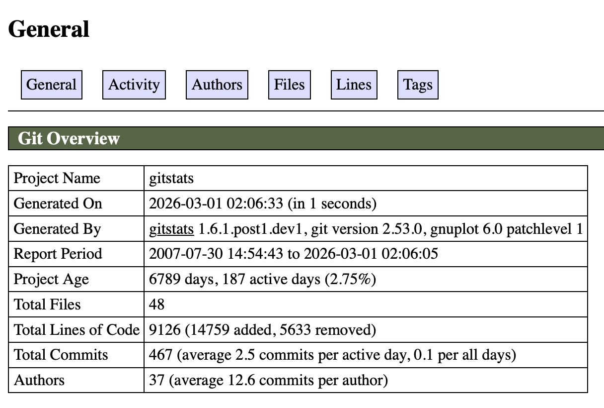
  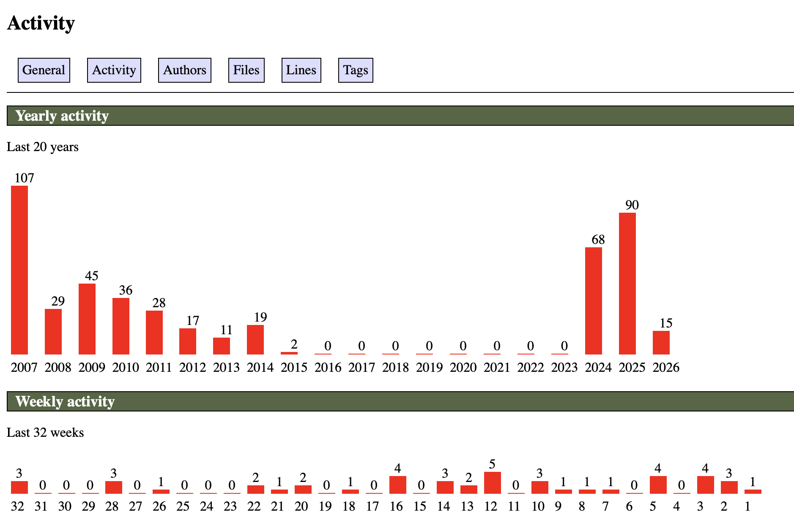
  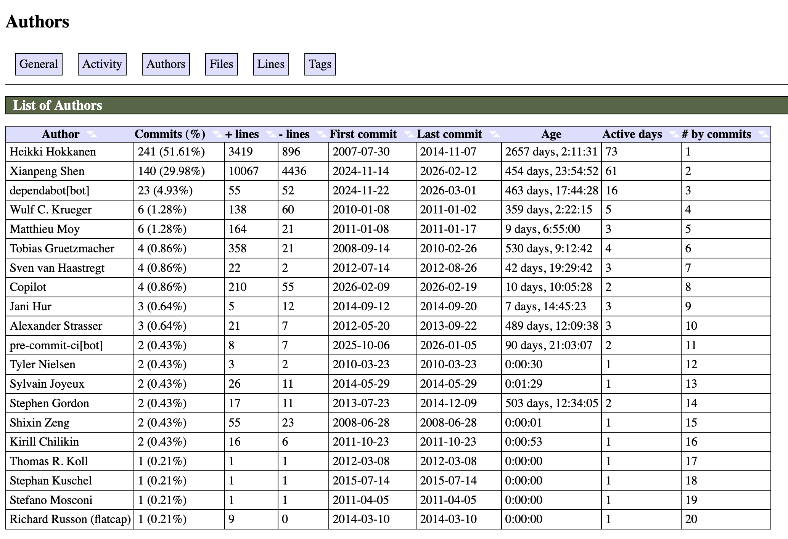
  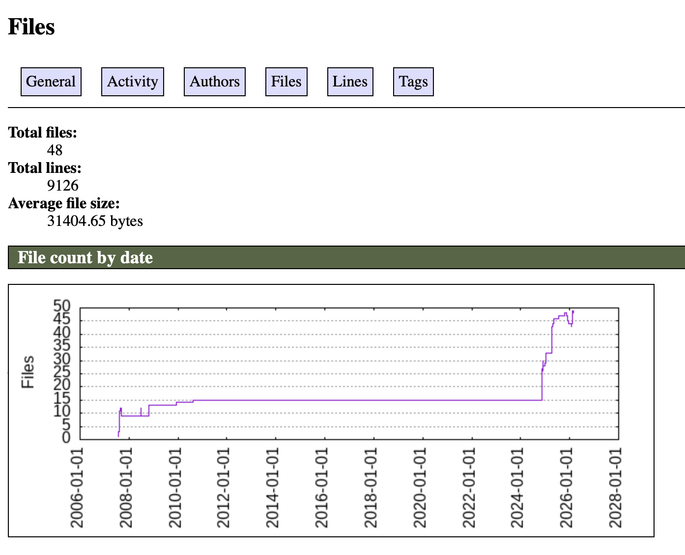
  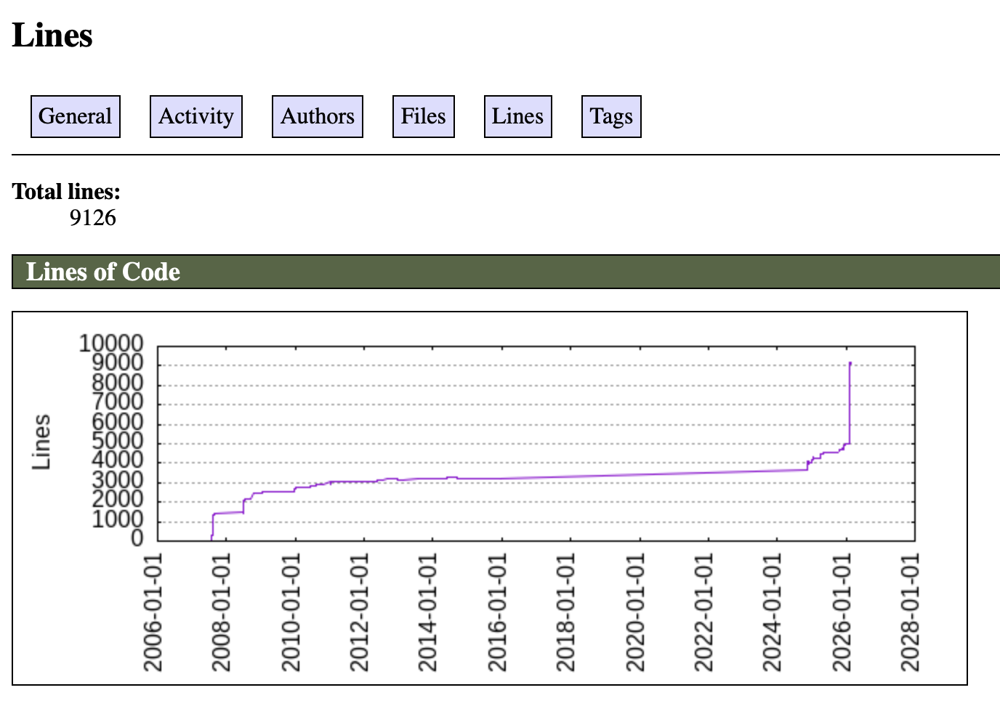
  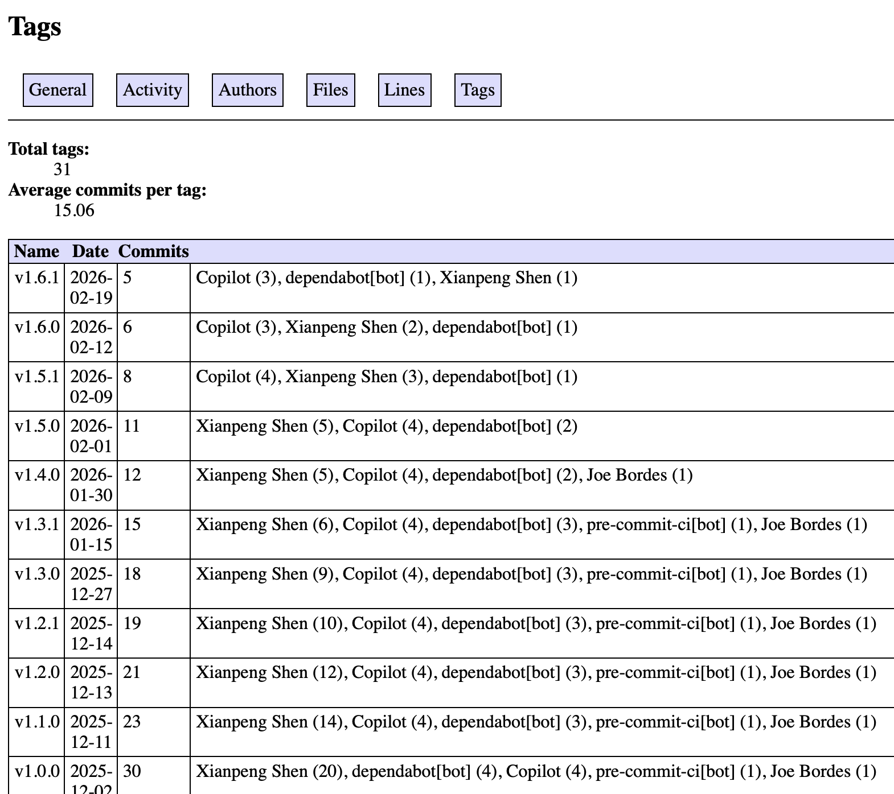


新版本：


  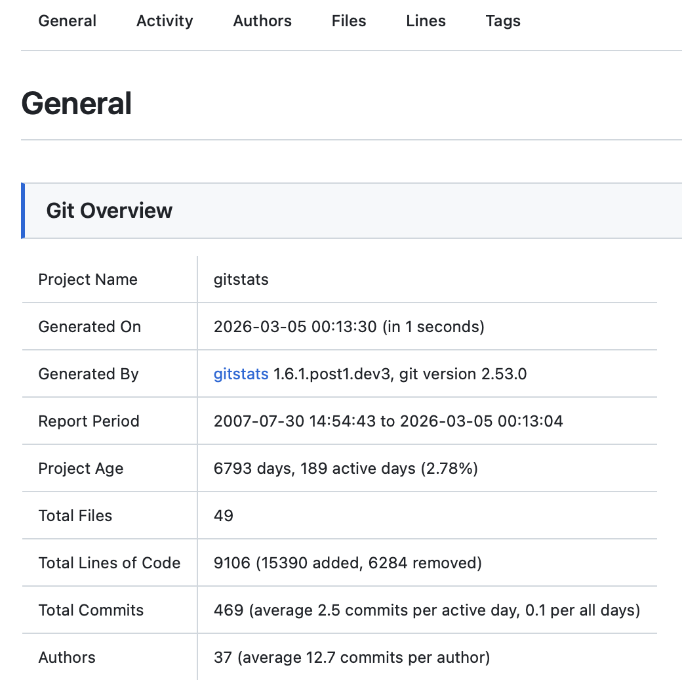
  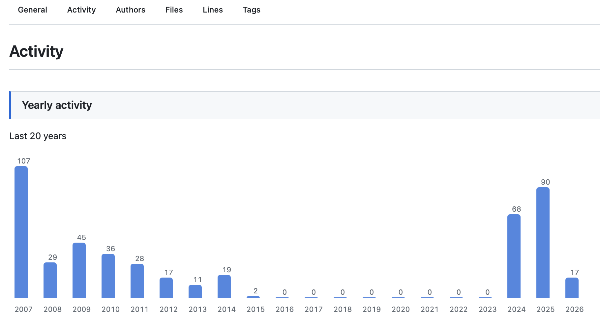
  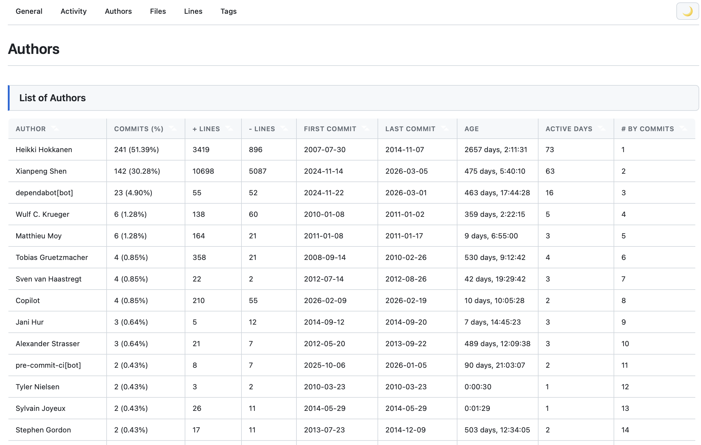
  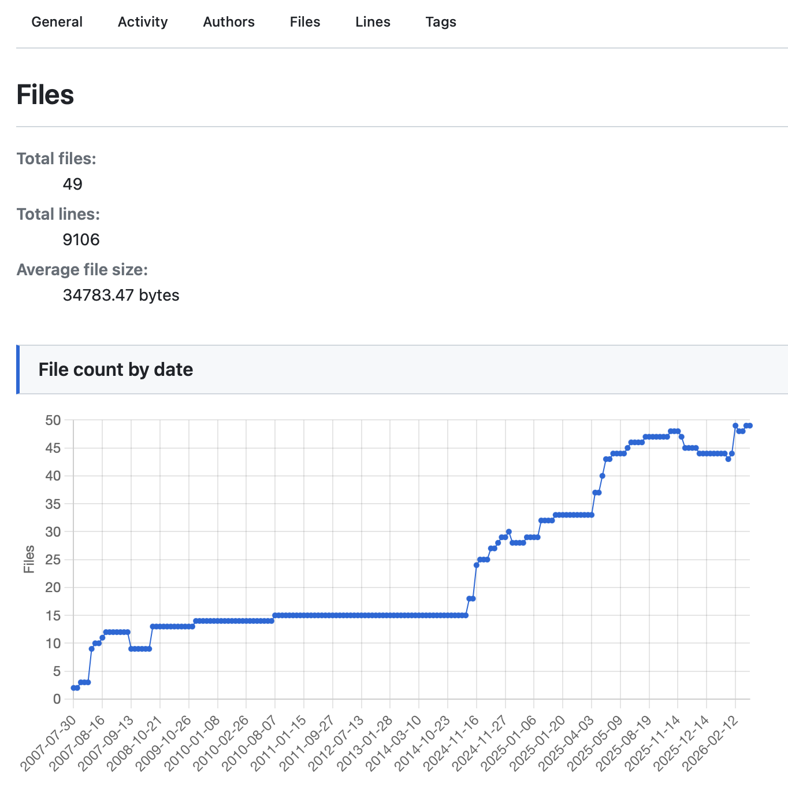
  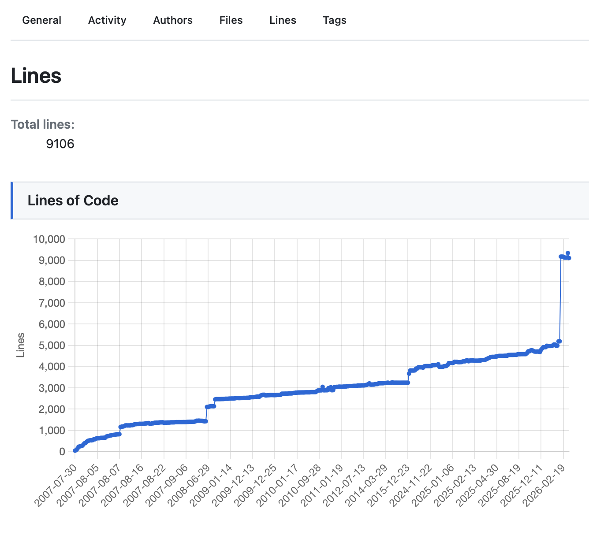
  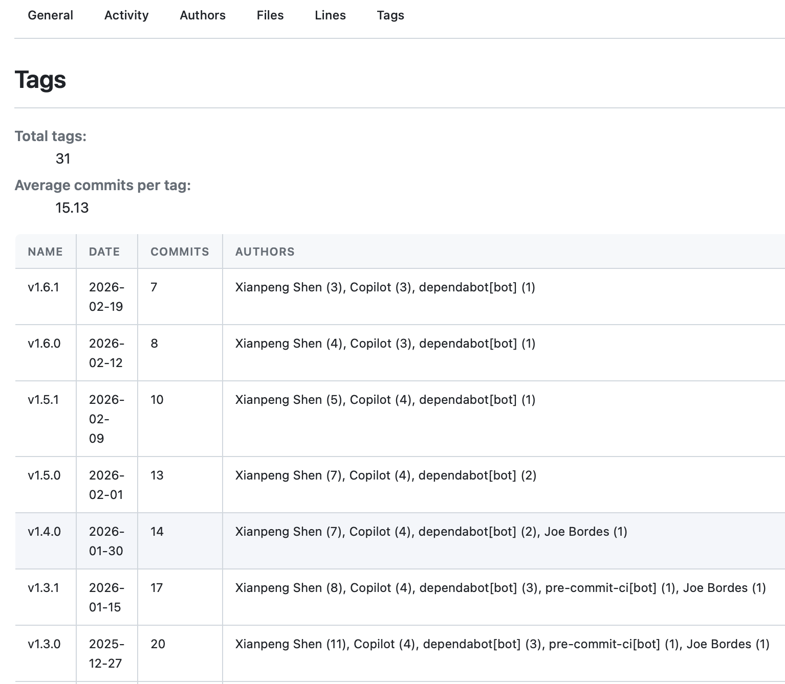


你可以访问 [这个在线预览](https://shenxianpeng.github.io/gitstats/index.html) 看实际效果，这是基于 GitStats 自身仓库生成的报告。

---

## 一点感受

说实话，我对 UI 和前端这块几乎一窍不通。这次改版是我和 Claude 一起完成的——我描述想要的效果，它来写 CSS，我看结果、提意见、再迭代。几轮下来，出来的效果比我预期的好很多。

图表引擎的替换也是同样的模式。这种级别的代码改动，放在以前我大概率会搁置，现在反而觉得可以动手试试——这个变化本身，比效率提升多少倍更值得说。

维护开源项目有一种很奇妙的体验：用户看不见你投入的时间，但他们能感受到结果。"好用但难看"和"好用又好看"，用户的信任感是完全不一样的。

如果你在用 Git，不妨跑一下 GitStats，看看自己的仓库历史长什么样——那些藏在 commit log 里的故事，用图表呈现出来会清晰很多。

* 项目地址：**https://github.com/shenxianpeng/gitstats**
* 文档：**https://gitstats.readthedocs.io**
