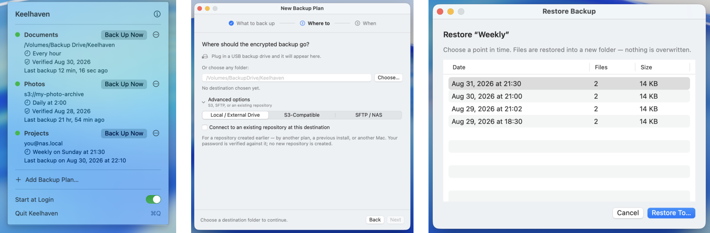

8 月 31 日，我发布了 Keelhaven；9 月 3 日，我在[上一篇](../keelhaven/)里介绍了它。



上一篇文章发出去之后，我开始陆续收到一些真实用户的反馈：有人发邮件，有人直接开 GitHub Issue，有人在 X 上转发，也有人点了 Star，还有人打赏了。

非常感谢！！！

这些反馈，有些是我坐在电脑前自己想出来的功能，有些则完全是我之前没有考虑过的使用场景。例如：

- 有一位用户在一个 Issue 里一次反馈了五个问题，里面既有 Bug，也有 Feature；
- 还有一位从命令行 restic 迁移过来的用户，把自己正在使用的参数都列了出来，问能不能在 Keelhaven 里使用。

在最新发布的 0.8.0 中，很多反馈已经落地。具体细节就不在这里展开了，感兴趣的话，可以直接通过下面的命令安装最新版本。

```bash
brew install --cask shenxianpeng/tap/keelhaven
# 或者
curl -fsSL https://keelhaven.app/install.sh | bash
```

## 真实用户的反馈是最有价值的

刚开始发布的时候，我觉得自己已经测试得差不多了，也觉得这个 App 已经挺好用了。结果发布没几天，就开始陆续收到用户反馈。

有意思的是，大部分反馈并不是 Bug，而是功能需求，而且很多需求是我自己根本没有想到的。

这让我更加体会到：任何工具，不管是面向开发者，还是面向普通用户，真正开始被使用之后，才会暴露出真实的使用场景。很多事情，坐在电脑前自己想，很难完全想清楚；只有把工具交到用户手里，听听他们的声音，才能知道它还缺什么。

所以这里也特别感谢每一位愿意花时间写下反馈的用户。

你们的反馈我都看到了，也都在认真考虑。很多已经落地，剩下的还在思考和设计中。

---

## 如果你用 Mac，正在找一个备份工具

Keelhaven 值得你花十分钟试一下：选好要备份的文件夹、目的地和备份频率，然后就可以基本忘掉它。

它会在后台按计划备份，定期自动检查仓库，出了问题才来提醒你。

加密在本机完成，没有账号系统；备份使用标准的 restic 格式，随时可以恢复，也可以迁移到其他工具。开源、免费，macOS 14 以上可用。它具体怎么工作，[上一篇](../keelhaven/)介绍得更详细。


官网：https://keelhaven.app  
源码：https://github.com/shenxianpeng/keelhaven

试用之后，无论觉得好用，还是踩了坑，都欢迎告诉我：可以发邮件到 support@keelhaven.app，或者开一个 [GitHub Issue](https://github.com/shenxianpeng/keelhaven/issues)；在公众号、知乎或 Twitter 上留言也可以。尤其是 X 上如果你发布了相关 Keelhaven 的内容，可以 @ 我，我也会把相关的评论更新到它的官网上。

觉得好用的话，欢迎点个 Star，也欢迎转发给身边需要的朋友。

谢谢每一位试用它、给它提意见甚至打赏的人。
