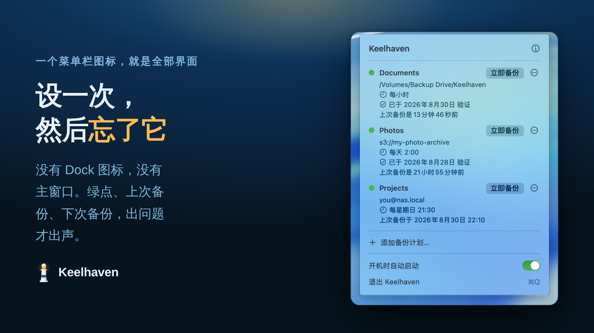
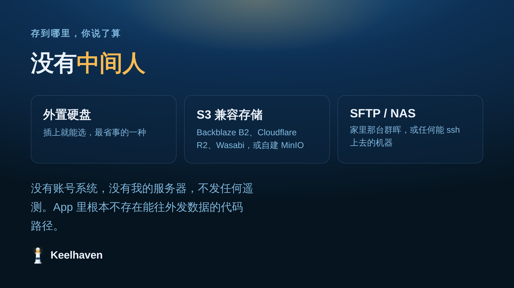
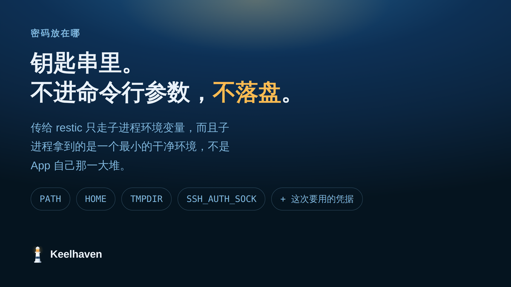
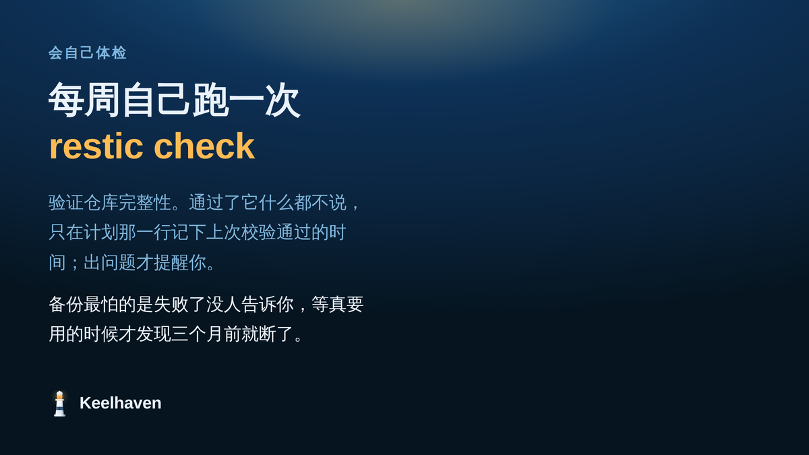

我用 restic 好几年了。它是个很好的命令行备份工具：去重、加密、增量，仓库格式稳定，社区活跃。

但使用下来，我也遇到了一些问题：

定时任务不知道从哪天起悄悄失败了，我是过了几周才发现的。因为它失败的时候没有任何人告诉我。而仓库密码，为了让定时任务能跑，就明文写在 shell 配置里。

这两个问题都不是 restic 的问题。命令行工具本来就把这些留给你：调度归你，凭据保管归你，出错通知归你。

所以我做了 [Keelhaven](https://github.com/shenxianpeng/keelhaven)。

## 它是什么

一个 macOS 菜单栏 App。没有 Dock 图标，没有主窗口。选文件夹，选目的地，设频率，然后你可以忘掉它。它会在后台按计划运行，检查仓库完整性，出问题才提醒你。



目的地是你自己的：

- **外置硬盘或移动硬盘**：插上就能选，最省事的一种
- **任何 S3 兼容的对象存储**：Backblaze B2、Cloudflare R2、Wasabi，或者你自己搭的 MinIO
- **SFTP**：家里那台群晖，或者任何一台你能 ssh 上去的机器



另外，没有账号系统，没有我的服务器，不发任何遥测。App 里根本不存在能往外发数据的代码路径。

---

## 三个值得展开讲的设计

### 1. 标准 restic 仓库，不是私有格式

这不是一个后加上去的卖点，是我做这个东西的前提。你可以在任何一台 Linux 上 `restic snapshots -r sftp:nas:/backups/laptop` 把它列出来，恢复也不需要装我的 App。如果哪天我不做了，你的数据不受影响。

备份软件最大的风险是这个App还在不在，同时把格式锁死在自己手里的备份工具，就是在拿用户的数据当筹码。

### 2. 密码不落盘，别的进程也看不到

仓库密码和 S3 密钥存在 macOS 钥匙串里，一个备份计划一条。

传给 restic 的时候不会出现在命令行参数里，也不会写进任何临时文件——别的进程看不到，磁盘上也不会留痕。



### 3. 会自己检查备份是不是还好的

备份最可怕的情况不是失败，是失败了没人告诉你，等到真的要用的时候才发现三个月前就断了。

所以每个计划会按计划跑 `restic check`（默认每周一次），验证仓库完整性。计划那一行会显示上次通过校验的时间。通过了它什么都不说，出问题才提醒你。



---

## 现在还没有 Apple 公证

苹果开发者账号一年要 700 块人民币左右（官方定价 99 美元），这个项目目前完全没有收入，这笔钱我暂时不打算掏。结果就是直接下载 DMG 双击，macOS 会拦一次。

但脚本安装的两条路都不会弹窗，因为它们都会把 quarantine 标记清掉：

```bash
brew install --cask shenxianpeng/tap/keelhaven
curl -fsSL https://keelhaven.app/install.sh | bash
```

前者在 cask 的 postflight 里清，后者在安装脚本里也有专门一步清。介意 `curl | bash` 的话完全合理，脚本就一页，可以先打开看：https://keelhaven.app/install.sh

---

v0.5.0，GPLv3（bundled 的 restic 引擎本身是 BSD-2-Clause），免费，以后也免费。macOS 14 以上，Apple 芯片和 Intel 都支持。

官网：https://keelhaven.app
源码：https://github.com/shenxianpeng/keelhaven

欢迎 star，更欢迎 issue。你要是用它备份了点什么然后出了问题，也请告诉我。
