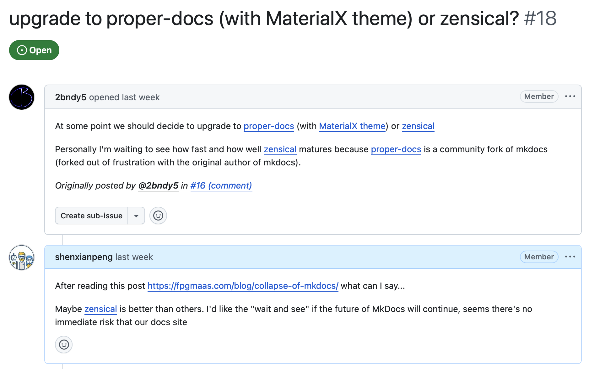

上周我在 GitHub 上 create 了一个新组织，叫 MkDocs NG。

然后一口气往 PyPI 上发了两个包：`mkdocs-ng` 和 `mkdocs-ng-material`。

这就要说说我为什么要 Fork MkDocs 和 Material for MkDocs 了。

## 背景

我自己很多开源项目的文档项目都是用 MkDocs 构建的。MkDocs 本身做构建，Material for MkDocs 负责外观。这套组合我用了好几年，很不错。

事情的起因是 cpp-linter 的小伙伴再次提到了 MkDocs 的停更问题，问要不要更新社区其他 Fork 或是转到 Zensical 上。（Zensical 是 squidfunk 团队的新项目，定位也是静态站点生成器。）



在我看了这些备选方案，以及这篇文章 [The Slow Collapse of MkDocs](https://fpgmaas.com/blog/collapse-of-mkdocs/) 之后，我觉得这事太狗血了，喜欢八卦的可以去看看。大概的脉络是这样的：

MkDocs 原作者长期缺席，社区维护者接力维持项目；后来维护者之间发生冲突，原作者重新介入但重点转向不兼容现有插件生态的 MkDocs 2.0 重写，导致原有 MkDocs 1.x 维护停滞，Material for MkDocs 进入维护模式，社区开始分裂出 ProperDocs、MaterialX、Zensical 等替代路线。具体细节非常精彩，强推那篇文章。

言归正传，看了现在的备选方案也不太满意，如果硬要我选的话，我可能会去尝试 Zensical。但 cpp-linter 的项目和官方文档都在 MkDocs 上，迁移成本不小。目前如果不迁移的话，会有一些 risk 但也不是特别大。

当时我就萌生了，**还不如自己来维护**，算了，这样一是能继续使用这两个文档工具，二是能让社区继续用这个工具，三是能满足我喜欢维护开源项目的兴趣。于是就有了 MkDocs NG（Next Generation 的意思）。

## 我做了什么

说干就干。上周末我就 fork 了这两个项目，r

把 mkdocs/mkdocs 和 squidfunk/material 这两个仓库都 fork 到了 MkDocs NG 下面。

现在他们分别仓库分别是：mkdocs-ng/mkdocs 和 mkdocs-ng/mkdocs-material。

这两个好哥们现在终于在一起了。抱抱！

然后我就把挂了很多的 Bug 基本上都修了，升了依赖，追了 Python 新版本的兼容性，最后发了新版本。

* [mkdocs-ng](https://pypi.org/project/mkdocs-ng/) 从 v1.7.0 发到 v1.7.2，一周内，三次迭代。
* [mkdocs-ng-material](https://pypi.org/project/mkdocs-ng-material/) 这边做了 rebrand、修了文档、Docker 镜像迁移到了 GHCR，发布了第一个 9.7.7 版本。

能修掉一个，就少一个人踩坑。一个停了快两年的项目，不在意有没有新功能，最重要的是有没有人清 bug。

怎么用呢？非常简单：

```bash
# 以前
pip install mkdocs mkdocs-material

# 现在
pip install mkdocs-ng mkdocs-ng-material
```

CLI 命令还是 `mkdocs`。配置文件还是 `mkdocs.yml`。目录结构不变，插件接口不变。你之前的文档项目完全不需要改，直接换个包名继续用就行了。

有人在社区里也做了 MkDocs 的 fork。我看到有的 fork 改了 CLI 命令名，有的连配置文件都换了名字。

我不评价别人的选择，我的做法是：**就是重新发布新的包，其他保持不变**，尽可能降低用户的迁移成本。

所以找到你的 `requirements.txt` 或 `pyproject.toml`，把 `mkdocs` 换成 `mkdocs-ng`，`mkdocs-material` 换成 `mkdocs-ng-material`，其他不变。就这么简单。

还有一个原因，说出来可能有点直白或是偏执，也可以说傲慢，除了 Zensical 以外，其他的备选方案离我心中的好项目还差一些。

这也就是我为什么要自己来维护的原因了。**我觉得 MkDocs 这个项目挺好的，想让它继续好下去。** 既然上游不行了，我就来吧。

我时刻对上游保持开放的态度。4 月 28 号我在 MkDocs 的 [Discussion #4010](https://github.com/mkdocs/mkdocs/discussions/4010) 下面留了言：

**如果 Christie 或任何管理员愿意给我权限，我会把现有 40+ PR 修复全合进上游，以后直接在上游维护。** 但我不觉得会得到回应。

---

## 最后，需要你帮忙

我能做的事很明确：修 bug、升依赖、发版本。

我做开源这些年有一个体会：一个项目有没有影响力，代码只是前半段，后半段是人。有多少人知道它、多少人愿意试、多少人顺手帮忙说一声。

如果你在用 MkDocs 或者 Material for MkDocs，几件事可以帮到我：

1. 把 `mkdocs` 换成 `mkdocs-ng`，`mkdocs-material` 换成 `mkdocs-ng-material`，试试新版本。
2. 遇到问题去 [GitHub](https://github.com/mkdocs-ng/mkdocs) 提 Issue，我会第一时间回复，能修的我会尽快修掉。
3. 给仓库点个 Star。不是虚荣——Star 多了，更多人会看到，更多人会用，这个 fork 才会服务到更多人。
4. 转发给同事，或者在群里说一下。我一个人能把代码维护好，但让这件事被更多人知道，**还是得靠大家**。

最后，附上两个仓库的链接：

- mkdocs https://github.com/mkdocs-ng/mkdocs
- mkdocs-material https://github.com/mkdocs-ng/mkdocs-material

欢迎大家来试用，提 Issue，点 Star，转发给同事！谢谢！
