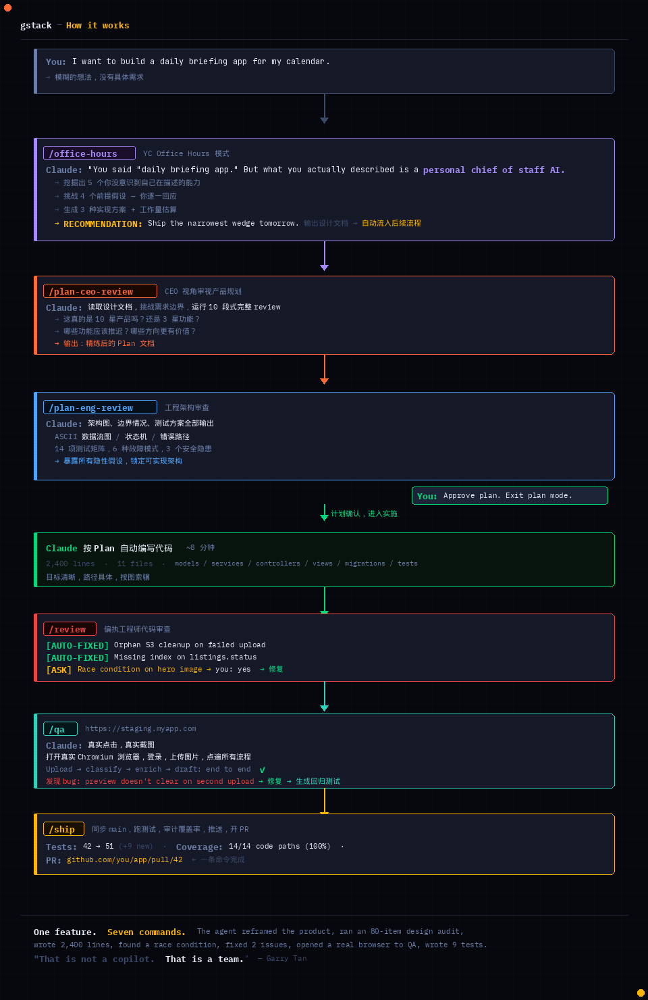

这是我最近每天分享 AI 使用心得的延续。

昨天说了 gstack 让我从「执行者」变成「决策者」。今天想说说另一面——当效率真的提升之后，发生了什么。

---

## 先说说今天的实践

gstack 最近更新了不少角色，除了之前的 CEO、Eng Manager，现在还加了 SRE、Release Engineer、Chief Security Officer 等新角色，slash 命令也增加了不少，整个团队配置越来越完整。

我把这个完整流程找 AI 画了一张图，一目了然：
 

今天我用它来推进一个想法，走了这样一套流程：

**Plan CEO Review** — 先把想法抛出来，它不会直接动手，而是不断向我确认、拆解，问你真正要解决的是什么问题，帮你找到更值得做的切入点。

**Engineer Review** — 切换到工程师视角，审视需求完不完整、可不可实现、要做成什么具体的样子。这一步会把很多「想当然」的假设暴露出来。

**Design Review** — 把具体的实现方式逐项列出来，每一项给 2～3 个选项，附带推荐理由。大多数时候我会直接接受推荐，有自己想法的地方再指定。

整个过程走下来，一个原本很模糊的想法，在一轮轮拆解和确认中逐渐变清晰，最终落成一份具体的 Plan 文档。然后再进入实施阶段，按 Plan 逐步落地。

一开始我其实不太相信这个需求能被实现得很好。但这套流程真的有效——目标变清晰，路径变具体，执行的时候少了很多来回返工。

如果你还没试过用这种方式来做 vibe coding，建议试试。

---

## 但有一点越来越明显

效率上来了，瓶颈开始回到人本身。

以我自己为例：我没办法同时对多个项目做深度决策。我只能在某个时间段参与这个「组」的讨论，拍完板再切到下一个「组」。即便可以同时开很多窗口，让思路在不同上下文之间跳转，**四个窗口大概就是极限了。**

再多，所有决策都会卡在我这里——AI 在等，进度在等，全部等我一个人确认。

本质上，生产力一直是这样运作的：机器效率越高，人就越会把节省出来的时间填满。要么开更多 AI 会话，要么去处理更多的事情。最终你会发现，时间依然是满的，只是装进去的东西变多了。

---

## 这解释了为什么两类人都在焦虑

**用了 AI 的人：** 效率提升了，但工作量并没有减少，反而更多。需求变快、节奏变快，外界的期待也随之水涨船高——「你不是在用 AI 吗，怎么还没做完？」压力不是消失了，是换了一种形式。

**没用 AI 的人：** 担心错过这一波，担心没有在高强度使用 AI 的过程中建立起自己的能力模型，担心差距在悄悄拉大。

两种焦虑，来源不同，但都真实存在。

---

一个挺有意思的现象：

很多用了 AI 的人，并没有变得更轻松，反而更忙了。

我觉得这可能才是这个阶段最真实的状态——不是「AI 帮你做完所有事」，而是「AI 把你的上限往上抬了，然后你开始尝试填满新的上限」。

循环继续。