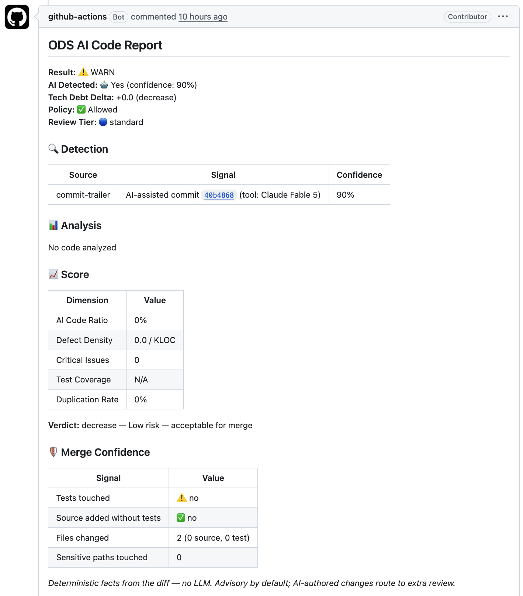

三周前我写了[《Open Delivery Spec：我为 AI 写的代码做了一道 CI 质量门》](open-delivery-spec/)，介绍了 ODS 的基本思路：读出 AI 工具自己申报的归属信号，聚合质量分析，把政策决定权交给团队。

如果你当时的感觉是"有点意思，但还不够我接入"，这篇文章想告诉你最近我又做了哪些优化。一句话总结新增的两条主线：

1. **Merge confidence**：用一组确定性信号（不引入任何 LLM）回答"这个 AI PR 敢不敢合"——测试跟没跟着改、改动行有没有被测试覆盖、测试是不是真的能抓住错误。
2. **证据文档**：每个 PR 自动产出一份 `evidence.cdx.json`——合法的 CycloneDX 格式，记录"哪些代码是 AI 参与的、证据强度如何、通过了什么验证"。这是为审计和合规准备的底料。

## 先看效果

接入 `open-delivery-spec/validate-action@v1` GitHub Action 后，现在每个 PR 会收到这样一条报告评论：



表里每一行都是从 diff 和测试产物里算出来的**确定性事实**，同样的输入永远得到同样的结果，没有任何一行来自"AI 觉得"。

## 主线一：这个 AI PR 敢不敢合？

上篇文章提过，人工 review 速度赶不上 AI 生成，唯一可行的方向是把人工注意力路由到真正需要的地方。

但"路由"依据什么？我也看了社区里维护者们的真实抱怨（包括 GitHub 官方讨论区、FastAPI、curl、Linux kernel 的相关讨论），发现两个高度一致的共识：

1. **拒绝用 LLM 判卷**——"任何足以识别 AI 的检测器，都能训练出躲过它的 AI"；
2. 大家实际使用的第一判断标准朴素得惊人：**"它有测试吗？"**

AI 代码最典型的失败模式恰恰是"覆盖率是绿的、断言是空的、逻辑是错的"。所以 ODS 沿着"测试是不是真的"这个问题，做了三层递进的确定性信号：

**第一层，纯 diff 信号（零配置，自动生效）。** 改了源码有没有跟着改测试；diff 是不是"宽而浅"的可疑形状；有没有碰敏感路径（CI 配置、认证、锁文件等）。

**第二层，patch coverage（有覆盖率产物就自动生效）。** 注意不是项目整体覆盖率，而是**你这次改动新增的行**里有多少被测试执行过——整体 80% 的项目照样可以合入一行都没被测过的新代码。支持 Go `coverage.out`、LCOV、Cobertura，放在工作目录就会被自动检测，低于阈值（默认 0.8）给出警告。

**第三层，mutation score（选择加入，最深的一层）。** 变异测试的思路是故意在你新增的行里制造 bug，看测试能不能抓住——这是"断言是不是空的"的直接检验。跑变异测试较重，所以 ODS 选择**吃现成报告**：你用 [gremlins](https://github.com/go-gremlins/gremlins) 等工具生成报告，通过 `mutation-report` 传入，ODS 计算 diff 范围内的杀伤率。

三条信号全部遵守同一套规矩：**默认只警告和路由，不拦截**；AI 署名的改动自动提高门槛（比如 AI 参与 + patch coverage 低 → review tier 升为 `elevated`）；想拦截的团队在自己的 Rego 策略里写一行 deny 即可。

还是那句话：这**不证明代码正确**。它证明的是这个改动**被测试、被扫描、形状像认真的工作**——这些也是开源社区实际在用的判断依据，ODS 把它们变成了机器可读、策略可用的信号，让人工注意力少在低风险处消耗。

## 主线二：留下证据

这条主线来自一个时间点：**欧盟 AI Act 的技术文档要求（Article 11 / Annex IV）已于 2026 年 8 月 2 日生效**。"你们代码库里哪些部分是 AI 参与写的、用了什么工具、做过什么验证"正在从工程问题变成采购和合规问题。

有意思的是现有 AI-BOM 生态（CycloneDX ML-BOM、OWASP AIBOM 等）回答的是另一个问题——"你的系统里**用了**哪些模型和数据集"。而"你的**源代码**哪些是 AI 写的、证据强度如何"这一层，目前没有工具覆盖。ODS 每个 PR 算出的东西恰好就是这一层需要的全部输入。

所以 CLI 新增了 `ods attest` 命令，validate-action 会在每个 PR 上自动运行它，产出 `evidence.cdx.json`——一份**通过官方 schema 校验的 CycloneDX 1.6 文档**（没有发明任何私有格式），核心是六条可核查的声明：AI 参与已披露（R1）、证据已分级（R2）、改动行被测试覆盖（R3）、测试能抓住错误（R4）、策略已评估（R5）、流水线完整（R6）。每条声明长这样：

```json
{
  "requirement": "req:ods-r3",
  "conformance": { "score": 0.75 },
  "confidence":  { "score": 0.9 }
}
```

两个分数刻意分开：`conformance` 是**测量值**（patch coverage 实测 75%），`confidence` 是**证据强度**。证据强度来自最近新增的另一个能力——**证据分级**。同样是"AI 参与"，证据可以是：

- 🟢 **corroborated**：有工具逐行度量记录佐证；
- 🟡 **attested**：工具或作者主动申报（commit trailer、PR 描述）；
- 🟠 **inferred**：仅从旁证推断（如分支命名）。

报告评论里会直接亮出这个等级。配套的还有**流水线完整性**：任何一个分析阶段失败，报告会如实标注"结果可能不完整"并至少给 WARN，**绝不把失败伪装成干净通过**——一份会说谎的报告不配当证据。文档里的每条证据都带可复核的定位（workflow run 链接），并且明确声明边界：*归属反映的是工具与作者申报的信号，不是作者身份的取证证明，也不断言代码正确性*。

诚实地说，这一步只是起点：文档目前未签名（下一阶段接 GitHub artifact attestations / sigstore），release 级别的聚合（"这个版本里所有 AI 参与代码的证据汇总"——审计真正想要的那份文件）也在路线图上。

但从今天起，接入 `open-delivery-spec/validate-action@v1` 的仓库每个 PR 都在自动积累这份台账。

## 接入

最小接入还是一段 workflow：

```yaml
# .github/workflows/ods.yml
name: ODS AI Code Quality
on:
  pull_request:
    types: [opened, synchronize, reopened]
jobs:
  ods:
    runs-on: ubuntu-latest
    steps:
      - uses: actions/checkout@v5
        with:
          fetch-depth: 0   # 完整历史，diff 与归属检测需要
      - uses: open-delivery-spec/validate-action@v1
```

这样就有了：报告评论 + 证据分级 + 纯 diff 的 merge-confidence 信号 + `evidence.cdx.json` 证据文档。想要更深的信号，按需加料：

```yaml
      # 在 ODS 之前跑测试，产出覆盖率 → 自动获得 patch coverage
      - run: go test ./... -coverprofile=coverage.out

      - uses: open-delivery-spec/validate-action@v1
        with:
          mutation-report: gremlins.json   # 可选：变异测试报告 → mutation score
          failure-mode: block              # 可选：分析阶段异常时直接拦截（默认 warn）
```

老用户什么都不用改：`@v1` 会自动滚动到最新版，新能力在你下一个 PR 上直接出现。

## 边界与不足（依旧重要）

- **归属仍可被规避**：squash 掉 trailer 就能抹掉。ODS 度量的始终是"申报的 AI 使用"——证据分级正是为了把这个不确定性明码标价，而不是掩盖它。
- **mutation score 需要你自己产报告**：ODS 只负责吃报告、算 diff 范围的分数，不替你跑变异测试。
- **证据文档还没有签名**：当前它证明"CI 在那个时刻算出了这些事实"，防篡改要等 sigstore 接入。
- **patch coverage 依赖你已有的覆盖率产出**：没有覆盖率文件时该信号显示"未测量"，不会假装是 0 或 100。

## 写在最后

上篇文章的结论今天更成立了：agent 自主开 PR 已经是日常，**PR 合并点是人类最后的、也是最重要的控制点**。

ODS 做的事，就是把这个控制点武装得更好——合并前，用确定性信号告诉你这个 AI 改动值不值得信任；合并后，留下一份标准格式的证据，等审计的人来问的时候你拿得出来。

如果你的团队在用 AI 写代码，接入成本是一段 workflow；如果你已经接入过，去看你下一个 PR 的报告就好。

- 规范与证据文档提案：https://github.com/open-delivery-spec/spec
- CLI：https://github.com/open-delivery-spec/cli
- GitHub Action：https://github.com/open-delivery-spec/validate-action

欢迎把这篇文章转给正在为 AI 代码治理和合规头疼的同事。

也欢迎大家使用和反馈（当然 star 也欢迎）。
