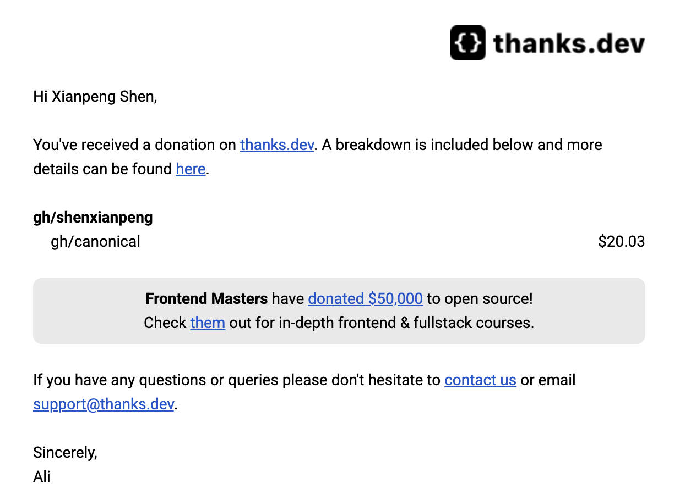
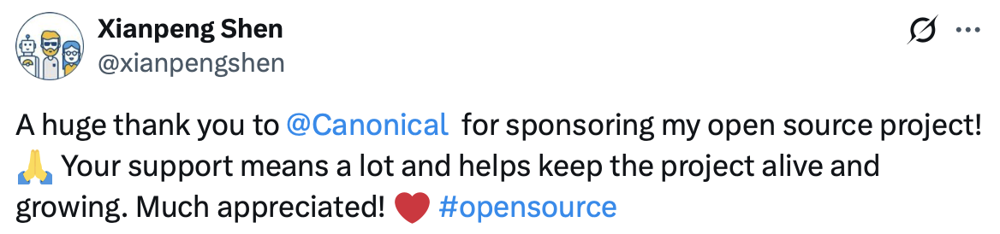
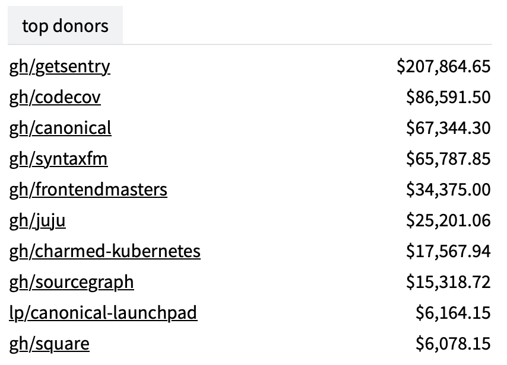

Today, I opened Gmail and saw a donation notification from [thanks.dev](https://thanks.dev).

Donor: `gh/canonical`.

That's Canonical, the company behind Ubuntu.

---

The story began a year ago.

At the time, I was working on a [DevOps Maturity](https://devops-maturity.github.io) assessment project that required generating badges in bulk. I found an open-source library under Google, and its functionality was exactly what I needed, so I used it.

However, this library was no longer maintained. While using it, I encountered a few bugs, and the issues remained open with no one responding.

Since I was using it, I fixed the problems myself when they arose. I forked it, fixed a few issues that significantly impacted usability, pushed it to GitHub, published it to PyPI, and then—that was it.

The project went live, the tool fulfilled its mission, and the matter gradually faded from memory.

---

Today, I checked the thanks.dev records and saw that Canonical has been donating for four consecutive months, roughly over $20 each month. I hadn't noticed the previous notification emails; I only happened to see them today.

I've worked on many open-source projects, and quite a few have been used by large corporations, but this is the first time someone has actively donated to me.

The money isn't much, just over twenty dollars a month. But for an ordinary developer who maintains open-source projects in their spare time, the weight of this signal is far more significant than those few dollars—it says: "What you've done is being used, and someone thinks it's worth supporting."

This kind of feedback is quite rare. I immediately posted a thank you on X, attaching a screenshot, to publicly express my gratitude.

To be honest, there are many large companies that use open-source projects, but very few actively donate. I checked thanks.dev and found that Canonical's cumulative donations exceed $67,000, ranking third on the entire platform, only behind Sentry and Codecov. They sponsor more open-source projects than just mine; they are genuinely and systematically investing money into giving back.

This story deserves to be told. In the open-source world, many contributors are "generating power for love," relying on passion and spare time, but passion doesn't put food on the table. For the open-source ecosystem to operate sustainably, large companies that truly benefit from it need to step up and give back with actual financial support. What Canonical is doing is the right thing.

---

When I forked that library, I wasn't thinking about any returns at all. I simply needed it, fixed it as I went, and maintained it—that was it.

But it was quietly discovered nonetheless.

Sometimes, just doing it is enough. No need to settle accounts too early.

---

Thanks to Canonical's support, and also to all friends who have used [badgepy](https://github.com/shenxianpeng/badgepy). The project will continue to be maintained.