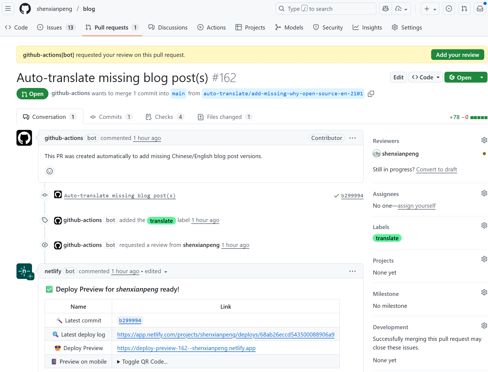

最近我在查看 Google Analytics 时发现一个有趣的现象：
我的博客（shenxianpeng.github.io）在 Google 搜索中的部分文章排名还不错，而访问者的主要语言竟然是 英文，其次才是中文。


其实原因也可以理解 —— 我之前写过[几篇质量较高的英文文章](../../en/posts)，比如 [使用 Gcov 和 LCOV 做 C/C++ 项目的代码覆盖率](../gcov-example)，吸引了不少海外读者。

但问题是，我主要写中文，偶尔写英文。要是有人想看另一种语言的版本，就得我手动翻译、复制、粘贴、预览再提交，非常繁琐。

现在有了 AI，质量高的翻译不再是难题，但如果数量一多，人工处理依旧麻烦。于是我决定借助 GitHub Actions + Gemini API 来实现自动化。

## 实现思路

整体流程很简单：

1. 当我在博客仓库提交新文章时，GitHub Actions 会被触发；
2. 工作流调用 Gemini API 自动将中文文章翻译成英文；
3. 翻译结果会被提交到一个新的分支，并自动创建一个 Pull Request (PR)；
4. Netlify 会自动部署，文章英文版就会上线供我审查；
5. 我只需要在 GitHub 上 Review，如果满意就合并到主分支；



合并后，GitHub Action 会自动部署，文章英文版就会上线。

## GitHub Actions 配置

下面是核心工作流配置：

```yaml
name: Auto Translate

on:
  push:
    paths:
      # 当我更新这个目录下的 Markdown 文件时触发翻译
      - 'content/posts/*.md'
      - 'content/misc/*.md'
  schedule:
    # 这里之所以加这个定时是为了防止漏翻译的文章
    # 每天触发是防止 Gemini API 的免费额度用完
    - cron: '0 2 * * *'
  workflow_dispatch:

jobs:
  check-and-translate:
    runs-on: ubuntu-latest
    steps:
      - name: Checkout code
        uses: actions/checkout@v5

      - name: Set up Python
        uses: actions/setup-python@v5
        with:
          python-version: '3.13'

      - name: Install dependencies
        run: make install-deps

      - name: Run translation check
        env:
          GEMINI_API_KEY: ${{ secrets.GEMINI_API_KEY }}  # 需要生成 Gemini API key，并添加到 GitHub Secrets
          GITHUB_TOKEN: ${{ secrets.GITHUB_TOKEN }}
        run: |
          # 设置 Git 用户信息
          git config --global user.name "github-actions[bot]"
          git config --global user.email "github-actions[bot]@users.noreply.github.com"
          # 执行翻译
          make translate
```

## Makefile

我用 Makefile 来管理依赖和执行逻辑：

```Makefile
# 安装依赖
install-deps:
	pip3 install -r requirements.txt

# 将中文文章翻译成英文 (需要 Gemini API key)
translate:
	python3 .github/auto_translate.py
```

## 效果

这样，我就能在专注写作的同时，让博客内容自动生成英文版本，方便更多海外读者阅读。

另外，借助免费的 Gemini API 和 Netlify，这个方案既省钱又省心。

以后我只管写中文，英文版就能自动生成。如果你也有类似需求，希望这篇文章能帮到你。

全部代码请查看 [GitHub 仓库](https://github.com/shenxianpeng/blog)。

---

转载本站文章请注明作者和出处，请勿用于任何商业用途。欢迎关注公众号「DevOps攻城狮」
