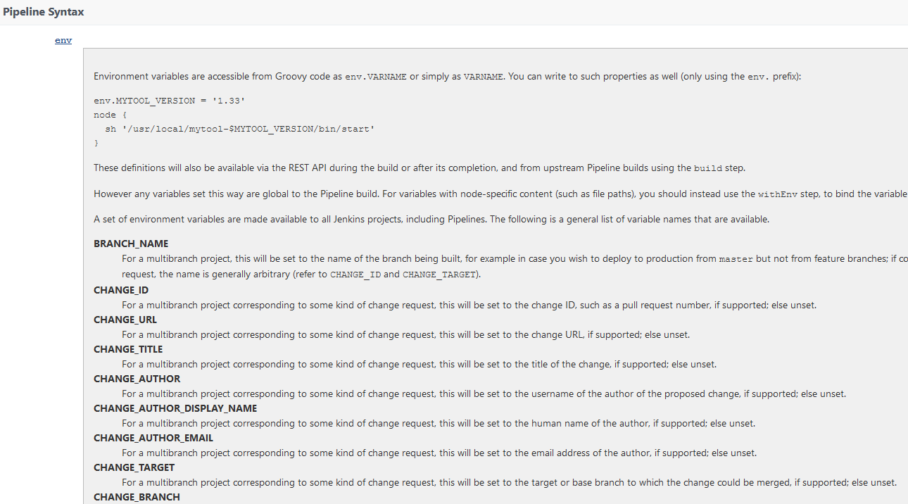
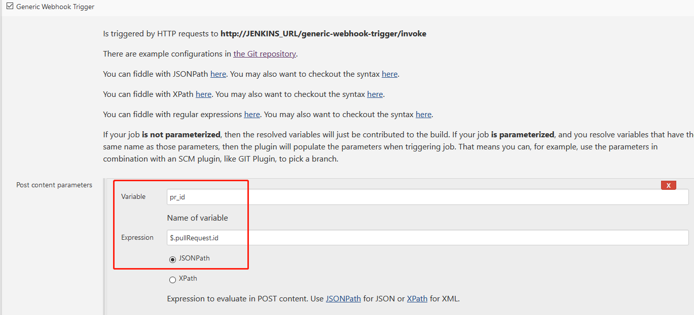
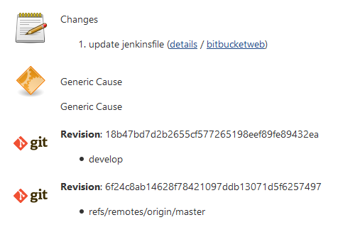
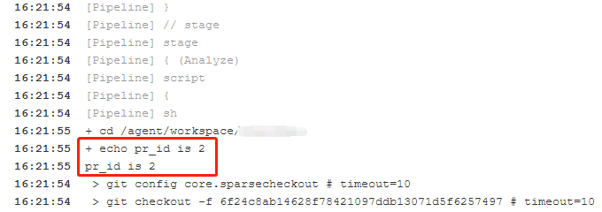

## Background

This article discusses how to obtain Git repository events (Events) using the Jenkins generic-webhook-trigger plugin.  For example, obtaining the repository's Pull Request ID.

Users familiar with Jenkins Multi-branch pipeline Jobs know that the environment variables in this Job type can provide the following Pull Request information:

To obtain this variable, you need to create this type of Job, and may need to clone the repository's code, which seems a bit overkill.

How can we obtain Bitbucket repository and Pull Request events in real time by simply creating a regular Jenkins Job? This can be achieved using the following features and plugins:

1. Configure Bitbucket's Webhook
2. Receive Webhook Event events using the Jenkins generic-webhook-trigger plugin

## Implementation Steps

### Setting up the Bitbucket Webhook

Create a webhook in the Bitbucket repository you want to monitor, as follows:

* Name: `test-demo`
* URL: `http://JENKINS_URL/generic-webhook-trigger/invoke?token=test-demo`

Note: Bitbucket has another setting. According to my tests, both this setting **Post Webhooks** and the above **Webhooks** can achieve the function described in this article.

### 2. Configuring the Jenkins Job

To obtain other Event information, such as PR title, commit, etc., please refer to this link [bitbucket-server-pull-request.feature](https://github.com/jenkinsci/generic-webhook-trigger-plugin/blob/master/src/test/resources/org/jenkinsci/plugins/gwt/bdd/bitbucket-server/bitbucket-server-pull-request.feature), and configure it according to the above settings.

The token value `test-demo` can be named arbitrarily, but it must be consistent with the token in the Bitbucket event URL.

## Testing

1. Add the following code snippet `echo pr_id is ${pr_id}` to the Jenkins Job pipeline to check if the output Pull Request ID is as expected.

2. Then create a Pull Request under the configured Bitbucket repository.

3. The Jenkins Job is automatically triggered and executed by the Pull Request Open event.

    

4. The successfully obtained Pull Request ID value can be seen in the Jenkins output log.

    

## Advanced Usage

Suppose you have a program that can receive the Pull Request ID and use the Bitbucket REST API to obtain and analyze the content of the specified Pull Request. For example, obtain the history of relevant files to determine who modified these files the most and which Jira issues were involved in this modification, thereby making recommendations for reviews or regression testing.

With this PR ID, you can automatically trigger your program to execute via Jenkins.

This method is suitable for those who do not want to or do not know how to monitor Git server (Bitbucket, GitHub, or GitLab, etc.) events and need to create a separate service. If you have any good practices, please share them in the comments.