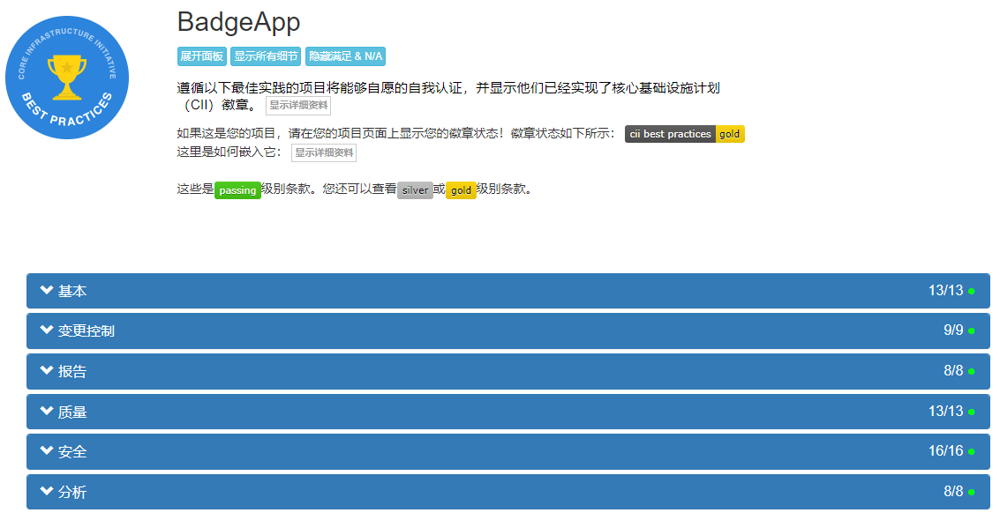
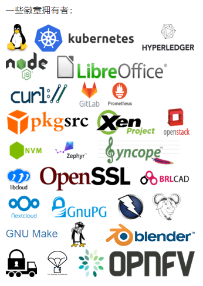

## Problem

Within an organization, different teams may use different dimensions to evaluate CI/CD maturity. This makes it difficult to measure the CI/CD performance of each team.

How can we quickly assess which projects follow best practices? How can we more easily build high-quality and secure software?  The organization needs to establish best practices discussed collaboratively by team members to help teams establish clear directions for their efforts.

## How to Assess

Here, I refer to the open-source project [CII Best Practices Badge Program](https://github.com/coreinfrastructure/best-practices-badge), an open-source project initiated by the Linux Foundation (LF). It provides best practices for Free/Libre/Open Source Software (FLOSS) projects. Projects that adhere to these best practice standards can self-certify to obtain a Core Infrastructure Initiative (CII) badge.  This is free of charge; your project can use the web application (BadgeApp) to demonstrate how it meets these practice standards and its detailed status.

These best practice standards can be used to:

* Encourage projects to follow best practices.
* Help new projects find best practices they should follow.
* Help users understand which projects follow best practices (so users can be more inclined to choose such projects).

Best practices include the following five standards: basic, change control, reporting, quality, security, and analysis.

For more details on the standards, please refer to the [CII Chinese documentation](https://hardenedlinux.github.io/2016/08/04/best-practices-criteria-for-floss-part1.html) or the [CII English documentation](https://github.com/coreinfrastructure/best-practices-badge/blob/main/doc/criteria.md).

Many well-known projects, such as [Kubernetes](https://bestpractices.coreinfrastructure.org/en/projects/569) and [Node.js](https://bestpractices.coreinfrastructure.org/en/projects/29), are using this best practice badge program.

If your project is on GitHub or you can follow the above badge program, you can use it to evaluate your project's best practices and display the badge results on your project's README.

## Customizing Best Practice Standards

If the above project does not meet your evaluation requirements, combined with my experience, the following "best practice standards" have been formulated and corresponding maturity badges have been assigned for your reference.

### Calculation Rules

1. Each best practice standard has a score; generally, the standard score is 10 points, and the important standard is 20 points.
2. Best practice standards with 🔰 indicate "must have".
3. Best practice standards with 👍 indicate "should have".
4. The range in which the sum of the best practice standard scores for each project falls determines the corresponding badge.

### Badge Score Comparison Table

| Badge  | Score | Description |
|----  | --  | -- |
| 🚩WIP | < 100 | Less than 100 points earns a 🚩Work In Progress badge |
| ✔️PASSING | = 100 | 100 points earns a ✔️PASSING badge |
| 🥈SILVER | > 100 && <= 150 | Greater than 100, less than or equal to 150 points earns a 🥈Silver badge |
| 🥇GOLD | > 150 | Greater than or equal to 150 points earns a 🥇Gold badge |

Note: This score range can be adjusted.

### Best Practice Standards and Scores

| Category    | Best Practice Standard        | Score | Description |
|----      | ----------------- | -----| ----------- |
|**Basic**  | 🔰**Build any branch** | **20** | Jenkins: Supports building any branch |
|          | 🔰**Build any PR**  | **20** | Jenkins: Supports building any Pull Request before merging |
|          | 🔰Upload artifacts        | 10 | Jenkins: Uploads build artifacts to an artifact repository for storage |
|          | 👍Containerized build      | 10  | Recommends using containerization technology to implement Pipeline |
| **Quality** | 🔰**Automated testing**   | **20** | Jenkins: Supports triggering smoke/unit/regression tests |
|          | 👍Performance testing        | 10 | Jenkins: Supports triggering performance tests |
|          | 👍Code coverage collection  | 10 | Jenkins: Supports obtaining code coverage |
| **Security** | 🔰Vulnerability scanning        | 10  |  Jenkins: Supports triggering vulnerability scans |
|          | 🔰License scanning    | 10 | Jenkins: Supports triggering license scans |
| **Analysis**  | 👍Code Lint     | 10  | Jenkins: Supports code style checking for PRs |
|          | 👍Static code analysis    | 10  | Jenkins: Supports static code analysis for PRs |
|          | 👍Dynamic code analysis    | 10  | Jenkins: Supports dynamic code analysis for PRs |
| **Reporting** | 🔰Email or Slack notifications | 10 | Supports notifications via Email or Slack |

Note: Jenkins is used as an example.

## Final Results

| No | Repository Name | Implemented Best Practice Standards | Badge |
|---| --------------- | --------- | ---- |
| 1 | project-a       | 🔰**Build any branch** 🔰**Build any PR** 🔰Upload artifacts 🔰**Automated testing** 🔰Email or Slack notifications | 🚩WIP |
| 2 | project-b       | 🔰**Build any branch** 🔰**Build any PR** 🔰Upload artifacts 🔰**Automated testing** 🔰Vulnerability scanning 🔰License scanning 🔰Email or Slack notifications | ✔️PASSING |
| 3 | project-c       | 🔰**Build any branch** 🔰**Build any PR** 🔰Upload artifacts 👍Containerized build 🔰**Automated testing** 🔰Vulnerability scanning 🔰License scanning 🔰Email or Slack notifications | 🥈SILVER |
| 4 | project-d       | 🔰**Build any branch** 🔰**Build any PR** 🔰Upload artifacts 👍Containerized build 🔰**Automated testing** 👍Performance testing 👍Code coverage collection 🔰Vulnerability scanning 🔰License scanning 👍Code Lint 👍Static code analysis 👍Dynamic code analysis 🔰Email or Slack notifications | 🥇GOLD |

## Q&A

Q: Why use badges instead of scores?\
A: Using badges better helps teams strive towards goals rather than scores.

Q: What other benefits does establishing best practice standards provide?\
A: Easier technical sharing among teams, easier building of high-quality and secure software, and maintaining a consistent high standard among teams.