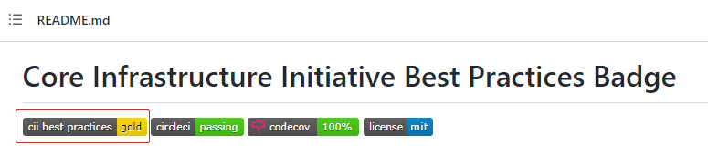

## 问题

在一个组织内，不同的团队之间可能会有不同的维度来评估 CI/CD 的成熟度。这使得对衡量每个团队的 CI/CD 的表现变得困难。

如何快速评估哪些项目遵循最佳实践？如何更容易地构建高质量的安全软件？组织内需要建立一个由团队成员一起讨论出来的最佳实践来帮助团队建立明确的努力方向。

## 如何评估

这里我参考了开源项目 [CII 最佳实践徽章计划](https://github.com/coreinfrastructure/best-practices-badge)，这是 Linux 基金会 (LF) 发起的一个开源项目。它提供一系列自由/开源软件 (FLOSS) 项目的最佳实践方法。参照这些最佳实践标准的项目可以进行自认证, 以获得核心基础设施促进会(CII)徽章。要做到这点无需任何费用，你的项目可以使用 Web 应用（BadgeApp) 来证明是如何符合这些实践标准的以及其详细状况。

这些最佳实践标准可以用来：

* 鼓励项目遵循最佳实践。
* 帮助新的项目找到那些它们要遵循的最佳实践
* 帮助用户了解哪些项目遵循了最佳实践（这样用户可以更倾向于选择此类项目）。

最佳实践包含以下五个标准：基本，变更控制，报告，质量，安全，分析。

更多关于标准的细分可以参考 [CII 中文文档](https://hardenedlinux.github.io/2016/08/04/best-practices-criteria-for-floss-part1.html) 或 [CII 英文文档](https://github.com/coreinfrastructure/best-practices-badge/blob/main/doc/criteria.md)。

已经很多知名的项目比如 [Kubernetes](https://bestpractices.coreinfrastructure.org/en/projects/569), [Node.js](https://bestpractices.coreinfrastructure.org/en/projects/29) 等在使用这个最佳实践徽章计划

如果你的项目在 GitHub 上或是你可以按照上述的徽章计划进行评估，就可以使用它来评估你项目的最佳实践，并可以在项目主页的 README 上显示徽章结果。

## 定制最佳实践标准

如果上述项目不能满足你的评估要求，结合我的实践，制定了如下“最佳实践标准”并分配了相应的成熟度徽章，供参考。

### 计算规则

1. 每个最佳实践标准都有分数，通常一般的标准是10分，重要的标准是20分
2. 带有🔰的最佳实践标准表示“一定要有”
3. 带有👍的最佳实践标准表示“应当有”
4. 每个项目的最佳实践标准分数之和落在的区间获得对应的徽章

### 徽章分数对照表

|徽章  | 分数 | 描述
|----  | --  | -- |
| 🚩WIP | < 100 | 小于100分获得 🚩Work In Progress 徽章 |
| ✔️PASSING | = 100 | 等于100分获得 ✔️PASSING 徽章 |
| 🥈SILVER | > 100 && <= 150 | 大于100，小于等于150分获得🥈银牌徽章 |
| 🥇GOLD | > 150 | 大于等于150分获得🥇金牌徽章 |

注：这个分数区间可调整。

### 最佳实践标准和分数

|类别      | 最佳实践标准        | 分数 | 描述 |
|----      | ----------------- | -----| ----------- |
|**基本**  | 🔰**构建任何分支** | **20** | Jenkins：支持任何分支构建 |
|          | 🔰**构建任何PR**  | **20** | Jenkins：支持对任何 Pull Request 在 Merge 之前进行构建 |
|          | 🔰上传制品        | 10 | Jenkins：构建产物上传到制品仓库保存 |
|          | 👍容器化构建      | 10  | 推荐使用容器化技术实现Pipeline |
| **质量** | 🔰**自动化测试**   | **20** | Jenkins：支持触发冒烟/单元/回归测试 |
|          | 👍性能测试        | 10 | Jenkins：支持触发性能测试 |
|          | 👍代码覆盖率收集  | 10 | Jenkins：支持获得代码覆盖率 |
| **安全** | 🔰漏洞扫描        | 10  |  Jenkins：支持触发漏洞扫描 |
|          | 🔰License扫描    | 10  | Jenkins：支持触发证书扫描 |
| **分析**  | 👍Code Lint     | 10  | Jenkins：支持对PR进行代码格式检查 |
|          | 👍静态代码分析    | 10  | Jenkins：支持对PR进行静态代码分析 |
|          | 👍动态代码分析    | 10  | Jenkins：支持对PR进行动态代码分析 |
| **报告** | 🔰Email或Slack通知 | 10 | 支持通过Email或Slack等方式通知 |

注：以Jenkins为例。

## 最终的结果

|No | Repository Name | 实现的最佳实践标准 |徽章 |
|---| --------------- | --------- | ---- |
| 1 | project-a       | 🔰**构建任何分支** 🔰**构建任何PR** 🔰上传制品 🔰**自动化测试** 🔰Email或Slack通知 | 🚩WIP |
| 2 | project-b       | 🔰**构建任何分支** 🔰**构建任何PR** 🔰上传制品 🔰**自动化测试** 🔰漏洞扫描 🔰License扫描 🔰Email或Slack通知 | ✔️PASSING |
| 3 | project-c       | 🔰**构建任何分支** 🔰**构建任何PR** 🔰上传制品 👍容器化构建 🔰**自动化测试** 🔰漏洞扫描 🔰License扫描 🔰Email或Slack通知 | 🥈SILVER |
| 4 | project-d       | 🔰**构建任何分支** 🔰**构建任何PR** 🔰上传制品 👍容器化构建 🔰**自动化测试** 👍性能测试 👍代码覆盖率收集 🔰漏洞扫描 🔰License扫描 👍Code Lint 👍静态代码分析 👍动态代码分析 🔰Email或Slack通知 | 🥇GOLD |

## Q&A

Q: 为什么使用徽章而不是分数？\
A: 使用徽章能更好的帮助团队朝着目标而不是分数努力。

Q: 建立最佳实践标准还有哪些帮助？\
A: 团队之间容易进行技术共享，更容易地构建高质量的安全软件，保持团队之间在统一的高水准。
