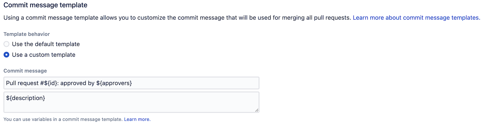
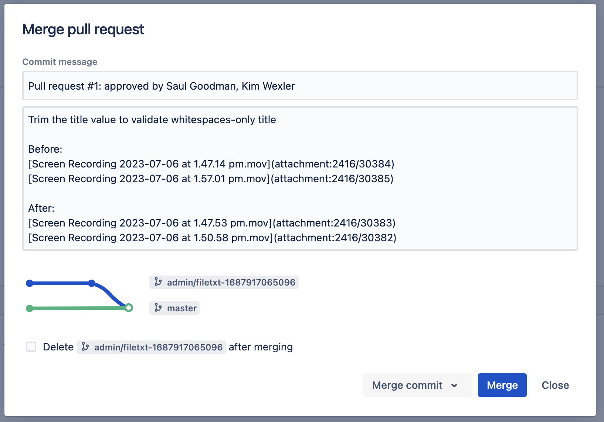

## Background

Recently, I had a discussion with colleagues about a seemingly simple yet crucial issue:

**How can we ensure that valuable information in PRs isn't lost over time and with changes in tools?**

While we currently use Bitbucket for collaborative development, we might migrate to GitHub, GitLab, or other platforms in the future.  **These hosting platforms may change, but Git itself, as the core record of code history, is likely to remain for a long time.**

This leads to the problem:

> PR page descriptions of change context, solutions, and key discussions, if only stored within the PR tool, are likely to "disappear" after platform migration. This information should be part of the commit message.

## Solutions We Considered:

1. **Manually recording the solution in `git commit -m`** — but this is easily overlooked or incomplete.
2. **Mimicking pip projects using a `NEWS` file** to record each change — while this preserves information, it's more suitable for generating release notes than recording the motivation or reasons for a change.
3. **Mandating that members write the content in Jira tickets** — this creates tool silos and hinders quick understanding of history within the code context.

Ultimately, we decided to: **Use Bitbucket's Commit Message Templates feature to directly write the PR description into the Git commit.**

## Bitbucket's Commit Message Templates Feature

Bitbucket supports automatically generating commit messages when merging PRs, allowing useful information to be inserted via templates.  The documentation is available here:
🔗 [Pull request merge strategies - Bitbucket Server](https://confluence.atlassian.com/bitbucketserver0819/pull-request-merge-strategies-1416826109.html)

> I've also seen similar functionality in GitLab, but GitHub seems to lack this feature.
>
> See the [GitLab Commit Templates official documentation](https://docs.gitlab.com/user/project/merge_requests/commit_templates/)

You can use the following variables in the template:

| Variable Name                             | Description          |
| --------------------------------- | ------------- |
| `title`                           | PR Title       |
| `id`                              | PR ID         |
| `description`                     | PR Description       |
| `approvers`                       | Current Approved Reviewers |
| `fromRefName` / `toRefName`       | Source / Target Branch Name  |
| `fromProjectKey` / `toProjectKey` | Source / Target Project      |
| `fromRepoSlug` / `toRepoSlug`     | Source / Target Repository      |
| `crossRepoPullRequestRepo`        | Source repository information for cross-repository PRs |

## How We Used It?

In Bitbucket's repository settings, you can configure the PR merge commit template. Find the settings:

Repository settings -> Merge strategies -> Commit message template

After configuration, when you merge a PR, Bitbucket will automatically write the PR title, description, and related ID into the final merge commit message.

This way, regardless of whether the team continues to use Bitbucket in the future, **key PR information will forever be preserved in Git history.**

Here are the actual results:

📥 Template Configuration Interface:

📤 Final Generated Git commit message:

## Summary

This small change helps us procedurally protect the context of code changes. It prevents PRs from being "temporary information containers" and instead makes them a natural part of Git history.

If you're also using Bitbucket, give this feature a try.

Let Git commit messages be not just code submissions, but records of decisions and evolution.

---

Please indicate the author and source when reprinting this article, and do not use it for any commercial purposes. Welcome to follow the WeChat official account "DevOps攻城狮"