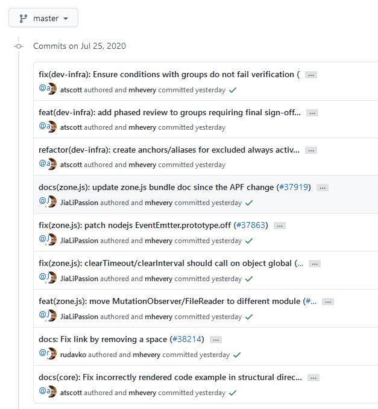

## Why Establish Conventions

The old saying goes, "No rules, no circle."  In team collaborative development, everyone writes commit messages when submitting code, but without conventions, everyone will have their own writing style. Therefore, when reviewing the git log, you often see a variety of styles, which is very unfavorable for reading and maintenance.

Let's look at the comparison between no conventions and conventions through the following two examples, and what benefits conventions can bring.

### Commit Messages—Unconventional vs. Conventional


From this commit message, you don't know what he modified or the intention of the modification.




This is the Angular commit message, which follows [Conventional Commits](https://www.conventionalcommits.org/en/v1.0.0/).

This is the most widely used Git commit message convention in the industry, and many projects are already using it. If your project has not yet established a Git commit message convention, it is recommended to copy or refer to this convention.

For a team, when many people work together on a project, establishing a commit message convention in advance is very helpful for the long-term development of the project and the subsequent addition and maintenance of personnel.

The benefits are summarized as follows:

1. Helps others better understand your change intentions, making it easier to contribute/modify code.
2. Structured commit messages facilitate the identification of automation scripts and CI/CD.
3. Provides the ability to automatically generate `CHANGELOGs`.
4. Finally, this also reflects a programmer's self-cultivation.

### Branch Creation—Unconventional vs. Conventional

If there is no convention for creating branches and no restrictions are imposed, many branches will look like this: `ABC-1234-Test`, `ABC-2345-demo`, `Hotfix-ABC-3456`, `Release-1.0`, or even worse. When there are many branches, it will appear chaotic and inconvenient to search.

If branch creation conventions are established, for example, the branches above must start with a type through a Hook during creation, then the newly created branches will look like this: `bugfix/ABC-1234`, `feature/ABC-2345`, `hotfix/ABC-3456`, `release/1.0`. This not only helps with retrieval but also allows others to understand the purpose of the branch through the type and facilitates the development of subsequent CI/CD pipelines.

## How to Solve Convention Issues

We should proceed from two aspects:

* First, establish commit message and branch creation conventions for the team, letting team members understand and follow the conventions.
* Then, when submitting code or creating branches, use Git Hooks to prevent unconventional submissions to the remote repository.

### Establishing Git Commit Message Conventions

The most effective way to establish reasonable conventions is to refer to whether there are common conventions in the software industry. Currently, the most widely used convention in the industry is [Conventional Commits](https://www.conventionalcommits.org/en/v1.0.0/), which is used by many projects, including Angular.

You can formulate conventions suitable for your team based on the above conventions, for example:

```text
JIRA-1234 feat: support for async execution

^-------^ ^--^: ^-------------------------^
|         |     |
|         |     +--> Summary in present tense.
|         |
|         +--> Type: feat, fix, docs, style, refactor, perf, test or chore.
|
+--> Jira ticket number

Type Must be one of the following:

    feat: A new feature
    fix: A bug fix
    docs: Documentation only changes
    style: Changes that do not affect the meaning of the code (white-space, formatting, missing semi-colons, etc)
    refactor: A code change that neither fixes a bug nor adds a feature
    perf: A code change that improves performance
    test: Adding missing or correcting existing tests
    chore: Changes to the build process, .gitignore or auxiliary tools and libraries such as documentation generation, etc.
```

## Setting Up Git Hooks

Here, Bitbucket is used as an example. Other Git tools such as GitHub and Gitlab have similar functions.

Bitbucket uses the [Yet Another Commit Checker](https://mohamicorp.atlassian.net/wiki/spaces/DOC/pages/1442119700/Yet+Another+Commit+Checker+YACC+for+Bitbucket) free plugin.

First, enable Yet Another Commit Checker.


Then, let's introduce some commonly used settings of Yet Another Commit Checker one by one.


### 1. Enable Require Valid JIRA Issue(s)

Enabling this function automatically verifies the existence of a Jira issue number during commit message submission through a Hook. If not, the submission fails. This forces the association of the commit message with the Jira issue number when submitting code.

### 2. Commit Message Regex

For example, setting a simple regular expression like `[A-Z\-0-9]+ .*` requires that the Jira issue number must start with this format `ABCD-1234`, and there must be a space between the description and the Jira issue number.

With the above settings, the commit message will be limited to the following format:

```text
ABCD-1234 Balabala......
```

For example, this more complex regular expression:

```text
^[A-Z-0-9]+ .*(?<type>chore|ci|docs|feat|fix|perf|refactor|revert|style|test|Bld|¯\\_\(ツ\)_\/¯)(?<scope>\(\w+\)?((?=:\s)|(?=!:\s)))?(?<breaking>!)?(?<subject>:\s.*)?|^(?<merge>Merge.* \w+)|^(?<revert>Revert.* \w+)
```

This regular expression not only limits the beginning to a JIRA issue number followed by a space, but also requires the `type` to be filled in the description information, and finally the description information. It also supports different descriptions for Merge or Revert.

Use the following test cases to specifically understand what kind of commit message convention restrictions the above regular expression will produce.

```text
# Test cases that pass
NV-1234 chore: change build progress
DT-123456 docs: update xdemo usage
QA-123 ci: update jenkins automatic backup
CC-1234 feat: new fucntional about sync
Merge branch master into develop
Reverted: Revert support feature & bugfix branches build
Merge pull request from develop to master

# Test cases that fail
NV-1234 build: update
NV-1234 Chore: change progress
DT-123456 Docs: update xdemo
QA-123ci: update jenkins automatic backup
CC-1234 Feat: new fucntional about sync
DT-17734: 8.2.2 merge from CF1/2- Enhance PORT.STATUS
DT-17636 fix AIX cord dump issue
DT-18183 Fix the UDTHOME problem for secure telnet
DT-18183 Add new condition to get UDTHOME
DT-15567 code merge by Xianpeng Shen.
```

Test results can also be found here: https://regex101.com/r/5m0SIJ/10.

Suggestion: If you also want to set such a strict and complex regular expression in your Git repository, it is recommended to consider and test it thoroughly before officially putting it into your Git repository's Hook settings.

### 3. Commit Regex Error

This setting is used to prompt error messages. When a team member submits a message that does not conform to the specifications and the submission fails, a reasonable prompt message will be given, which helps to find the problem. For example, if the submission fails, the following information will be seen on the command line:

```text
Commit Message Specifications:

<Jira-ticket-number> <type>: <Description>

Example:

ABC-1234 feat: Support for async execution

1. Between Jira ticket number and type MUST has one space.
2. Between type and description MUST has a colon and a space.

Type MUST be one of the following and lowercase

feat: A new feature
fix: A bug fix
docs: Documentation only changes
style: Changes that do not affect the meaning of the code (white-space, formatting, missing semi-colons, etc)
refactor: A code change that neither fixes a bug nor adds a feature
perf: A code change that improves performance
test: Adding missing or correcting existing tests
chore: Changes to the build process, .gitignore or auxiliary tools and libraries such as documentation generation, etc.
```

Based on this description information, the submitter can easily know what the correct convention looks like, and then modify their last commit message using the `git commit --amend` command.

### 4. Branch Name Regex

This is a convention restriction for creating branches. After setting the corresponding regular expression, developers can only push branches that meet the conditions of the regular expression to the remote repository.

For example, this branch creation regular expression: `^(bugfix|feature|release|hotfix).*|(master)|(.*-dev)`

This restricts all branches to start with `bugfix`, `feature`, `release`, `hotfix`, or types like `v1.0-dev`.

You can design a branch regular expression for your project based on the above regular expression.

### 5. Branch Name Regex Error

This setting is to prompt for errors when pushing unconventional branches. Pre-setting the corresponding error prompt information helps users quickly find the reason for the push failure. For example, the following error message:

```text
Branches must begin with these types: bugfix/ feature/ release/ hotfix/
```

Tells the user that the branch must start with `bugfix/`, `feature/`, `release/`, `hotfix/`.

### 6. Other Settings

There are also some other settings, such as the status of the associated Jira issue. This prevents developers from secretly submitting code to already closed Jira issues, which may cause untested code to enter the repository.

There are also Require Matching Committer Email and Require Matching Committer Name to limit developers to configure usernames and emails that match their login usernames and emails to standardize the usernames and emails displayed in commit information, and to facilitate the collection of subsequent data such as Git information statistics.


## References

> Conventional Commits https://www.conventionalcommits.org/en/v1.0.0/ \
> Angular Commit Guidelines: https://github.com/angular/angular.js/blob/master/DEVELOPERS.md#commits \
> Projects Using Conventional Commits: https://www.conventionalcommits.org/en/v1.0.0/#projects-using-conventional-commits \
> Yet Another Commit Checker: https://mohamicorp.atlassian.net/wiki/spaces/DOC/pages/1442119700/Yet+Another+Commit+Checker+YACC+for+Bitbucket
