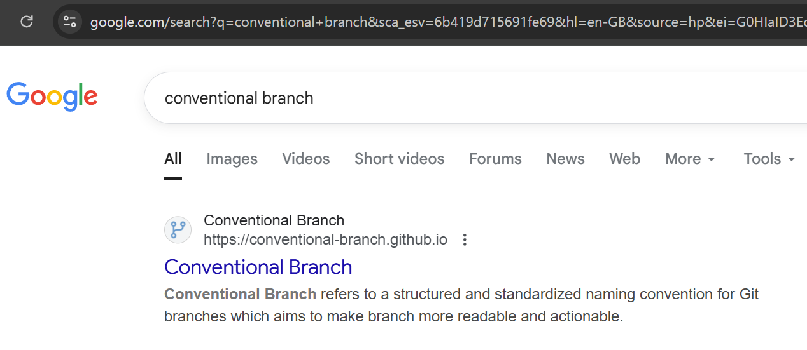
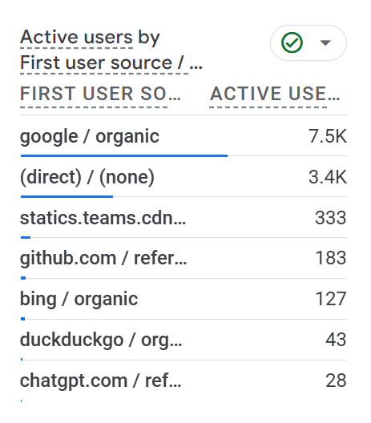

This time last year, I published the [Conventional Branch specification](../conventional-branch).

Over the past year, the community response has been enthusiastic, with more and more teams adopting this specification to manage their Git branches.

For example, when searching "Conventional Branch" on Google, the specification page was ranked first in search results for a long time.

According to Google Analytics data, over the past year, the specification homepage (**https://conventional-branch.github.io/**) has accumulated over 12K visits, with widespread adoption beginning earlier this year.

Currently, **the Conventional Branch specification has been translated into multiple languages**, including Chinese and Portuguese.

Based on access data, users are distributed globally, with particularly active usage in **the United States, Brazil, France, the United Kingdom, Germany, Russia, and Japan**.

However, there are some regrets: despite China's large IT workforce, the number of visits is relatively limited, possibly due to the inconvenience of using Google Search and GitHub within the country.

Today, the Conventional Branch specification is quite mature and frequently appears alongside Conventional Commits in the Contribution Guides of many open-source projects, helping developers better manage branches and commits.

Going forward, I hope it will be adopted in more projects and continue to improve multilingual support, benefiting more developers.

👉 If you also find this specification valuable, please like and share it to let more people know about it.
Also, feel free to try it in your projects or suggest improvements, and let's work together to make Git branch management simpler and more efficient.

---

Please indicate the author and source when reprinting this article, and do not use it for any commercial purposes.  Follow the WeChat Official Account "DevOps攻城狮" for more updates.