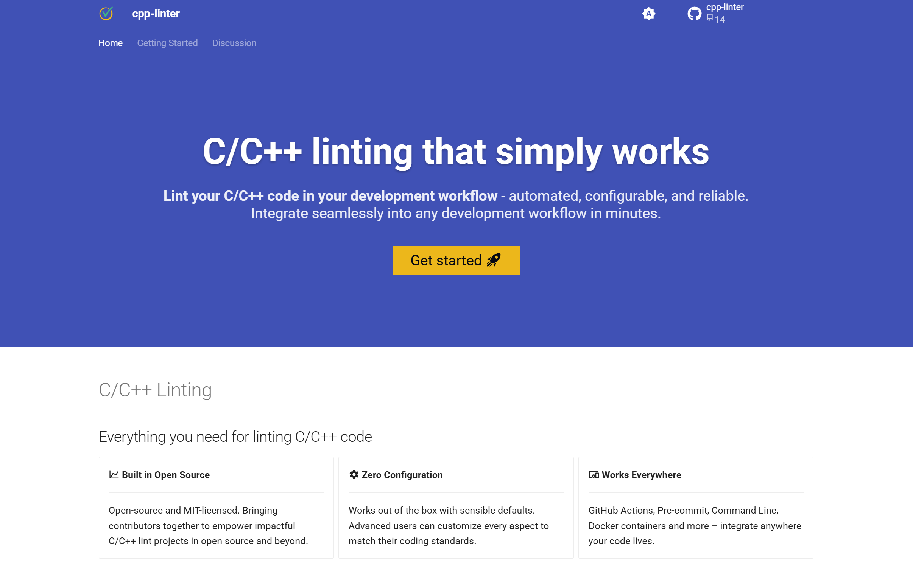
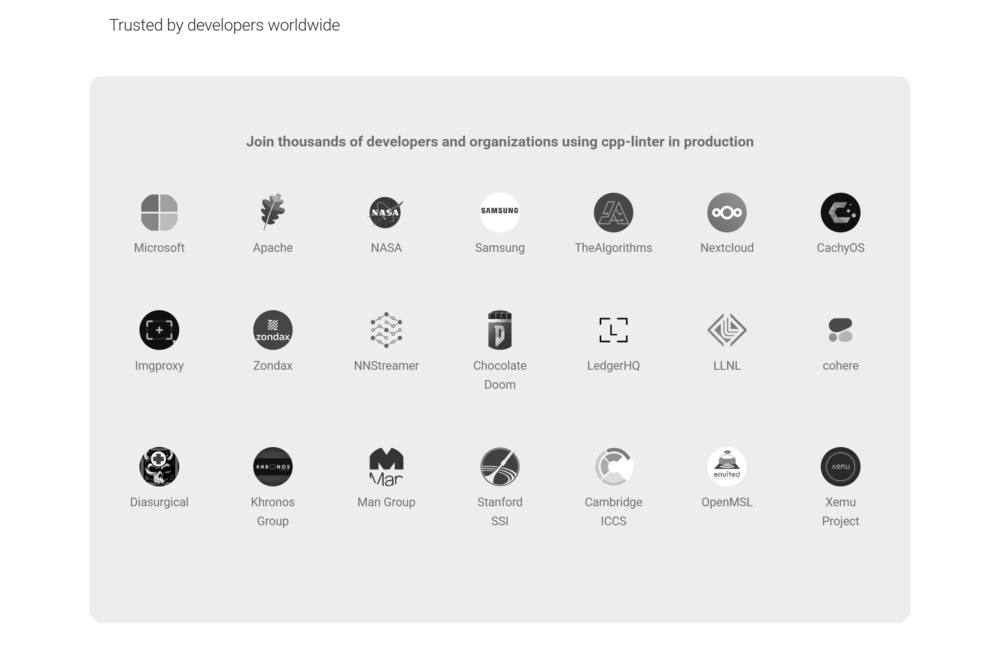
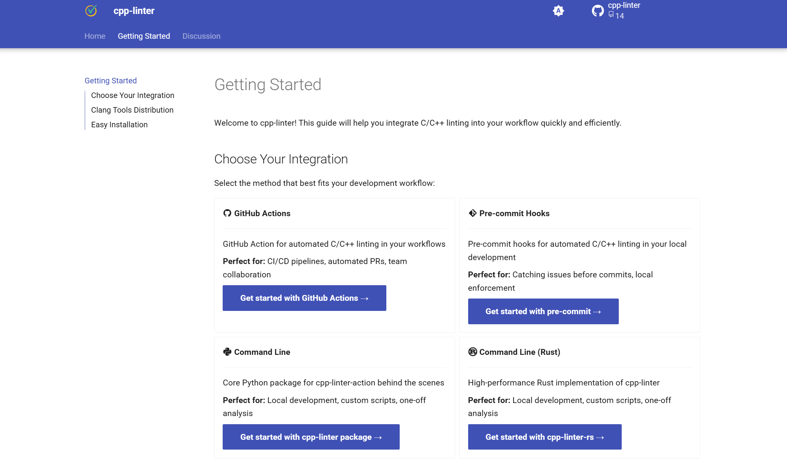

As cpp-linter enters its 4th year of maintenance, we have also created quite a few related projects and tools. However, up until now, we've only provided a simple introduction on the GitHub organization's homepage.

But for users, this is clearly not friendly enough. Additionally, a website can integrate Google Analytics for traffic analysis, helping us better understand user needs and behaviors.

Therefore, I decided to create an official website to more systematically introduce cpp-linter related projects and tools.

After several evenings of effort, cpp-linter's official website is finally live: https://cpp-linter.github.io/

Without further ado, let's look at the pictures!

## Homepage

The homepage is generally concise, highlighting the tool entry points.

The homepage also showcases renowned organizations and open-source communities that use our projects.

This includes industry giants like Microsoft, Samsung, and Apache, as well as top research institutions such as NASA, Stanford University, Cambridge University, and even Lawrence Livermore National Laboratory.

This makes me very proud and encouraged!

How to quickly use cpp-linter's projects and tools.

## Get Started Page

Lists all related projects and tools, providing brief introductions and links.

## Discussion Page

Finally, there's the discussion section, inviting users to participate in discussions and exchanges.

## Why This Design?

Many projects under our previous cpp-linter organization already had online documentation, mostly built using [GitHub Pages](https://pages.github.com/) + [MkDocs](https://www.mkdocs.org/) + [Material for MkDocs](https://squidfunk.github.io/mkdocs-material/).

To maintain a consistent style, the cpp-linter.github.io official website also uses mkdocs-material as its theme.

Overall, I am very satisfied with the final result, which has largely met the original goals.

## Tip

If you also want to build a website, it's best to first find a theme you like. A suitable theme can better carry and express your content, thus achieving the desired effect.

For this website, for example, I referenced the designs of some excellent open-source project official websites, such as astral.sh and mkdocs-material's official website.

Of course, it's not a direct copy, but rather learning from their **design concepts, layout methods, and classification logic**.

## Conclusion

When working on open-source projects, it's not enough to just have good code; good documentation and a good website are also essential. This allows more people to discover and use your project.

Everyone is welcome to use cpp-linter related projects and tools — providing you with a one-stop **C/C++ code formatting and static analysis solution**.

If you have any suggestions or feedback, feel free to submit an Issue or participate in Discussions!

If you found this article helpful, please share it with your C/C++ developer friends.

---

Please cite the author and source when reproducing articles from this site. Do not use for any commercial purposes. Welcome to follow the official account "DevOps攻城狮"