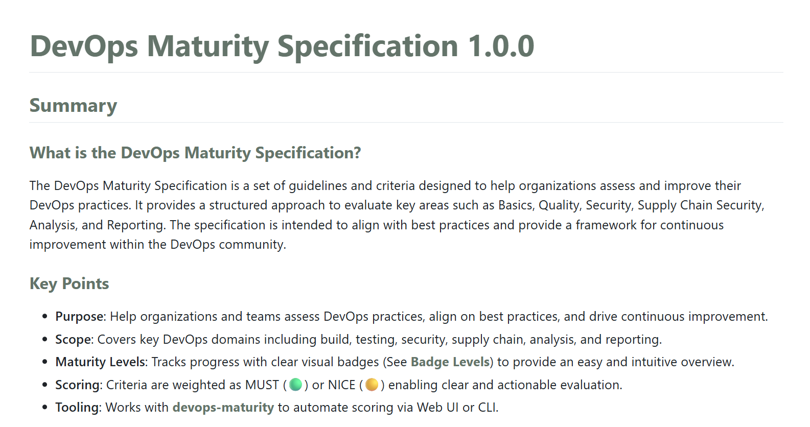
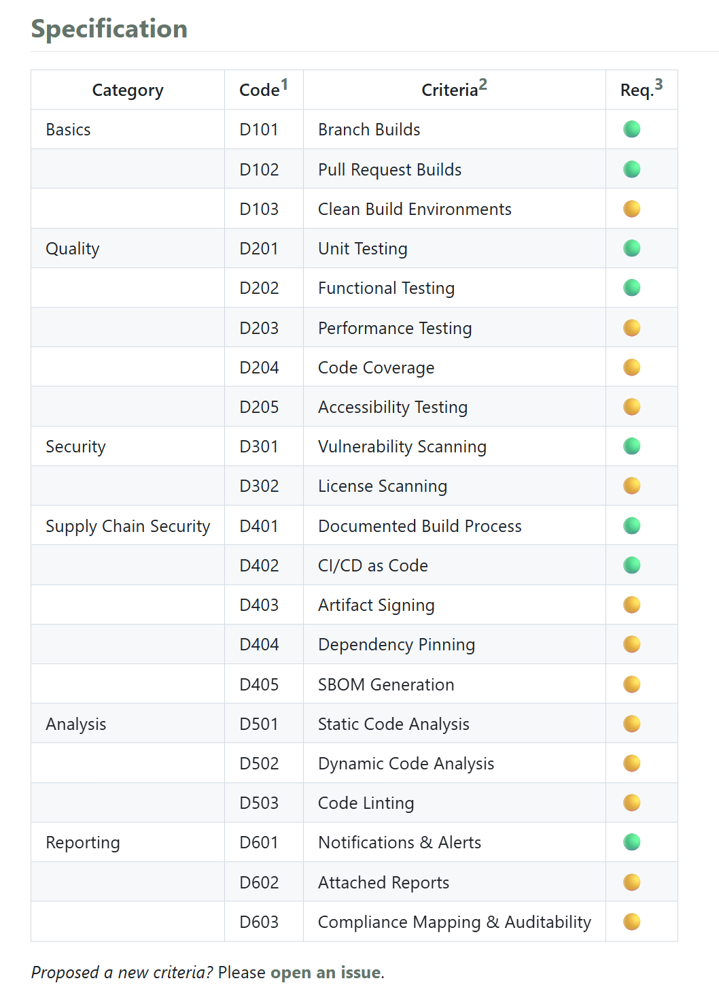
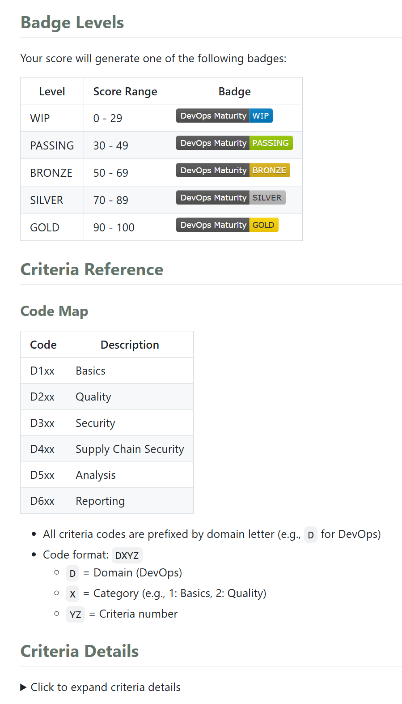

In daily work, we often talk about the buzzword **DevOps**.
But have you ever wondered:

* What is our team's actual DevOps maturity?
* How do we measure if one group is doing well and another needs improvement?
* Is there a unified standard for assessment?

Based on these questions, **we need a DevOps maturity model** to help teams better evaluate and improve their practices.

But the assessment method itself is worth considering.
If you just write a wiki or send out an Excel sheet for everyone to fill in, this "primitive" approach is not only inefficient, but also hard to track and accumulate results.

Thus, an open source project—**DevOps Maturity**—was born.

## DevOps Maturity Specification

This specification is based on the [DevOps Maturity Model](https://axify.io/blog/devops-maturity-model) and [Google DORA](https://cloud.google.com/devops), combined with real-world implementation.

It defines the **characteristics and metrics** of different maturity levels, so teams clearly know:

* What stage are we currently at?
* What should we improve next?

Key points:

The specification covers **basics, quality, security, supply chain security, analytics and reporting**, with actionable assessment items for each part:

For results, instead of complex percentages or scores, we use **badge levels** to motivate teams to keep improving:

More details can be found on the official site 👉 https://devops-maturity.github.io/en/

## DevOps Maturity Assessment Tool

With standards and specifications, we also need a tool for practical implementation.

So I developed the [DevOps Maturity Assessment Tool](https://github.com/devops-maturity/devops-maturity), available in both Web and CLI versions.

Assessment results are stored in a SQLAlchemy database and can be viewed and analyzed via Web or CLI.

CLI example:

CLI video:

<iframe width="560" height="315" src="https://www.youtube.com/embed/RZJtcynyC08?si=Zw_Yc2YMa_R6SfCi" title="YouTube video player" frameborder="0" allow="accelerometer; autoplay; clipboard-write; encrypted-media; gyroscope; picture-in-picture; web-share" referrerpolicy="strict-origin-when-cross-origin" allowfullscreen></iframe>

Web video:

<iframe width="560" height="315" src="https://www.youtube.com/embed/BGpz0iP61c4?si=XXJJT5Gq5adHdF8D" title="YouTube video player" frameborder="0" allow="accelerometer; autoplay; clipboard-write; encrypted-media; gyroscope; picture-in-picture; web-share" referrerpolicy="strict-origin-when-cross-origin" allowfullscreen></iframe>

## Five Highlights

The DevOps Maturity project has five key highlights:

1. **Standardized Assessment**: Based on industry-proven models, providing clear standards and metrics.
2. **Open Source Tools**: Web and CLI options for easy use and integration.
3. **Visualized Results**: Intuitive interfaces to quickly understand your team's status.
4. **Continuous Improvement**: Badge level incentives encourage ongoing DevOps practice improvement.
5. **Customizable Extension**: Users can customize assessment items and metrics as needed, e.g., by editing [`criteria.yaml`](https://github.com/devops-maturity/devops-maturity/blob/main/src/config/criteria.yaml), without changing a single line of code to generate a unique assessment scheme.

DevOps Maturity Enterprise Edition is also in development, with more enterprise features and support coming soon!

## Join Us

DevOps Maturity is officially released—everyone is welcome to:

* Adopt it
* Share feedback
* Suggest improvements
* Contribute code

All of these are the greatest support for open source 🙌

If you find it valuable, please give a ⭐ [Star](https://github.com/devops-maturity/devops-maturity) to help more people discover and benefit from it.
