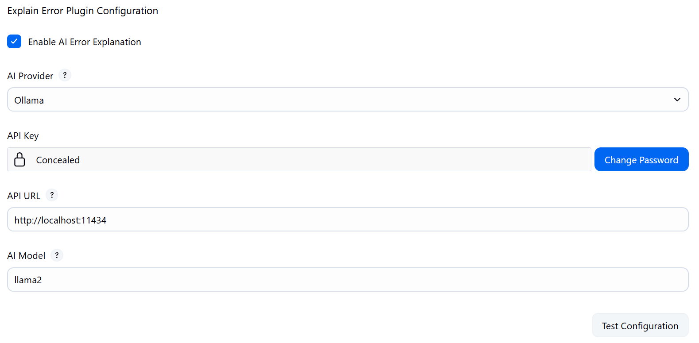

I previously released the [Jenkins Explain Error Plugin](https://plugins.jenkins.io/explain-error/), which allows Jenkins users to analyze and resolve build errors faster with the help of AI.

Recently, some friends asked: **Can it support local models, such as Ollama?**

The answer is: It's happening!

Today, I'm excited to announce: The Explain Error Plugin now supports Ollama models! 🎉

## The Power of the Community

This update, in fact, wouldn't have been possible without the community's drive.
While I was still validating user needs, a Jenkins community member directly contributed a PR—introducing [**langchain4j**](https://github.com/langchain4j/langchain4j), enabling the plugin to extend support for more models, including Ollama.

Even more surprisingly, this contributor turned out to be the **co-founder and CEO** of a Dutch company.
This once again made me feel the charm of the open-source community: **Needs + Contributions = Better Tools**.

Configuration in future versions will also be simpler; users will no longer need to fill in complex API URLs, they can just select the model and use it.

New Version Update Highlights

*   ✨ **Added support for Ollama models**
*   ✨ **Introduced langchain4j**, making it easier to extend more AI models in the future
*   ✨ **Simpler configuration**, no need to manually enter API addresses

## How to Enable Ollama

1.  Upgrade to the latest version of Explain Error Plugin in Jenkins Plugin Manager.
2.  Open: Manage Jenkins → Configure System → Explain Error Plugin Configuration
3.  Select Ollama from the dropdown, fill in the corresponding API address (required for local models) and key.
    
4.  Click Test Configuration to confirm the connection is normal, then you can start using it!

## Why Is It Worth Trying?

*   Local model support: No worries about cloud data leakage
*   One-click build error analysis: Quickly pinpoint issues with AI, saving troubleshooting time
*   Community-driven: Features stem from real needs and contributions

Whether you are an individual developer or an enterprise team, the Explain Error Plugin can make your CI/CD process smarter and more efficient.

## Finally

If you have any thoughts or questions during use, feel free to:

*   Submit an issue on GitHub
*   Leave a comment in the comments section

If you find this [plugin](https://plugins.jenkins.io/explain-error/) helpful, please give it a **Star** ⭐️!

This will not only help more Jenkins users discover it but also motivate me to continue optimizing and expanding its features.

If you find this article helpful, feel free to share it with your friends who use Jenkins.

---

When reprinting articles from this site, please credit the author and source, and do not use for any commercial purposes. Welcome to follow the official WeChat account "DevOps Engineer".
