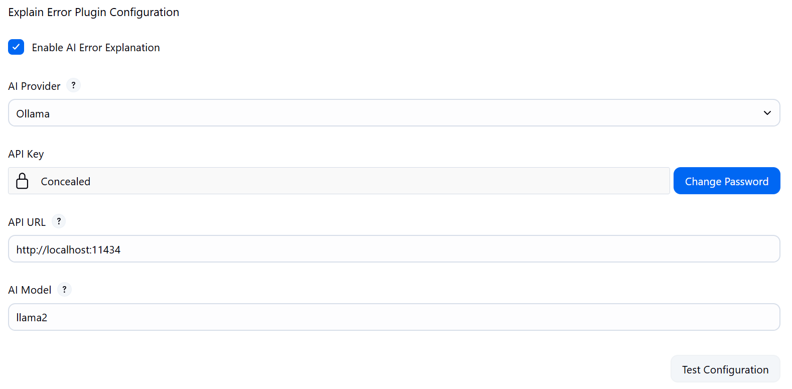

之前我发布了 [Jenkins Explain Error Plugin](https://plugins.jenkins.io/explain-error/)，它能让 Jenkins 用户借助 AI 更快地分析和解决构建错误。

这几天，有朋友问：**能不能支持本地模型，比如 Ollama？**

答案是：安排上！✔️

今天，我很高兴地宣布：Explain Error Plugin 已经支持 Ollama 模型！ 🎉

## 来自社区的力量

这次更新，其实离不开社区的推动。
当我还在验证用户需求时，一位 Jenkins 社区成员直接贡献了 PR ——引入 [**langchain4j**](https://github.com/langchain4j/langchain4j)，让插件能够扩展支持更多模型，包括 Ollama。

更令人惊讶的是，这位贡献者竟然是某荷兰公司的 **联合创始人兼 CEO**。
这让我再次感受到开源社区的魅力：**需求 + 贡献 = 更好的工具**。

未来版本的配置也会更简单，用户无需再填写复杂的 API URL，直接选择模型就能用了。

新版本更新点

* ✨ **新增支持 Ollama 模型**
* ✨ **引入 langchain4j**，后续扩展更多 AI 模型更方便
* ✨ **配置更简洁**，无需再手动填写 API 地址

## 如何启用 Ollama

1. 在 Jenkins 插件管理器中升级到最新版本 Explain Error Plugin。
2. 打开：Manage Jenkins → Configure System → Explain Error Plugin Configuration
3. 在下拉框中选择 Ollama，填写对应的 API 地址（本地模型需要地址）和密钥。
  
4. 点击 Test Configuration 确认连接正常，即可使用！

## 为什么值得一试？

* 本地模型支持：不用担心云端数据泄露
* 一键分析构建错误：借助 AI 快速定位问题，节省排错时间
* 社区驱动：功能来自真实需求和贡献

无论是个人开发者还是企业团队，Explain Error Plugin 都能让你的 CI/CD 流程更加智能、高效。

## 最后

如果你在使用过程中有任何想法或问题，欢迎：

* 在 [GitHub](https://github.com/jenkinsci/explain-error-plugin) 提交 issue
* 在评论区留言交流

👉 如果觉得这个插件对你有帮助，请点个 **Star** ⭐️！

这不仅能帮更多 Jenkins 用户发现它，也能激励我继续优化和扩展功能。

---

转载本站文章请注明作者和出处，请勿用于任何商业用途。欢迎关注公众号「DevOps攻城狮」
