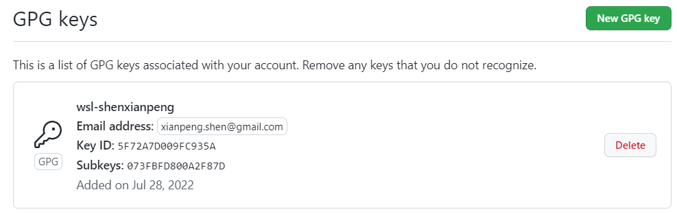

### 1. 查看现有 GPG 密钥

```bash
# 如果文件夹不存在会自动创建
$ gpg --list-keys
gpg: directory '/home/ubuntu/.gnupg' created
gpg: keybox '/home/ubuntu/.gnupg/pubring.kbx' created
gpg: /home/ubuntu/.gnupg/trustdb.gpg: trustdb created

$ gpg --list-key
```

---

### 2. 生成 GPG 密钥

```bash
$ gpg --gen-key
gpg (GnuPG) 2.2.19; Copyright (C) 2019 Free Software Foundation, Inc.
This is free software: you are free to change and redistribute it.
There is NO WARRANTY, to the extent permitted by law.

Note: Use "gpg --full-generate-key" for a full featured key generation dialog.

GnuPG needs to construct a user ID to identify your key.

Real name: shenxianpeng
Email address: xianpeng.shen@gmail.com
You selected this USER-ID:
    "shenxianpeng <xianpeng.shen@gmail.com>"

Change (N)ame, (E)mail, or (O)kay/(Q)uit? O
...
gpg: key 5F72A7D009FC935A marked as ultimately trusted
...
public and secret key created and signed.

pub   rsa3072 2022-07-28 [SC] [expires: 2024-07-27]
      F0F32CB8C65536ECE0187EAD5F72A7D009FC935A
uid                      shenxianpeng <xianpeng.shen@gmail.com>
sub   rsa3072 2022-07-28 [E] [expires: 2024-07-27]
```

---

### 3. 导出公钥内容

```bash
# 使用邮箱导出
gpg --armor --export xianpeng.shen@gmail.com
# 或使用公钥 ID 导出
gpg --armor --export F0F32CB8C65536ECE0187EAD5F72A7D009FC935A

# 输出为公钥内容
```

---

### 4. 将公钥添加到 GitHub

打开 GitHub，进入：
**Settings → SSH and GPG keys → New GPG key**
粘贴刚才导出的公钥内容。



---

完成后，当你使用命令提交：

```bash
git commit -S -m "Your commit message"
```

GitHub 会显示 **Verified** 签名标识：


---

转载本文请注明作者与出处，禁止商业用途。欢迎关注公众号「DevOps攻城狮」。
