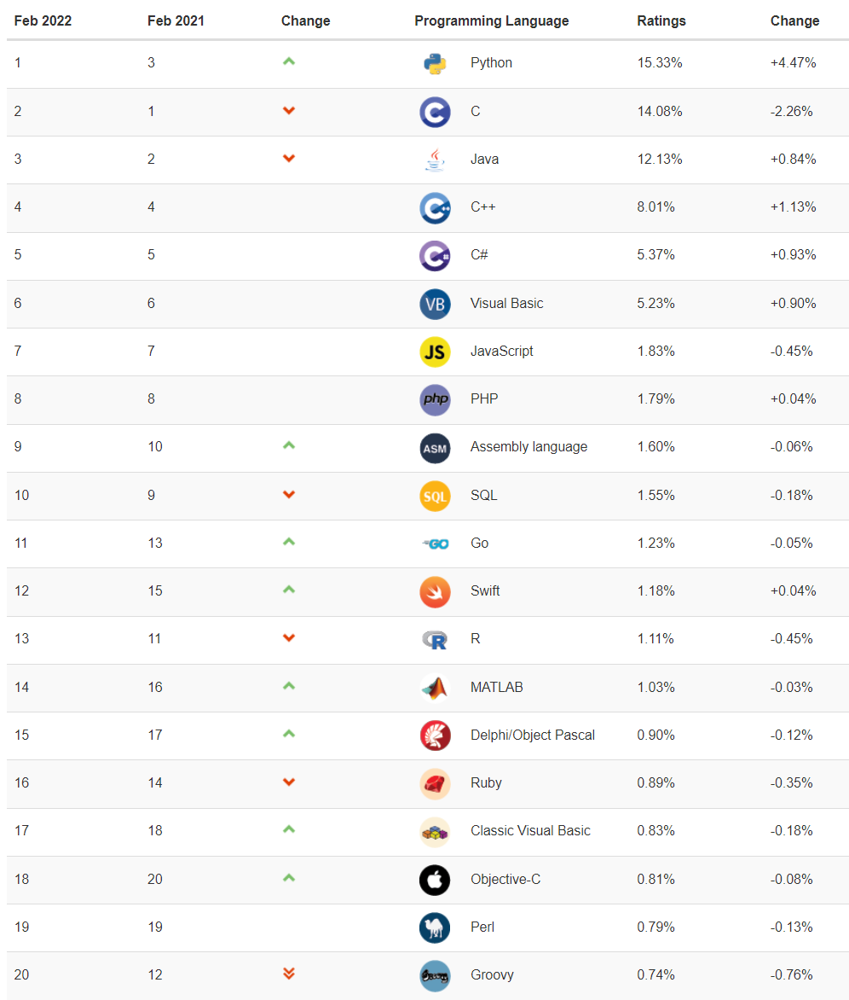
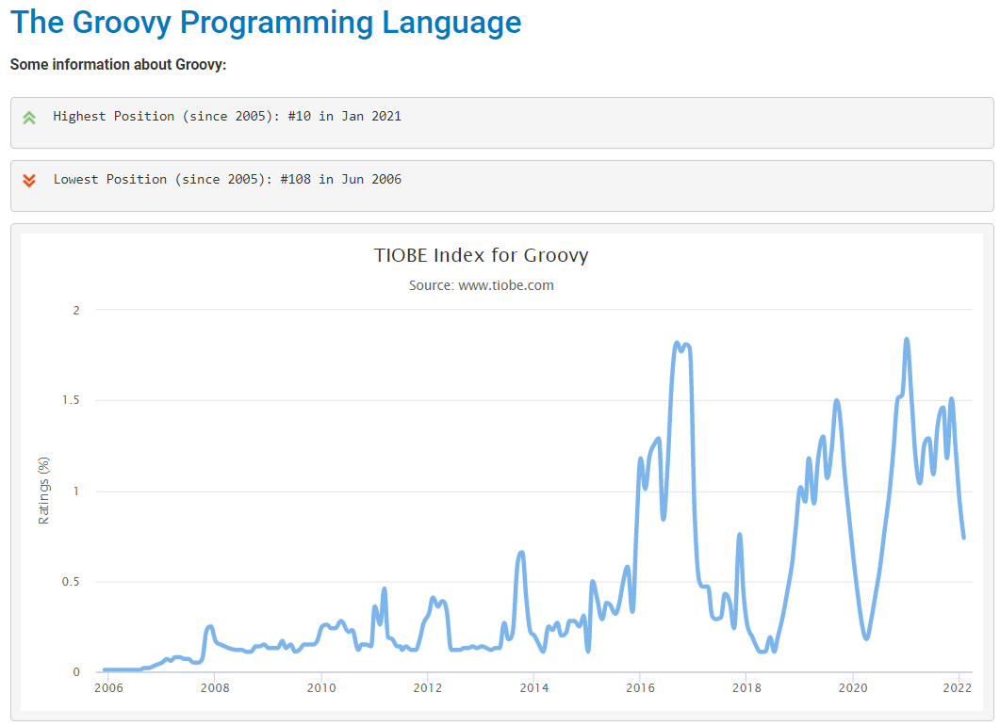

The longer I use Jenkins and Groovy, the more I wonder:

What exactly is Groovy?
What are the features of Groovy?
What are the differences between Groovy and Java?
How to choose between Groovy and Java?
Where does Groovy stand among all programming languages? Should I learn it?

This article shares my learning results, hoping to help you answer these questions as well.

## What is Groovy

Apache Groovy is a powerful, optionally typed dynamic language with static typing and static compilation capabilities, suitable for the Java platform. It aims to improve developer productivity through concise, familiar, and easy-to-learn syntax.
It integrates seamlessly with any Java program and immediately provides powerful capabilities to your applications, including scripting capabilities, domain-specific language creation, runtime and compile-time metaprogramming, and functional programming.

## Groovy's Features

According to the official documentation, Groovy has the following six main features:

1. Gentle learning curve — Concise, readable, and expressive syntax, easy for Java developers to learn
2. Powerful features — Closures, builders, runtime and compile-time metaprogramming, functional programming, type inference, and static compilation
3. Smooth Java integration — Seamless and transparent integration and interoperability with Java and any third-party libraries
4. Domain-Specific Language — Flexible and extensible syntax, advanced integration and customization mechanisms, integrate readable business rules into your applications
5. Vibrant and rich ecosystem — Web development, reactive applications, concurrent/asynchronous/parallel libraries, testing frameworks, build tools, code analysis, GUI building
6. Scripting and testing glue — Ideal for writing concise and maintainable tests, as well as all build and automation tasks

## Differences between Groovy and Java

1. Groovy is a programming language that also supports scripting languages; Java is an object-oriented programming language.
2. Groovy supports multimethods, and the selection of the method to run will be chosen at runtime; Java provides multimethod declarations, selecting at compile time rather than runtime.
3. In Groovy, automatic resource management mechanisms are absent, static, and anonymous inner classes; Java has provided automatic resource management since Java 7 and has the upper hand in terms of inner static classes or anonymous classes.
4. In Groovy, there are some functional programming features such as Lambda functions, functional interfaces; while Java has had Lambda functions, functional interfaces, and many other stream and parallel operation features since JDK 8.
5. Groovy can define and declare string and character literals in single or double quotes; Java only uses double quotes to declare and define string literals or character literals.
6. In Groovy, everything is an object and only objects are used. Therefore, there is no concept of autoboxing or unboxing, nor is there primitive type conversion; conversely, Java has primitive data types and Wrapper classes that allow explicit or implicit autoboxing and unboxing.
7. In Groovy, there is a wide range of automatic widening and narrowing of data types, with many conversions; while Java has limitations on narrowing or widening of data types.
8. Groovy has a default access modifier for all its class members or data; while Java's default access level is package-level, depending on the type of class member.
9. Groovy automatically generates getters and setters in its classes to access and modify class members; while in Java, they must be explicitly mentioned in the class with access modifiers.
10. Groovy has Groovy beans; while Java has Java beans.
11. Groovy is also known as a superset of Java because Java programs can run in a Groovy environment. The reverse is not necessarily true.
12. Groovy has simpler syntax when defining types, simply using `def` to declare a variable; Java has different type names to declare variables or any methods or members of a class.
13. Groovy does not require any main method or entry point method to run a class or any program; while Java requires a main method in the class to run the program.

## Choosing between Groovy and Java

* If scalability and performance are critical and the company develops web applications, Java is the obvious choice. Large companies in e-commerce, banking, finance, defense, healthcare, etc., will choose Java because it's time-tested and commonly used for developing complex enterprise projects.
* Groovy can be used to orchestrate pipelines, automate, and test tasks because it's both a programming language and an excellent scripting language—powerful and easy to learn.

## Groovy's Current Popularity Ranking

From this chart, we can see that Groovy's ranking in 2022 has dropped significantly, falling from its previous ranking of 12 to 20.

Data shows a slight decrease in Groovy in February 2022 (from 0.76% to 0.74%), but this is not the main reason.  The main reason is likely the fluctuation caused by the TIOBE index switching from Alexa to the Similarweb web traffic engine.

The rise in the rankings of these languages, including Assembly language, Go, Swift, MATLAB, Delphi/Object Pascal, Classic Visual Basic, and Objective-C, has taken away Groovy's original position.

Also, looking at Groovy's popularity history, it is still used by many people. Developers may not use it as their primary language, but it's still worth learning as a scripting language.

DevOps engineers using Jenkins Shared Libraries need to learn Groovy.

## References

* Groovy vs Java: https://flyoutsourcing.com/blog/groovy-vs.-java-what-suits-your-needs.html
* Differences with Java：https://groovy-lang.org/differences.html
* TIOBE index：https://www.tiobe.com/tiobe-index/