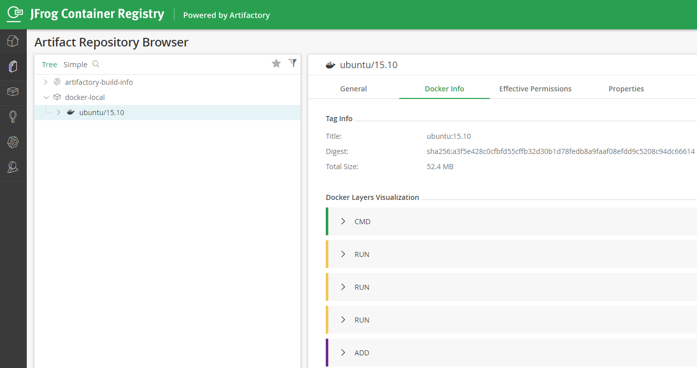

Besides using Jenkins plugins for regular backups, another good option is to install Jenkins in Docker and regularly back up a Docker Image, then upload it to Artifactory.


## Installing Docker Jenkins

To install Docker Jenkins on CentOS, it's recommended to use the Long-term Support (LTS) version, which can be downloaded from the Jenkins website [here](https://jenkins.io/download/).

```bash
# Download the specified LTS version 2.130
sudo docker pull jenkins/jenkins:2.130
# Run the specified Docker Jenkins
sudo docker run -p 8080:8080 -p 50000:50000 jenkins/jenkins:2.130
# To download the latest LTS version
sudo docker pull jenkins/jenkins:lts
# Run the latest LTS Docker Jenkins
sudo docker run -p 8080:8080 -p 50000:50000 jenkins/jenkins:lts
```

After successful startup, you can open the URL `http://hostname:8080/`.


## Changing the Login Password

List all images and running containers:

```bash
# List all images
sudo docker image list
# List currently running containers
sudo docker ps
# Enter the container, using the -it parameter
sudo docker exec -it 39bc7a8307d9 /bin/bash
# View the default admin password
jenkins@a6195912b579:/$ cat /var/jenkins_home/secrets/initialAdminPassword
5193d06c813d46d3b18babeda836363a
```

It is recommended to change the admin password after logging in for easier access next time.

```bash
sudo docker commit 39bc7a8307d9 myjenkins:v0.1
```

## Mapping the Host Directory to the Jenkins Docker Container

To allow Docker Jenkins to access the host machine's directories, use the `-v` parameter to mount the volume when running Docker:

```bash
sudo docker run -p 8080:8080 -p 50000:50000 --name mydata -v /data/backup:/home/backup jenkins/jenkins:2.130
# Mapping successful, you can see the backup files on the host machine
jenkins@c85db3f88115:/home/backup$ ls
FULL-2019-09-14_02-00  FULL-2019-09-28_02-00  FULL-2019-10-19_02-00  FULL-2019-11-02_02-00  FULL-2019-11-23_02-00
FULL-2019-09-21_02-00  FULL-2019-10-05_02-00  FULL-2019-10-26_02-00  FULL-2019-11-09_02-00  FULL-2019-11-30_02-00
```

## Saving the Jenkins Docker Image to Artifactory

Download and install Artifactory Enterprise Edition or JFrog Container Registry. Note that Artifactory Open Source does not support Docker Registry.

For example, my JFrog Container Registry is: `dln.dev.mycompany.com:8040`, and a Docker repository called `docker-local` has been created.

Uploading a Docker Image involves three steps:

docker login

```bash
# Before logging in, add the following configuration to `/etc/docker/daemon.json`
{
"insecure-registries" : ["dln.dev.mycompany.com:8040"]
}
# docker login <DOCKER_SERVER>, example below:
sudo docker login dln.dev.mycompany.com:8040
```

docker tag

```bash
# docker tag <IMAGE_ID> artprod.mycompany/<DOCKER_REPOSITORY>:<DOCKER_TAG>, example below:
sudo docker tag myjenkins:v0.1 dln.dev.mycompany.com:8040/docker-local/myjenkins:v0.1
```

docker push

```bash
# docker push artprod.mycompany/<DOCKER_REPOSITORY>:<DOCKER_TAG>, example below:
$ sudo docker push dln.dev.mycompany.com:8040/docker-local/myjenkins::v0.1
The push refers to repository [dln.dev.mycompany.com:8040/docker-local/myjenkins]
98d59071f692: Pushed
af288f00b8a7: Pushed
4b955941a4d0: Pushed
f121afdbbd5d: Pushed
15.10: digest: sha256:a3f5e428c0cfbfd55cffb32d30b1d78fedb8a9faaf08efdd9c5208c94dc66614 size: 1150
```

After logging into JFrog Container Registry and refreshing, you will see the uploaded image. Note: The screenshot shows another image I uploaded, `ubuntu:15.10`.

