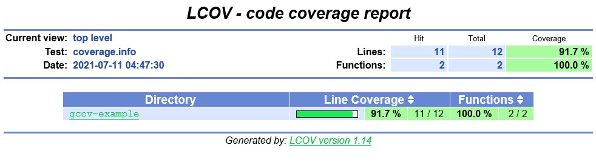

本文适用的是 Gradle 来构建和适用 JaCoCo。

分别介绍了 `build.gradle` 的文件配置，执行测试和生成报告，报告参数说明，以及如何忽略指定的包或类从而影响测试覆盖率的结果。

## build.gradle 文件配置

比如使用 gradle 来管理的项目可以在 `build.gradle` 里添加如下代码

```java
plugins {
    id 'jacoco'
}

jacoco {
    toolVersion = "0.8.5"
}

test {
    useJUnitPlatform()
    exclude '**/**IgnoreTest.class'  // 如果有 test case 不通过，如有必要可以通过这样忽略掉
    finalizedBy jacocoTestReport       // report is always generated after tests run
}

jacocoTestReport {
    dependsOn test // tests are required to run before generating the report
    reports {
        xml.enabled true
        csv.enabled false
        html.destination file("${buildDir}/reports/jacoco")
    }
}
```

## 执行测试，生成代码覆盖率报告

然后执行 `gradle test` 就可以了。之后可以可以在 `build\reports\jacoco` 目录下找到报告了。


重点是如何分析报告。打开 index.html，报告显示如下：



## 报告参数说明


### Coverage Counters（覆盖计数器）

JaCoCo 使用一组不同的计数器来计算覆盖率指标，所有这些计数器都来自于 Java 类文件中包含的信息，这些信息基本上是 Java 字节码指令和嵌入类文件中的调试信息。这种方法可以在没有源代码的情况下，对应用程序进行有效的即时检测和分析。在大多数情况下，收集到的信息可以映射到源代码，并可视化到行级粒度。

这种方法也有一定的局限性，就是类文件必须与调试信息一起编译，以计算行级覆盖率并提供源码高亮。但不是所有的 Java 语言结构都可以直接编译成相应的字节码。在这种情况下，Java 编译器会创建所谓的合成代码，有时会导致意外的代码覆盖率结果。

### Instructions (C0 Coverage) - 指令（C0覆盖率）

最小的单位 JaCoCo 计数是单个 Java 字节码指令，指令覆盖率提供了关于被执行或遗漏的代码量的信息，这个指标完全独立于源码格式化，即使在类文件中没有调试信息的情况下也始终可用。

### Branches (C1 Coverage) - 分支（C1覆盖率）

JaCoCo 还计算所有 if 和 switch 语句的分支覆盖率，这个指标计算一个方法中此类分支的总数，并确定执行或遗漏的分支数量。即使在类文件中没有调试信息的情况下，分支覆盖率总是可用的。但请注意在这个计数器定义的上下文中**异常处理不被认为是分支。**

如果类文件没有编译调试信息，决策点可以被映射到源行并相应地高亮显示。

* 没有覆盖。行中没有分支被执行（红菱形
* 部分覆盖。仅执行了该线的部分分支（黄钻
* 全覆盖。线路中的所有分支都已执行（绿色菱形）

### Cyclomatic Complexity - 环形复杂度

JaCoCo 还计算了每个非抽象方法的循环复杂度并总结了类、包和组的复杂度。循环复杂度是指在（线性）组合中，能够产生通过一个方法的所有可能路径的最小路径数。
因此复杂度值可以作为完全覆盖某个软件的单元测试用例数量的指示，即使在类文件中没有调试信息的情况下，也可以计算出复杂度数字。

循环复杂度v(G)的正式定义是基于将方法的控制流图表示为一个有向图。

v(G) = E - N + 2

其中E为边数，N为节点数。JaCoCo根据分支数(B)和决策点数(D)计算方法的循环复杂度，其等价公式如下。

v(G) = B - D + 1

根据每个分支的覆盖状态，JaCoCo还计算每个方法的覆盖和遗漏复杂度。遗漏的复杂度再次表明了完全覆盖一个模块所缺少的测试用例数量。请注意，由于JaCoCo不考虑异常处理作为分支，尝试/捕获块也不会增加复杂性。

### Lines - 行

对于所有已经编译过调试信息的类文件，可以计算出各个行的覆盖率信息。当至少有一条分配给该行的指令被执行时，就认为该源行已被执行。

由于单行通常会编译成多条字节码指令，源码高亮显示每行包含源码的三种不同状态。

* No coverage: 该行没有指令被执行（红色背景）。
* 部分覆盖。该行中只有部分指令被执行（黄色背景）。
* 全覆盖。该行的所有指令都已执行（绿色背景）。

根据源码的格式，一个源码的一行可能涉及多个方法或多个类。因此，方法的行数不能简单地相加来获得包含类的总行数。同样的道理也适用于一个源文件中多个类的行数。JaCoCo根据实际的源代码行数来计算类和源代码文件的行数。

### Method - 方法

每个非抽象方法至少包含一条指令。当至少有一条指令被执行时，一个方法就被认为是被执行的。由于 JaCoCo 工作在字节代码层面，构造函数和静态初始化器也被算作方法，其中一些方法在 Java 源代码中可能没有直接的对应关系，比如隐式的，因此生成了默认的构造函数或常量的初始化器。

### Classes - 类

当一个类中至少有一个方法被执行时，该类被认为是被执行的。请注意，JaCoCo 认为构造函数和静态初始化器都是方法。由于 Java 接口类型可能包含静态初始化器，这种接口也被视为可执行类。

[覆盖率的计算原文](https://www.eclemma.org/jacoco/trunk/doc/counters.html)

## 从代码覆盖率报告中忽略指定的包或代码

对于有些包和代码可能不属于你的项目，但也被统计在内，可以通修改在 `build.gradle` 将指定的代码或是包从 JaCoCo 报告中忽略掉。如下：

```java

// 省略部分代码

jacocoTestReport {
    dependsOn test // tests are required to run before generating the report
    reports {
        xml.enabled true
        csv.enabled false
        html.destination file("${buildDir}/reports/jacoco")
    }
    afterEvaluate {
        classDirectories.setFrom(files(classDirectories.files.collect {
            fileTree(dir: it, exclude: [
			'com/vmware/antlr4c3/**'])
			'com/vmware/antlr4c3/**',
            'com/basic/parser/BasicParser*'
            ])
        }))
    }
}
```
