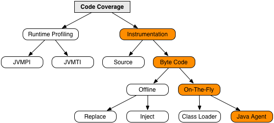

For Java projects requiring code coverage testing, the open-source code coverage analysis tool JaCoCo is a popular choice among many tools.

This article is a rough translation of the JaCoCo implementation design document: https://www.jacoco.org/trunk/doc/implementation.html.

## Implementation Design

This is an unordered list of implementation design decisions. Each topic tries to follow this structure:

* Problem Statement
* Proposed Solution
* Choices and Discussion

### Coverage Analysis Mechanism

> Coverage information must be collected at runtime. For this purpose, JaCoCo creates instrumented versions of the original class definitions. The instrumentation process happens dynamically during class loading using so-called Java agents.

Several different approaches exist for collecting coverage information. Each approach has different implementation techniques.  The following diagram gives an overview of the technique used by JaCoCo:



Byte code instrumentation is very fast, can be implemented in pure Java, and works with every Java VM. Dynamic instrumentation with Java agent hooks can be added to the JVM without any modifications to the target application.

Java agent hooks require at least Java 1.5 JVMs. Class files compiled with debug information (line numbers) allow highlighting of the source code. Unfortunately, some Java language constructs are compiled into byte code that produces unexpected highlighting results, especially when using implicitly generated code (like default constructors or control structures in finally statements).


### Coverage Agent Isolation

> The Java agent is loaded by the application class loader. Therefore, the agent's classes live in the same namespace as the application classes. This may lead to conflicts, especially with third-party libraries like ASM. Therefore, the JaCoCo build moves all agent classes into a unique package.

The JaCoCo build renames all classes contained in `jacocoagent.jar` to have the prefix `org.jacoco.agent.rt_<randomid>`, including the required ASM library classes. The identifier is created from a random number. Since the agent does not provide any API, nobody will be affected by this renaming. This trick also allows using JaCoCo to verify JaCoCo tests.

### Minimal Java Version

> JaCoCo requires Java 1.5 and above.

Java 1.5 VMs provide the Java agent mechanism for dynamic instrumentation. Coding and testing using the Java 1.5 language level is more efficient, less error-prone—and more fun—than using older versions. JaCoCo still allows running against Java code compiled for these.


### Byte Code Manipulation

> Instrumentation requires a mechanism for modifying and generating Java byte code. JaCoCo internally uses the ASM library for this purpose.

Implementing the Java byte code specification would be a broad and error-prone task. Therefore, an existing library should be used. The ASM library is lightweight, easy to use, very efficient in terms of memory and CPU usage, it is actively maintained and contains a huge regression test suite. Its simplified BSD license is approved by the Eclipse Foundation and can be used with EPL products.


### Java Class Identity

> Each class loaded at runtime needs a unique identifier to associate coverage data. JaCoCo creates such an identifier by a CRC64 hash code of the original class definition.

In a multi-class loader environment, the pure name of a class does not unambiguously identify the class. For example, OSGi allows loading different versions of the same class in the same virtual machine. In complex deployment scenarios, the actual version of the test target may differ from the currently developed version. The code coverage report should guarantee that the presented numbers are extracted from the valid test target. A hash code of the class definition allows distinguishing classes and class versions. The CRC64 hash calculation is simple and fast, resulting in a small 64-bit identifier.

Class loaders may load the same class definition, which leads to different classes produced by the Java runtime system. For coverage analysis, this difference should be irrelevant.  The class definition may be altered by other instrumentation-based techniques (e.g., AspectJ). In this case, the hash code will change and the identity will be lost. On the other hand, code coverage analysis based on the altered class will produce unexpected results. The CRC64 code may produce so-called collisions, i.e., creating the same hash code for two different classes. Although CRC64 is not cryptographically strong and it's easy to calculate collision examples, the probability of a collision is very low for regular class files.


### Coverage Runtime Dependency

> The instrumented code usually depends on a coverage runtime that is responsible for collecting and storing the execution data. JaCoCo only uses JRE types in the generated instrumented code.

In frameworks with their own class loading mechanisms, making the runtime library available to all instrumented classes may be a painful or impossible task. Since Java 1.6 `java.lang.instrument.Instrumentation`. instrumentation has an extended bootstrap loader API. Because our minimum target is Java 1.5, JaCoCo decouples instrumented classes and coverage runtime only through official JRE API types. Instrumented classes communicate with the runtime via the `Object.equals(Object)` method. Instrumented classes can retrieve their probe array instance using the following code. Note that only JRE APIs are used:

```java
Object access = ...                          // Retrieve instance

Object[] args = new Object[3];
args[0] = Long.valueOf(8060044182221863588); // class id
args[1] = "com/example/MyClass";             // class name
args[2] = Integer.valueOf(24);               // probe count

access.equals(args);

boolean[] probes = (boolean[]) args[0];
```

The trickiest part happens in line 1. The object instance that must be obtained to provide access to the coverage runtime via the `equals()` method is not shown in the code snippet above. Different approaches have been implemented and tested so far:

* `SystemPropertiesRuntime`: This approach stores the object instance under a system property. This solution breaks the convention that system properties must only contain `java.lang.String`. string values, therefore causing trouble in applications (like Ant) that rely on this definition.
* `LoggerRuntime`: Here we use a shared `java.util.logging.Logger`. and communicate via a log parameter array instead of the `equals()` method. The coverage runtime registers a custom handler to receive the parameter array. This approach may break environments that install their own log management (e.g., Glassfish).
* `ModifiedSystemClassRuntime`: This approach adds a public static field to an existing JRE class via instrumentation. Unlike the other approaches above, this method only works in an active Java agent environment.
* `InjectedClassRuntime`: This approach uses `java.lang.invoke.MethodHandles.Lookup.defineClass` introduced in Java 9 to define a new class.

Starting with version 0.8.3, when running on JRE 9 or higher, the JaCoCo Java agent implementation uses `InjectedClassRuntime` to define a new class in the bootstrap class loader, otherwise `ModifiedSystemClassRuntime` to add fields to existing JRE classes. Starting with version 0.8.0, fields are added to the class `java.lang.UnknownError`. version 0.5.0 - 0.7.9 added fields to the class `java.util.UUID`, which has a higher chance of conflicts with other agents.


### Memory Usage

> For large projects with thousands of classes or hundreds of thousands of lines of code, coverage analysis should be possible. To allow reasonable memory usage, coverage analysis is based on a streaming mode and a "depth-first" traversal.

A complete data tree of a huge coverage report is too large to fit into reasonable heap memory configurations. Therefore, coverage analysis and report generation are implemented as a "depth-first" traversal. That is, at any point in time, only the following data needs to be kept in working memory:

* The single class currently processed.
* The aggregated information of all parent classes (packages, groups) of this class.

### Java Element Identifiers

> The Java language and the Java VM use different string representation formats for Java elements. For example, type references in Java read like `java.lang.Object`. objects, the VM references the type as `Ljava/lang/Object`. The JaCoCo API is only based on VM identifiers.

Using VM identifiers directly does not cause any conversion overhead at runtime. Several Java VM-based programming languages may use different symbols. Therefore, specific conversions should only happen at the UI level, e.g., during report generation.

### Modularization of the JaCoCo implementation

> JaCoCo is implemented in several modules providing different functionalities. These modules are provided as OSGi bundles with appropriate manifests. However, it does not depend on OSGi itself.

Using OSGi bundles allows well-defined dependencies in development time and runtime within OSGi containers. Since there is no dependency on OSGi, the bundles can also be used like ordinary JAR files.