## Business Scenario

Daily work requires switching to different versions on different platforms (including Linux, AIX, Windows, Solaris, HP-UX) for development and problem verification. However, due to limited virtual machines, it cannot be guaranteed that every developer and tester has virtual machines for all platforms with different versions installed. Therefore, preparing various development and testing environments can be time-consuming.


## Requirements Analysis

For such requirements, Docker is usually the first consideration; secondly, fetching builds from Artifactory and installing them via CI tools; finally, building from source code and then installing.

* Regarding Docker, because we support numerous platforms, including Linux, AIX, Windows, Solaris, and HP-UX, Docker is only suitable for Linux and Windows, so it cannot meet this requirement.

* Due to other reasons, our Artifactory is temporarily unavailable, so we can only choose to build from source code and then install. Both methods need to address the issue of resource locking and unlocking. If the current environment is being used by someone, the resources of that virtual machine should be locked, preventing Jenkins from calling the node in use again, to ensure that the environment is not damaged during use.

This article mainly introduces how to achieve resource locking and unlocking using the Jenkins Lockable Resources Plugin.

## Demo

1. Setting up Lockable Resources

    * Jenkins -> Manage Jenkins -> Configure System -> Lockable Resources Manager -> Add Lockable Resource
    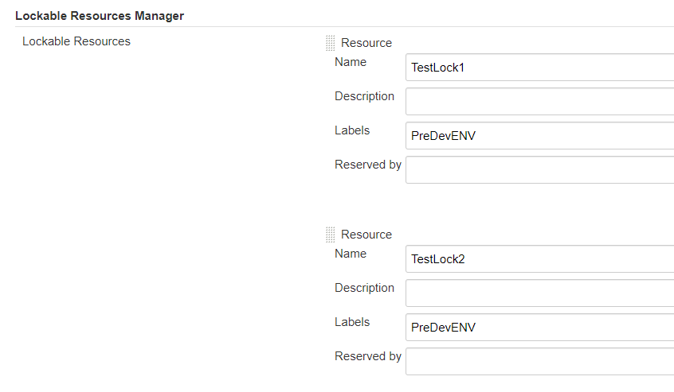
    The Labels here are the Labels of your nodes, set in Jenkins -> Manage Jenkins -> Manage Nodes and Clouds

2. Viewing the Lockable Resources Pool

    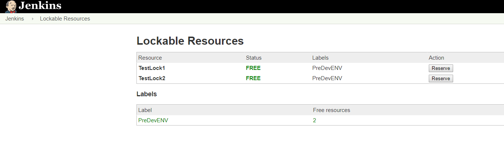

3. Testing Resource Locking
    * Here, I have configured a parameterized job that allows selection of different platforms and repositories for building.
    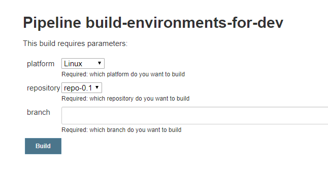
    * Running the first job
    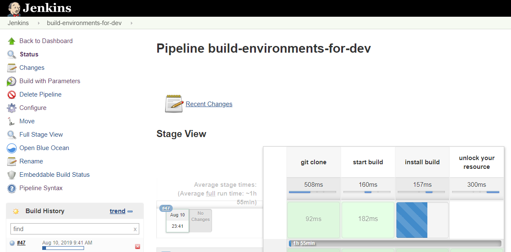
    * Viewing the current number of available resources: Free resources = 1, showing that it is being used by Job #47.
    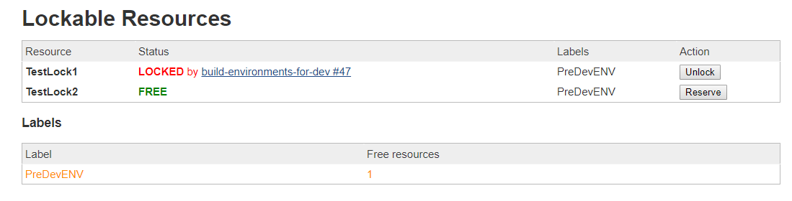
    * Running a second job
    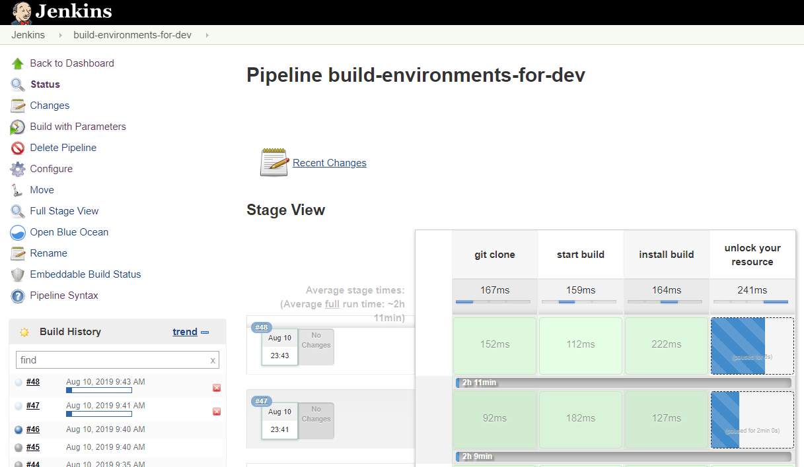
    * Viewing the current number of available resources: Free resources = 0, showing that it is being used by Job #48.
    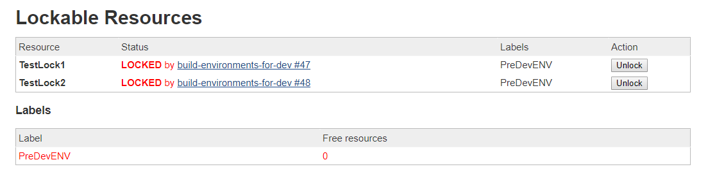
    * Crucially, if a third job is run, will it be executed?
    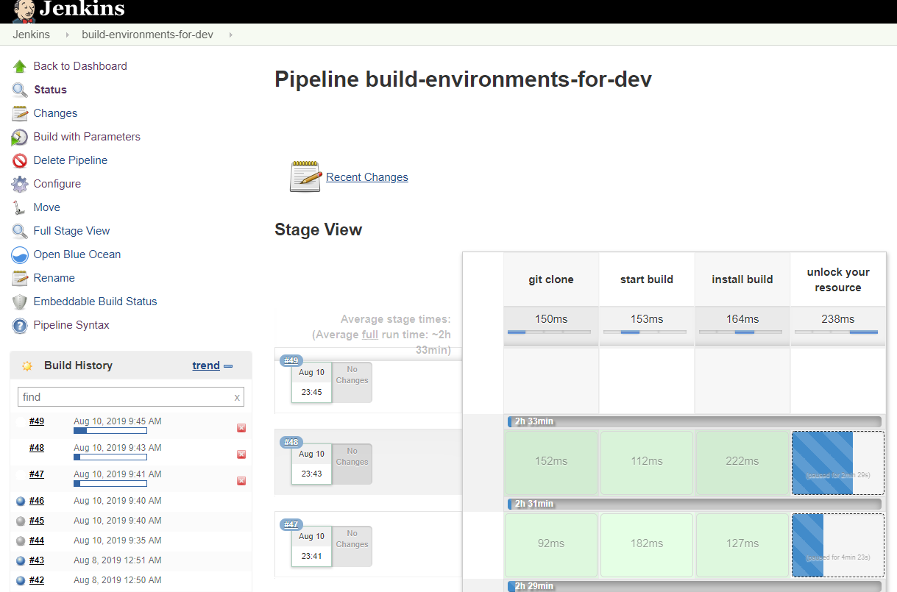
    *  The task is not executed. Checking the log shows it's waiting for available resources.
    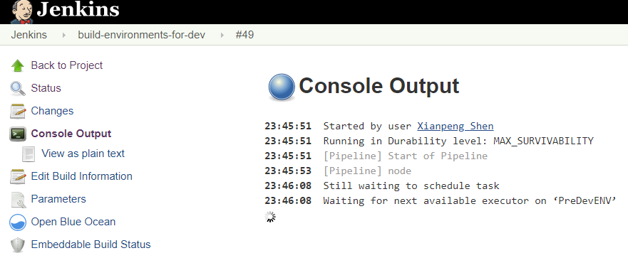

4. Testing Resource Unlocking
    * Now, releasing a resource, let's see if the third job can acquire the resource and execute.
    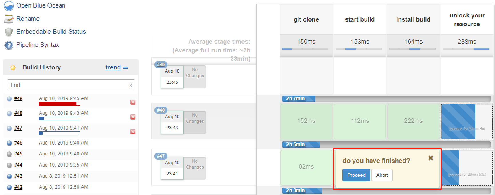
    * The following image shows that the third job has run successfully.
    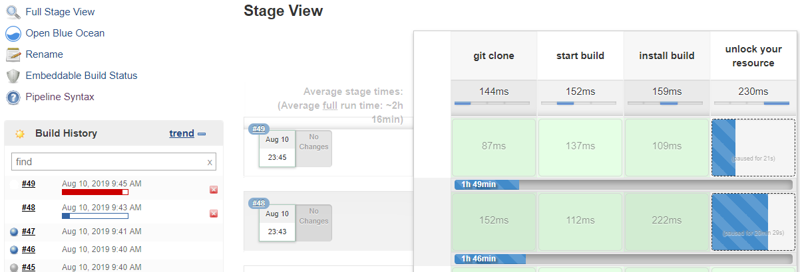

## Jenkins Pipeline Code

The most crucial part of the entire pipeline is how to lock and unlock. This is achieved using `lock` and `input` steps.

The current job will remain unfinished until the user clicks Yes, and its lock will remain in effect.  The lock is released once Yes is clicked and the job ends.

Refer to the following `Jenkinsfile` for details.

```bash
pipeline {
    agent {
        node {
            label 'PreDevENV'
        }
    }
    options {
        lock(label: 'PreDevENV', quantity: 1)
    }

    parameters {
        choice(
            name: 'platform',
            choices: ['Linux', 'AIX', 'Windows', 'Solris', 'HP-UX'],
            summary: 'Required: which platform do you want to build')
        choice(
            name: 'repository',
            choices: ['repo-0.1', 'repo-1.1', 'repo-2.1', 'repo-3.1', 'repo-4.1'],
            summary: 'Required: which repository do you want to build')
        string(
            name: 'branch',
            defaultValue: '',
            summary: 'Required: which branch do you want to build')
    }

    stages {
        stage('git clone'){
            steps {
                echo "git clone source"
            }
        }
        stage('start build'){
            steps {
                echo "start build"
            }
        }
        stage('install build'){
            steps{
                echo "installing"
            }
        }
        stage('unlock your resource'){
            steps {
                input message: "do you have finished?"
                echo "Yes, I have finished"
            }
        }
    }
}
```