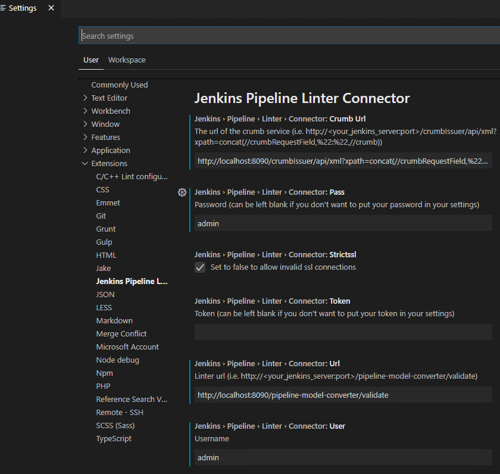

A common problem I encounter when developing Jenkins Declarative Pipelines is this: the modified Pipeline looks fine, but when it's submitted to the code repository and a Jenkins build is performed, a syntax error is discovered.  Then I have to modify, submit, and build again, potentially finding other unnoticed syntax issues.

To reduce the frequency of submitting to the code repository due to syntax errors, it would be helpful to perform basic syntax validation before submission to check for syntax errors in the current Pipeline.

After investigation, I found that Jenkins itself provides a syntax check REST API that can be directly used to validate Declarative Pipelines. This method requires executing a long `curl` command, which seems cumbersome. It would be much better if this could be run directly within the IDE.

VS Code, being the most popular IDE currently, indeed has relevant plugins.

Below are two methods for checking for syntax errors in `Jenkinsfile` files for Jenkins Declarative Pipelines. Both methods use the Jenkins REST API.


> Note:
>
> Currently, only Declarative Pipelines support syntax validation; Scripted Pipelines do not.
>
> If you use the Jenkins replay feature or develop Pipelines using the Jenkins web page, this problem does not exist.

## REST API

If your project uses Jenkins Shared Libraries, for easier use of the REST API, consider creating a `linter.sh` file in that repository and adding it to your `.gitignore`. This allows you to configure your username and password in the file without accidentally committing them to the Git repository.

The following is the `linter.sh` script content for reference.

```sh
# How to use
# sh linter.sh your-jenkinsfile-path

# Replace with your Jenkins username
username=admin
# Replace with your Jenkins password
password=admin
# Replace with your Jenkins URL
JENKINS_URL=http://localhost:8080/

PWD=`pwd`
JENKINS_FILE=$1

curl --user $username:$password -X POST -F "jenkinsfile=<$PWD/$JENKINS_FILE" $JENKINS_URL/pipeline-model-converter/validate
```

Let's test the effect: `sh linter.sh your-jenkinsfile-path`

Example 1

```bash
$ sh linter.sh Jenkinsfile
Errors encountered validating Jenkinsfile:
WorkflowScript: 161: Expected a stage @ line 161, column 9.
           stages {
           ^
```

Example 2

```bash
sh linter.sh Jenkinsfile
Errors encountered validating Jenkinsfile:
WorkflowScript: 60: Invalid condition "failed" - valid conditions are [always, changed, fixed, regression, aborted, success, unsuccessful, unstable, failure, notBuilt, cleanup] @ line 60, column 9.
           failed{
           ^
# Change "failed" to "failure", and execute again; it succeeds.
sh linter.sh Jenkinsfile
Jenkinsfile successfully validated.
```

When the Pipeline is very long, it's always difficult to find unmatched brackets or missing parentheses.  This script allows you to check for problems before submitting.

```sh
Jenkinsfile successfully validated.
```

## `Jenkins Pipeline Linter Connector` Plugin

The second method is more universal; any Declarative Pipeline can use this plugin to check for syntax errors.

### Installing the Plugin

Search for `Jenkins Pipeline Linter Connector` in the VSCode plugin marketplace.

### Configuring the Plugin

Open File -> Preferences -> Settings -> Extensions, find `Jenkins Pipeline Linter Connector`, and configure it as follows.



### Running the Plugin

Right-click -> Command Palette -> Validate Jenkinsfile

Or

Use the shortcut Shift + Alt + V

### Execution Result


## Summary

If you use VSCode as your development tool, the `Jenkins Pipeline Linter Connector` plugin is recommended.

For Jenkins Shared Libraries repositories, consider creating a shell script to perform validation by executing the script.

Of course, if you only use a simple `Jenkinsfile`, you can also write it on the Jenkins web Pipeline page, which has built-in syntax checking.

If you have other methods, please feel free to leave a comment and let me know.