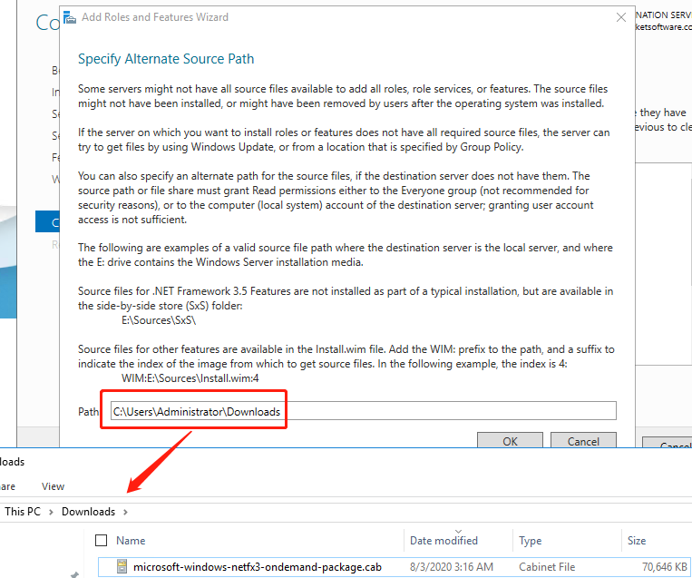

在将 Jenkins 从 `2.176.3` 升级到 `2.235.1` 后，我的 Windows Agent 无法与 Master 成功连接，并提示：

```
.NET Framework 2.0 or later is required on this computer to run a Jenkins agent as a Windows service
```

这意味着需要升级 Windows Agent 的 **.NET Framework**。以下是将其升级到 **.NET Framework 3.5** 的步骤。

---

## 安装 .NET Framework 3.5

1. 打开 **Programs and Features（程序和功能）**  
   

2. 勾选 **.NET Framework 3.5 Features**（截图中已安装）  
   

安装完成后，尝试重新连接 Jenkins Agent，一般即可恢复正常。

---

## 安装 Jenkins Agent 服务

如果系统中找不到 `Jenkins agent` 服务，可以按以下步骤安装：

```bash
# 安装 Jenkins agent 服务
cd c:\\jenkins
.\jenkins-agent.exe install
net start jenkinsslave-C__agent

# 卸载 Jenkins agent 服务
sc delete jenkinsslave-C__agent
```


---

## 手动安装 .NET Framework 3.5

如果在 Windows 功能中安装失败，可以手动安装：

1. 下载 [microsoft-windows-netfx3-ondemand-package.cab](https://androidfilehost.com/?fid=1322778262904003837)
2. 在命令行中指定路径进行安装（路径为 `.cab` 文件所在目录）
   

在我的案例中，安装完成后 **无需重启** Windows Agent。

---

希望此方法对你有帮助，如有更好的解决方案，欢迎分享。
