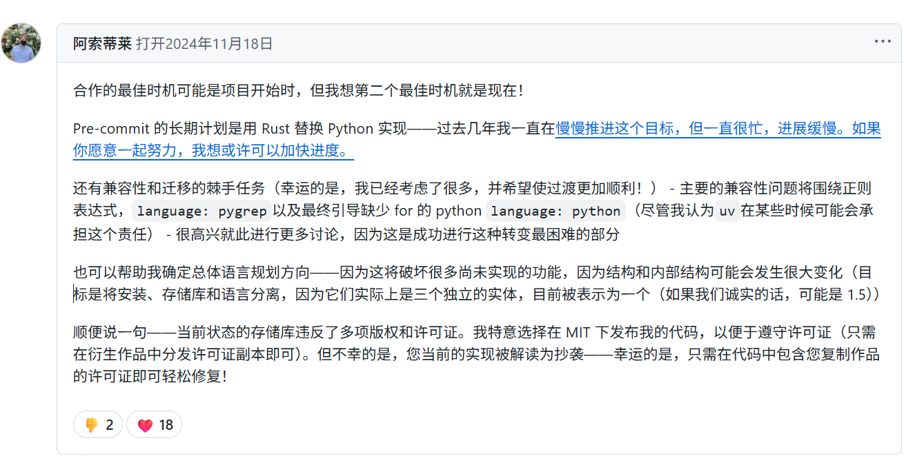
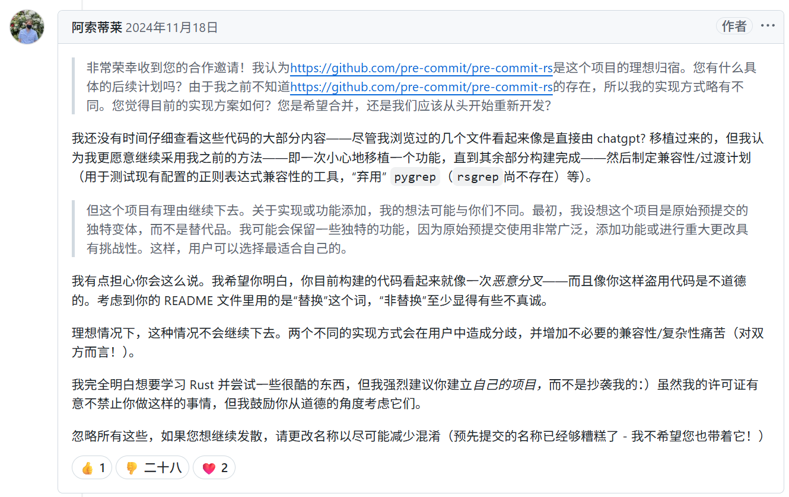
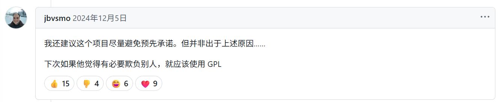
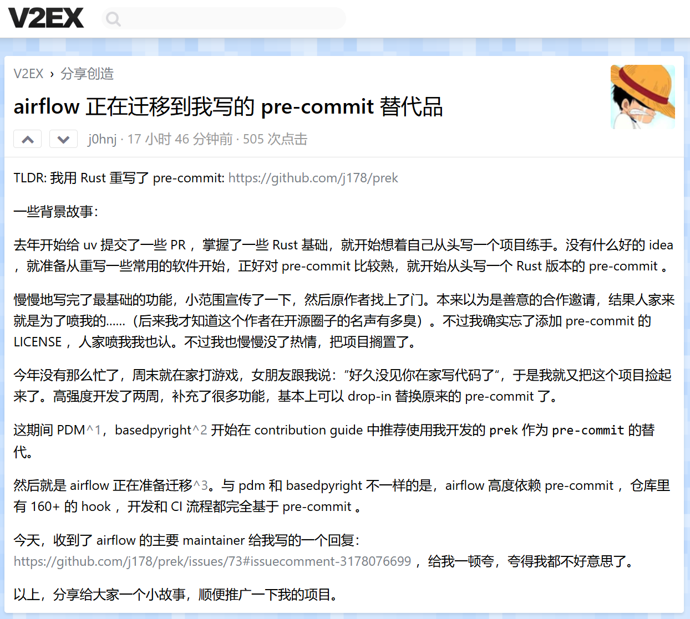
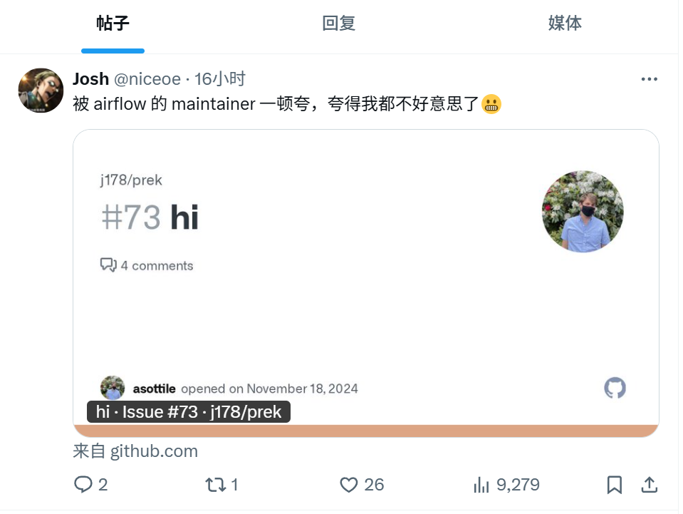

While browsing online yesterday, I stumbled upon a repository called `prek`, described as —— ⚡ Better `pre-commit`, re-engineered in Rust. This piqued my interest, as `pre-commit` is a widely used pre-commit tool; any improvements, especially performance enhancements, are welcome.

What's most interesting is that the author of `pre-commit` also posted in the project's Issue section. He initially expressed interest in collaboration, then mentioned a copyright violation (since fixed), and finally called it malicious, unethical, and plagiaristic.

Let's take a look at this post. I'll use Google Translate here to guide you through it.

Finally, after a comment from an Airflow Maintainer, the author added a ❤ and locked the thread. (This was a perfect move.)

> Link here: https://github.com/j178/prek/issues/73

This situation is somewhat similar to uv replacing pip, except I didn't see the same level of controversy. This might be because pip is maintained by numerous community volunteers, while `pre-commit` is more like Anthony Sottile's "personal" project. Although it's open-source, the original author has absolute control over the project.

Furthermore, its derivative project, pre-commit.ci, is free for open-source projects but charges for private repositories ($10/month), startups ($20/month), and large organizations ($100/month).  A competitive alternative could impact its revenue.

Let me briefly introduce Anthony Sottile—he's the author of `pre-commit`, a core developer of `pytest-dev` and `tox-dev`, maintains `flake8`, is a member of PyCQA, and has many GitHub stars. If you use Python, you've likely encountered projects he's involved with. He's also a YouTuber who does programming live streams. I initially learned about him through `pre-commit` and have watched his videos; he's truly skilled. However, as mentioned above, his interaction style within the `pre-commit` community has caused some discomfort and displeasure.

## My Opinion

Unless `pre-commit`'s original author, Anthony Sottile, becomes more proactive and open, accelerating the development of `pre-commit-rs`, the threat from `prek` will continue to grow.  Currently, `prek` shows strong momentum.

Based on the following points, I believe it has a high chance of succeeding:

* **Author's Influence:** The `prek` author is an active and influential open-source contributor, participating in and contributing to well-known projects like `encode/httpx`, `astral-sh/uv`, `astral-sh/rye`, etc. He has the capacity to gain long-term community trust and endorsement.
* **High-Profile Endorsement:** `prek` has received positive endorsements from renowned contributors like Jarek Potiuk—a contributor and PMC member of Apache Airflow. Airflow is actively preparing to switch to `prek`.
* **Community Image Difference:** Compared to the `pre-commit` author's "cold" style, which may limit the willingness of external contributors to participate; `prek`, on the other hand, listened to community feedback and changed the project name from `prefligit` to `prek`, which is a better name—shorter and easier to pronounce—creating space for the rise of this alternative.
* **Community Needs:** The community needs a project like `prek`, actively pushing a Rust rewrite, to disrupt the status quo of `pre-commit`.

Unless Anthony Sottile makes a 180-degree turn, proactively inviting external contributors to accelerate the development of `pre-commit-rs`, and changing his community interaction style, this trend is unlikely to reverse in the short term. Overall, I'm optimistic about `prek`'s future.

At the time of writing, I also saw the author post the above conversation on V2EX and Twitter, attracting even more attention.

I won't comment further on this—the open-source community is a stage for continuous exchange, discussion, and competition.

---

Please indicate the author and source when reprinting this article. Please do not use it for any commercial purposes.  Follow the WeChat public account "DevOps攻城狮" for more.