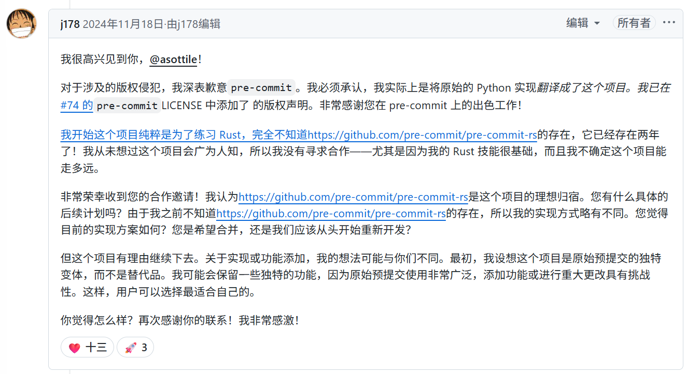

While browsing online yesterday, I stumbled upon a repository called `prek`, described as —— ⚡ Better `pre-commit`, re-engineered in Rust. This piqued my interest, as `pre-commit` is a widely used pre-commit tool. Any improvements, especially performance enhancements, are welcome.

What's most interesting is that the author of `pre-commit` also posted in this project's Issue.  He first expressed a desire to collaborate, then mentioned the project violated copyright (since fixed), and later called it malicious, unethical, and a copy.

Let's take a look at this post. I'll use Google Translate here to guide you through it.

Finally, after an Airflow Maintainer commented, the author added a ❤ and locked the thread. (This move was perfect.)

> Link here: https://github.com/j178/prek/issues/73

This situation is somewhat similar to uv replacing pip, except I didn't see the same level of controversy.  The reason might be that pip is maintained by numerous community volunteers, while `pre-commit` is more like Anthony Sottile's "personal" project. Although it's open-source, the original author has absolute control over the project.

Furthermore, its derivative project, pre-commit.ci, is free for open-source projects, but charges for private repositories ($10/month), startups ($20/month), and large organizations ($100/month). A competitive alternative could impact its revenue.

Let me briefly introduce Anthony Sottile—he's the author of `pre-commit`, a core developer of `pytest-dev` and `tox-dev`, maintains `flake8`, is a member of PyCQA, a GitHub Star, etc. If you use Python, you've likely encountered projects he's involved in. He's also a YouTuber who does programming livestreams. I initially learned about him through `pre-commit` and have watched his videos; his expertise is undeniable. However, as mentioned above, his interaction style within the `pre-commit` community has caused discomfort or displeasure for some.

## My Opinion

Unless `pre-commit`'s original author, Anthony Sottile, becomes more proactive and open, accelerating the development of `pre-commit-rs`, the threat from `prek` will continue to grow.  Currently, `prek` shows strong momentum.

Based on the following points, I believe it has high potential for success:

* **Author Influence:** The `prek` author is an active and influential open-source contributor, participating in and contributing to well-known projects like `encode/httpx`, `astral-sh/uv`, `astral-sh/rye`, etc., possessing the ability to gain long-term community trust and endorsement.
* **High-Profile Endorsement:** `prek` has received positive endorsements from prominent contributors like Jarek Potiuk—a contributor and PMC member of Apache Airflow, which is actively preparing to switch to `prek`.
* **Community Image Difference:** Compared to `pre-commit`'s author, his "cold" style might limit the willingness of external contributors to participate; conversely, the `prek` author listened to community suggestions, changing the project name from `prefligit` to `prek`, which I believe is a better name—shorter and easier to pronounce—creating space for the rise of an alternative.
* **Community Need:** The community needs a project like `prek`, actively promoting a Rust rewrite, to break the status quo of `pre-commit`.

Unless Anthony Sottile makes a 180-degree turn, proactively inviting external contributors to accelerate `pre-commit-rs` development and changing his current community interaction style, this trend is unlikely to reverse in the short term. Overall, I'm optimistic about `prek`'s future.

At the time of writing, I also saw the author posting the above conversation on V2EX and Twitter, generating further attention.

I won't comment further on this—the open-source community is a stage for continuous communication, exchange, and competition.

---

Please indicate the author and source when reprinting this article. Do not use it for any commercial purposes. Follow the "DevOps攻城狮" WeChat Official Account.