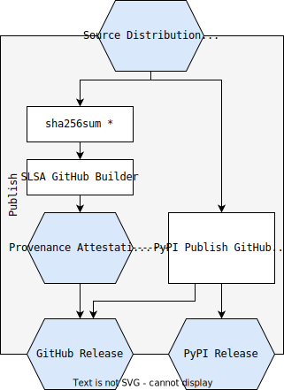

Due to the increasing frequency of software supply chain attacks in recent years, with SonaType statistics showing a 742% increase in attacks targeting open-source software from 2019 to 2022, Google proposed a solution in 2021: Supply chain Levels for Software Artifacts ("SLSA").


This article will introduce how we can use the SLSA framework in the Python ecosystem to generate and verify the provenance of Python artifacts, thereby raising your SLSA Level from L0/L1 to L3.

Note: This article focuses on **Python projects hosted on GitHub**. The SLSA framework can be implemented out-of-the-box using GitHub Actions, requiring minimal configuration.

For projects hosted outside of GitHub (e.g., Bitbucket), you can try [Witness](https://witness.dev/). I will update the article with instructions on how to use Witness in a future post.

## Contents

1. [Building a clean Python package](#building-a-clean-python-package)
2. [Generating provenance](#generating-provenance)
3. [Uploading to PyPI](#uploading-to-pypi)
4. [Verifying the provenance of a Python package](#verifying-the-provenance-of-a-python-package)
5. [Projects used in this article](#projects-used-in-this-article)

Below is the end-to-end workflow from maintainer to user: from building a Wheel package -> generating provenance -> verifying provenance -> publishing to PyPI -> and user verifying provenance -> installing the wheel. Let's go through each step together.

If you want to learn more about Python packaging processes or terminology, refer to the [Python Packaging User Guide](https://packaging.python.org/en/latest/overview/#packaging-python-libraries-and-tools).


## Building a clean Python package

Building a pure Python package typically involves only two artifacts: the pure Python Wheel Package and the source code distribution.  You can use the command [`python3 -m build`](https://pypi.org/project/build/) to build from source code.

Here's a GitHub Actions job definition to build the Wheel Package and source code distribution, and create a SHA-256 hash value for each artifact:

```yaml
jobs:
  build:
    steps:
      - uses: actions/checkout@...
      - uses: actions/setup-python@...
        with:
          python-version: 3.x
      - run: |
          # Install build, create sdist and wheel
          python -m pip install build
          python -m build

          # Collect hashes of all files
          cd dist && echo "hashes=$(sha256sum * | base64 -w0)" >> $GITHUB_OUTPUT
      - uses: actions/upload-artifacts@...
        with:
          path: ./dist
```

This uploads the built wheel package to GitHub Artifacts for later use in the "Uploading to PyPI" job.  It also stores the hashes of all files in `dist` in `hashes` for use as input in the subsequent `provenance` job.

> Note: SLSA uses the output of `sha265sum` as input for the `subject-base64` field in the provenance. The output of `sha256sum` is one or more hash + name pairs.

## Generating provenance

Now that we've built the sdist and wheel, we can generate provenance from the file hashes.

Because we need the output of the Build stage as input for provenance generation, the [needs](https://docs.github.com/en/actions/using-workflows/workflow-syntax-for-github-actions#jobsjob_idneeds) option is used here as a prerequisite for the execution of the `provenance` job. You can see the hashes generated above are used by `subject-base64` here.

```yaml
jobs:
  provenance:
    needs: [build]
    uses: slsa-framework/slsa-github-builder/.github/workflows/generator_generic_slsa3.yml@v1.9.0
    permissions:
      # Needs to inspect the GitHub Actions environment
      actions: read
      # Needs to create provenance using GitHub OIDC
      id-token: write
      # Needs to create and upload to GitHub Releases
      contents: write
    with:
      # Generated package SHA-256 hashes
      subject-base64: ${{ provenance.needs.build.output.hashes }}
      # Upload provenance file to GitHub Release
      upload-assets: true
```

You'll notice that SLSA builders use the [reusable workflows](https://docs.github.com/en/actions/using-workflows/reusing-workflows) feature to prove that the given builders' behavior cannot be modified by the user or other processes.

The provenance file is [JSON lines](https://jsonlines.org/), ending in `.intoto.jsonl`.  A `*.intoto.jsonl` file can contain provenance for multiple artifacts or multiple provenance entries in the same file. The `.jsonl` format means that the file is a "JSON lines" file, i.e., one JSON document per line.

> Note:  A slightly confusing point is that the `id-token` in the GitHub job requires `write` permission to read the GitHub OIDC token. `read` does not allow you to read OIDC...🤷.  For more information on `id-token` permissions, see the [GitHub documentation](https://docs.github.com/en/actions/deployment/security-hardening-your-deployments/about-security-hardening-with-openid-connect#adding-permissions-settings).


## Uploading to PyPI

We use the official [pypa/gh-action-pypi-publish](https://github.com/pypa/gh-action-pypi-publish) GitHub Action to upload the wheel package to PyPI.

Note: The `publish` job needs to execute after both `build` and `provenance` are complete. This means we can assume the `provenance` job has already drafted a GitHub Release (because of the `upload-assets: true` setting), and we can assume that job succeeded. We don't want to upload these wheels to PyPI without first creating the provenance files, hence we upload to PyPI last.



```yaml
publish:
  needs: ["build", "provenance"]
  permissions:
    contents: write
  runs-on: "ubuntu-latest"
  steps:
  # Download built distributions
  - uses: "actions/download-artifact@..."
    with:
      name: "dist"
      path: "dist/"
  # Upload distributions to GitHub Release
  - env:
      GITHUB_TOKEN: "${{ secrets.GITHUB_TOKEN }}"
    run: gh release upload ${{ github.ref_name }} dist/* --repo ${{ github.repository }}
  # Publish distributions to PyPI
  - uses: "pypa/gh-action-pypi-publish@..."
    with:
      user: __token__
      password: ${{ secrets.PYPI_TOKEN }}
```

## Verifying the provenance of a Python package

Let's verify the provenance of a real Python project.  Let's take the urllib3 project as an example. It publishes provenance with its releases on GitHub Releases. Here we demonstrate using its latest release [`2.1.0`](https://github.com/urllib3/urllib3/releases/tag/2.1.0).

First, we need to download [slsa-verifier](https://github.com/slsa-framework/slsa-verifier/releases) to verify the provenance. After downloading the `slsa-verifier` tool, let's get the urllib3 wheel package from PyPI, not using [pip download](https://pip.pypa.io/en/stable/cli/pip_download/). We use the [`--only-binary`](https://pip.pypa.io/en/stable/cli/pip_install/#cmdoption-only-binary) option to force pip to download the wheel.


```bash
python3 -m pip download --only-binary=:all: urllib3
Collecting urllib3
  Downloading urllib3-2.1.0-py3-none-any.whl.metadata (6.4 kB)
Downloading urllib3-2.1.0-py3-none-any.whl (104 kB)
   ━━━━━━━━━━━━━━━━━━━━━━━━━━━━━━━━━━━━━━━━ 104.6/104.6 kB 761.0 kB/s eta 0:00:00
Saved ./urllib3-2.1.0-py3-none-any.whl
Successfully downloaded urllib3
```

After downloading the package, we need to download the provenance from the GitHub release. We need to use the same GitHub Release as the package version to ensure we get the correct provenance, hence the tag is also 2.1.0.

```bash
curl --location -O https://github.com/urllib3/urllib3/releases/download/2.1.0/multiple.intoto.jsonl
```

The provenance file is named `multiple.intoto.jsonl`, which is a standard name for a provenance file containing multiple artifact attestations.

At this point, we should have two files in our current working directory: the wheel and the provenance.  Let's `ls` to make sure:

```bash
ls
multiple.intoto.jsonl  urllib3-2.1.0-py3-none-any.whl
```

From here we can use `slsa-verifier` to verify the provenance. We can verify the most important things, namely which GitHub repository actually built the wheel, and other information such as the git tag, branch, and builder ID:

Source repository (`--source-uri`)
Builder ID (`--builder-id`)
Git branch (`--source-branch`)
git tag (`--source-tag`)

```bash
# Here we only verify the GitHub repository of the wheel package
slsa-verifier verify-artifact --provenance-path multiple.intoto.jsonl --source-uri github.com/urllib3/urllib3 urllib3-2.1.0-py3-none-any.whl
Verified signature against tlog entry index 49513169 at URL: https://rekor.sigstore.dev/api/v1/log/entries/24296fb24b8ad77a08c2f012d69948ed5d12e8e020852bb7936ea9208d684688e5108cca859a3302
Verified build using builder "https://github.com/slsa-framework/slsa-github-generator/.github/workflows/generator_generic_slsa3.yml@refs/tags/v1.9.0" at commit 69be2992f8a25a1f27e49f339e4d5b98dec07462
Verifying artifact urllib3-2.1.0-py3-none-any.whl: PASSED

PASSED: Verified SLSA provenance
```

**Success!** 🥳 We have verified the provenance of this wheel, so we can now safely install it, knowing it was built as expected:

```bash
python3 -m pip install urllib3-2.1.0-py3-none-any.whl
Defaulting to user installation because normal site-packages is not writeable
Processing ./urllib3-2.1.0-py3-none-any.whl
Installing collected packages: urllib3
  Attempting uninstall: urllib3
    Found existing installation: urllib3 2.0.5
    Uninstalling urllib3-2.0.5:
      Successfully uninstalled urllib3-2.0.5
Successfully installed urllib3-2.1.0
```

## Projects used in this article

The following are all the projects and tools used in this article:

* [SLSA GitHub Builder](https://github.com/slsa-framework/slsa-github-generator/blob/main/internal/builders/generic/README.md)
* [slsa-framework/slsa-verifier](https://github.com/slsa-framework/slsa-verifier)
* [pypa/gha-action-pypi-publish](https://github.com/pypa/gh-action-pypi-publish)
* [pypa/build](https://github.com/pypa/build)
* [urllib3/urllib3](https://github.com/urllib3/urllib3/blob/main/.github/workflows/publish.yml)

> Original English article: https://sethmlarson.dev/python-and-slsa

---

Please indicate the author and source when reprinting this article. Please do not use it for any commercial purposes. Welcome to follow the official account "DevOps攻城狮"