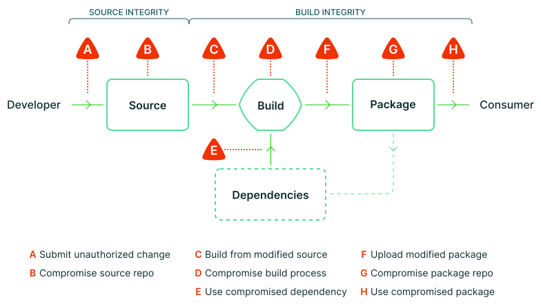

随着近些年针对软件供应链发起的攻击次数越来越多，Google 发布了一系列指南来确保软件包的完整性，目的是为了防止未经授权的代码修改影响软件供应链。

Google 的 SLSA 框架（Supply-chain Levels for Software Artifacts 软件制品的供应链级别）是通过识别 CI/CD 流水线中的问题并减小影响，为实现更安全的软件开发和部署流程提供建议。

## 目录

1. [什么是SLSA](#什么是SLSA)
2. [软件供应链中的问题](#软件供应链中的问题)
2.1 [供应链攻击包括哪些](#供应链攻击包括哪些)
2.2 [真实世界的例子](#真实世界的例子)
3. [SLSA等级](#SLSA等级)
3.1 [详细解释](#详细解释)
3.2 [限制](#限制)
4. [SLSA落地](#SLSA落地)
5. [其他工具](#其他工具)

## 什么是SLSA

[SLSA](https://slsa.dev/) 全名是 Supply chain Levels for Software Artifacts, or SLSA (发音“salsa”).

SLSA 是一个端到端框架，一个标准和控制的清单确保软件构建和部署过程的安全性，防止篡改源代码、构建平台以及构件仓库而产生的威胁。

## 软件供应链中的问题

任何软件供应链都可能引入漏洞，随着系统变得越来越复杂，做好最佳实践从而保证交付工件的完整性变得非常重要。如果没有一定的规范和系统发展计划，就很难应对下一次黑客攻击。

### 供应链攻击包括哪些

A 提交未经认证的修改
B 泄露源码仓库
C 从被修改源代码构建
D 泄露构建过程
E 使用已泄露的依赖
F 上传被修改的包
G 泄露了包仓库
H 使用已泄露的包

### 真实世界的例子

| 完整性威胁 | 已知例子 | SLSA 如何提供帮助 |
|-----------|---------|-------------------|
| A 提交未经认证的修改 | [研究人员](https://lore.kernel.org/lkml/202105051005.49BFABCE@keescook/)试图通过邮件列表上的 补丁程序故意将漏洞引入 Linux 内核。 | 两人审查发现了大部分（但不是全部）漏洞。 |
| B 泄露源码仓库 | [PHP](https://news-web.php.net/php.internals/113838)：攻击者破坏了 PHP 的自托管  git 服务器并注入了两个恶意提交。 | 一个受到更好保护的源代码平台 将成为攻击者更难攻击的目标。 |
| C 从被修改源代码构建 | [Webmin](https://www.webmin.com/exploit.html)：攻击者修改了构建基础设施 以使用与源代码控制不匹配的源文件。 | 符合 SLSA 标准的构建服务器会生成出处， 以识别实际使用的来源，从而使消费者能够检测到此类篡改。 |
| D 泄露构建过程 | [SolarWinds](https://www.crowdstrike.com/blog/sunspot-malware-technical-analysis/)：攻击者破坏了构建平台 并安装了在每次构建期间注入恶意行为的植入程序。 | 更高的 SLSA 级别需要对构建平台进行更强大的安全控制， 这使得妥协和获得持久性变得更加困难。 |
| E 使用已泄露的依赖 | [event-stream](https://web.archive.org/web/20210909051737/https://schneider.dev/blog/event-stream-vulnerability-explained/)：攻击者添加了一个无害的依赖项，然后更新了该依赖项 以添加恶意行为。更新与提交到 GitHub 的代码不匹配（即攻击 F）。 | 递归地将 SLSA 应用于所有依赖项会阻止这个特定的向量，因为 出处会表明它不是由适当的构建器构建的，或者源不是来自 GitHub。 |
| F 上传被修改的包 | [CodeCov](https://about.codecov.io/apr-2021-post-mortem/)：攻击者使用泄露的凭据将恶意工件上传到  Google Cloud Storage(GCS)，用户可以从中直接下载。 | GCS 中工件的出处表明工件不是以 预期的方式从预期的源代码库中构建的。 |
| G 泄露了包仓库 | [对包镜像的攻击](https://theupdateframework.io/papers/attacks-on-package-managers-ccs2008.pdf)：研究人员为几个流行的 包存储库运行镜像，这些镜像可能被用来提供恶意包。 | 与上面的 (F) 类似，恶意工件的来源表明它们不是 按预期构建的，也不是来自预期的源代码库。 |
| H 使用已泄露的包 | [Browserify typosquatting](https://blog.sonatype.com/damaging-linux-mac-malware-bundled-within-browserify-npm-brandjack-attempt)：攻击者 上传了一个与原始名称相似的恶意包。 | SLSA 不直接解决这种威胁，但将出处链接回源代码控制 可以启用和增强其他解决方案。 |

## SLSA等级

| 等级 | 描述 | 示例 |
|-----|------|------|
|1 | 构建过程的文档 | 无署名的出处 |
|2 | 构建服务的防篡改 | 托管源/构建，署名出处 |
|3 | 对特定威胁的额外抵抗力 | 对主机的安全控制，不可伪造的来源 |
|4 | 最高级别的信心和信任 | 两方审查+密封构建 |

### 详细解释

| 等级 | 要求 |
|-----|------|
|0 | 没有保证。 SLSA 0 表示缺少任何 SLSA 级别。 |
|1 | **构建过程必须完全脚本化/自动化并生成出处。**  出处是关于工件构建方式的元数据，包括构建过程、顶级源和依赖项。 了解出处允许软件消费者做出基于风险的安全决策。 SLSA 1 的 Provenance 不能防止篡改，但它提供了基本级别的代码源识别并有助于漏洞管理。|
|2 | **需要使用版本控制和生成经过身份验证的来源的托管构建服务。**  这些附加要求使软件消费者对软件的来源更有信心。 在此级别，出处可防止篡改到构建服务受信任的程度。 SLSA 2 还提供了一个轻松升级到 SLSA 3 的途径。 |
|3 | **源和构建平台符合特定标准，以分别保证源的可审计性和出处的完整性。**  我们设想了一个认证流程，审计员可以通过该流程证明平台符合要求，然后消费者就可以信赖了。  SLSA 3 通过防止特定类别的威胁（例如交叉构建污染），提供比早期级别更强的防篡改保护。 |
|4 | **需要两人审查所有更改和密封、可重现的构建过程。**  两人审查是发现错误和阻止不良行为的行业最佳实践。  密封构建保证来源的依赖项列表是完整的。  可重现的构建虽然不是严格要求的，但提供了许多可审计性和可靠性的好处。  总的来说，SLSA 4 让消费者对软件未被篡改具有高度的信心。 |

### 限制

SLSA 可以帮助减少软件工件中的供应链威胁，但也有局限性。

* 许多工件在供应链中存在大量依赖关系，完整的依赖关系图可能非常大。
* 实际上从事安全工作的团队需要确定并关注供应链中的重要组成部分，可以手动执行，但工作量可能很大。
* 工件的 SLSA 级别不可传递并且依赖项有自己的 SLSA 评级，这意味着可以从 SLSA 0 依赖项构建 SLSA 4 工件。因此，虽然主要的工件具有很强的安全性，但其他地方可能仍然存在风险。这些风险的总和将帮助软件消费者了解如何以及在何处使用 SLSA 4 工件。
* 虽然这些任务的自动化会有所帮助，但对于每个软件消费者来说，全面审查每个工件的整个图表并不切实际。为了缩小这一差距，审计员和认证机构可以验证并断言某些东西符合 SLSA 要求。这对于闭源软件可能特别有价值。

作为 SLSA 路线图的一部分，SLSA 团队还会继续探讨如何识别重要组成部分、如何确定整个供应链的总体风险以及认证的作用。

## SLSA落地

SLSA 是一个标准，但如何落地呢？

我们可以通过 SLSA 的 [Requirements](https://slsa.dev/spec/v0.1/requirements) 的汇总表来一一对照进行自检，查看当前的 CI/CD 工作流处在哪个安全等级。

有没有工具能够更好的帮助我们检查并指导我们如何提高安全等级呢？

目前只有少数可以实现此目的的工具，并且绝大多数只限于 GitHub。

[OpenSSF Scorecard](https://github.com/ossf/scorecard) 就是一个来自于开源安全基金会（OpenSSF）针对开源软件安全指标检查的一个自动化工具，它可以帮助开源维护者改进他们的安全最佳实践，并帮助开源消费者判断他们的依赖项是否安全。

它是通过评估软件安全相关的许多重要项目，并为每个检查分配 0-10 的分数。你可以使用这些分数来了解需要改进的特定领域，以加强项目的安全状况。还可以评估依赖项引入的风险，并就接受这些风险、评估替代解决方案或与维护人员合作进行改进做出明智的决定。

## 其他工具

* [slsa-verifier](https://github.com/slsa-framework/slsa-verifier) - 验证符合 SLSA 标准的构建出处
* [Sigstore](https://github.com/sigstore) - 用于签名、验证和保护软件的新标准

---

转载本站文章请注明作者和出处，请勿用于任何商业用途。欢迎关注公众号「DevOps攻城狮」
