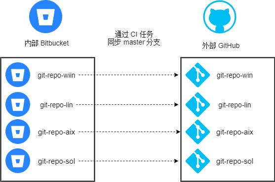

## Background

Recently our team needed to synchronize some examples and samples from our internal Bitbucket to GitHub. I know GitHub can create public or private repositories, but we needed to maintain these two points:

* Only share the code we want to share with clients.
* Not change the current workflow; continue using Bitbucket.


Therefore, we needed to create corresponding repositories on GitHub and then periodically synchronize the corresponding master branch in the internal Bitbucket repository to GitHub via a CI job.



## Branch Strategy

First, we needed to set branch permissions in Bitbucket:

* The `master` branch is only allowed to be modified via Pull Requests.
* Pull Requests require at least one reviewer by default, and only approved Pull Requests can be merged.

Second, to simplify the branch strategy for product, after-sales, and other personnel:

1. Create a feature or bugfix branch from the `master` branch (depending on the purpose of your modification).
2. Commit your changes to your feature or bugfix branch.
3. After testing your branch, submit a Pull Request to the `master` branch.
4. The Pull Request can only be merged after reviewer approval.


## Jenkins Pipeline

Because this synchronization task isn't very frequent, and to keep the Jenkins Pipeline simple and easy to maintain, I didn't add a `Jenkinsfile` to each repository that needs synchronization or add webhooks in Bitbucket. This has several advantages:

* Only one Jenkins job is created, using a single `Jenkinsfile` to handle all repository synchronizations.
* Reduces redundant `Jenkinsfile` code; modifications only require maintaining one file.
* No need to add a `Jenkinsfile` to each repository; provides a cleaner presentation of examples and avoids confusion for non-IT personnel.

Disadvantages:  It cannot be triggered by SCM.  If you want to trigger via webhooks, some companies require permissions to add webhooks, which can be troublesome. Additionally, it may not be able to distinguish which repository sent the request, making it difficult to implement synchronization for specific repositories.

Therefore, if synchronization isn't frequently needed, manual or scheduled synchronization is sufficient.

```groovy
// This Jenkinsfile is used to synchronize Bitbucket repositories master branches to GitHub repositories master branches.

@Library('jenkins-shared-library@develop') _

def email = new org.cicd.email()

pipeline {

  agent {
    label "main-slave"
  }
  parameters {
    booleanParam(defaultValue: false, name: 'git-repo-win', summary: 'Sync internal git-repo-win master branch with external git-repo-win on GitHub')
    booleanParam(defaultValue: true,  name: 'git-repo-lin', summary: 'Sync internal git-repo-lin master branch with external git-repo-lin on GitHub')
    booleanParam(defaultValue: false, name: 'git-repo-aix', summary: 'Sync internal git-repo-aix master branch with external git-repo-aix on GitHub')
    booleanParam(defaultValue: false, name: 'git-repo-sol', summary: 'Sync internal git-repo-sol master branch with external git-repo-sol on GitHub')
  }
  options {
    timestamps()
    buildDiscarder(logRotator(numToKeepStr:'50'))
  }
  stages {
    stage("Synchronous master branch"){
      steps{
        script {
          try {
            params.each { key, value ->
              def repoName = "$key"
              if ( value == true) {
                echo "Start synchronizing $key Bitbucket repository."
                sh """
                rm -rf ${repoName}
                return_status=0
                git clone -b master ssh://git@git.your-company.com:7999/~xshen/${repoName}.git
                cd ${repoName}
                git config user.name "Sync Bot"
                git config user.email "bot@your-company.com"
                git remote add github git@github.com:shenxianpeng/${repoName}.git
                git push -u github master
                return_status="\$?"
                if [ \$return_status -eq 0 ] ; then
                  echo "Synchronize ${repoName} from Bitbucket to GitHub success."
                  cd ..
                  rm -rf ${repoName}
                  exit 0
                else
                  echo "Synchronize ${repoName} from Bitbucket to GitHub failed."
                  exit 1
                fi"""
              } else {
                echo "${repoName} parameter value is $value, skip it."
              }
            }
            cleanWs()
          }
          catch (error) {
            echo "Some error occurs during synchronizing $key process."
          } finally {
            email.Send(currentBuild.currentResult, env.CHANGE_AUTHOR_EMAIL)
          }
        }
      }
    }
  }
}
```

The main key point of the above `Jenkinsfile` is the line `params.each { key, value -> }`.  By judging the parameters selected during the build, if a parameter is checked during the build, the synchronization script will be executed; otherwise, the synchronization script will be skipped, and the loop will proceed to the next parameter. This allows for synchronization of specified repositories.

---