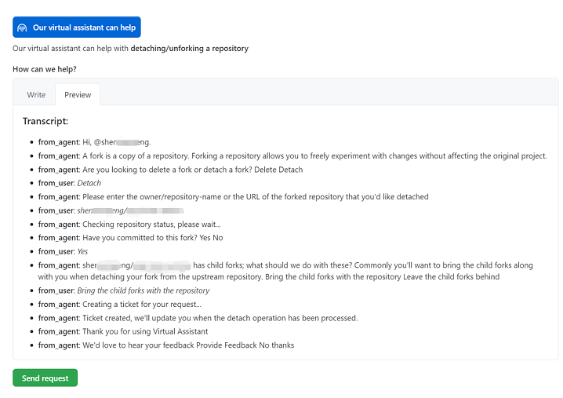

## Background

Developers, and even companies, may encounter the following problems:

1. A repository was initially forked, and subsequently underwent significant modifications, diverging from the parent repository in both functionality and programming language.
2. Because it's a forked repository, every Pull Request defaults to the parent repository's branch, leading to accidental PRs to the parent.
3. Contributors have contributed to and used the forked repository, but their contributions and the downstream usage of the project are not visible, hindering its development.

Due to these issues, developers may consider separating from the parent repository. However, GitHub currently does not offer an Unfork/Detach function.

While deleting and recreating the project achieves separation, it results in the loss of crucial information, such as Issues, Wikis, and Pull Requests.

> Unforking is fundamentally different from freeloading Apache SkyWalking using a certain engine under a certain company.  It's more like the divergence of Hudson and Jenkins.

## Solution

After investigation and testing, the most feasible solution is to use GitHub Support. The specific steps are as follows:

1. Open this link: https://support.github.com/contact?tags=rr-forks
2. Select your account or organization, and enter "unfork" in the Subject field. A virtual assistant will automatically appear; select the virtual assistant.
    
3. Follow the virtual assistant's prompts and select the appropriate answers (partial screenshot below).
    
4. The conversation will be automatically transcribed. Send the request and wait for Support to process it (it won't take long).
    

Note that if your repository has been forked by others and you want to maintain the fork record of your child repository after separating from the parent, you should select "Bring the child forks with the repository".

Alternatively, using commands like `git clone --bare` and `git push --mirror` preserves the complete Git history but loses Issues, Wikis, and Pull Requests.

Hopefully, this helps those in need.

## References

* [Delete fork dependency of a GitHub repository](https://stackoverflow.com/questions/16052477/delete-fork-dependency-of-a-github-repository)
* [Unfork a Github fork without deleting](https://stackoverflow.com/questions/29326767/unfork-a-github-fork-without-deleting/41486339#41486339)

---

Please indicate the author and source when reprinting this article. Do not use it for any commercial purposes.  Welcome to follow the WeChat public account "DevOps攻城狮"