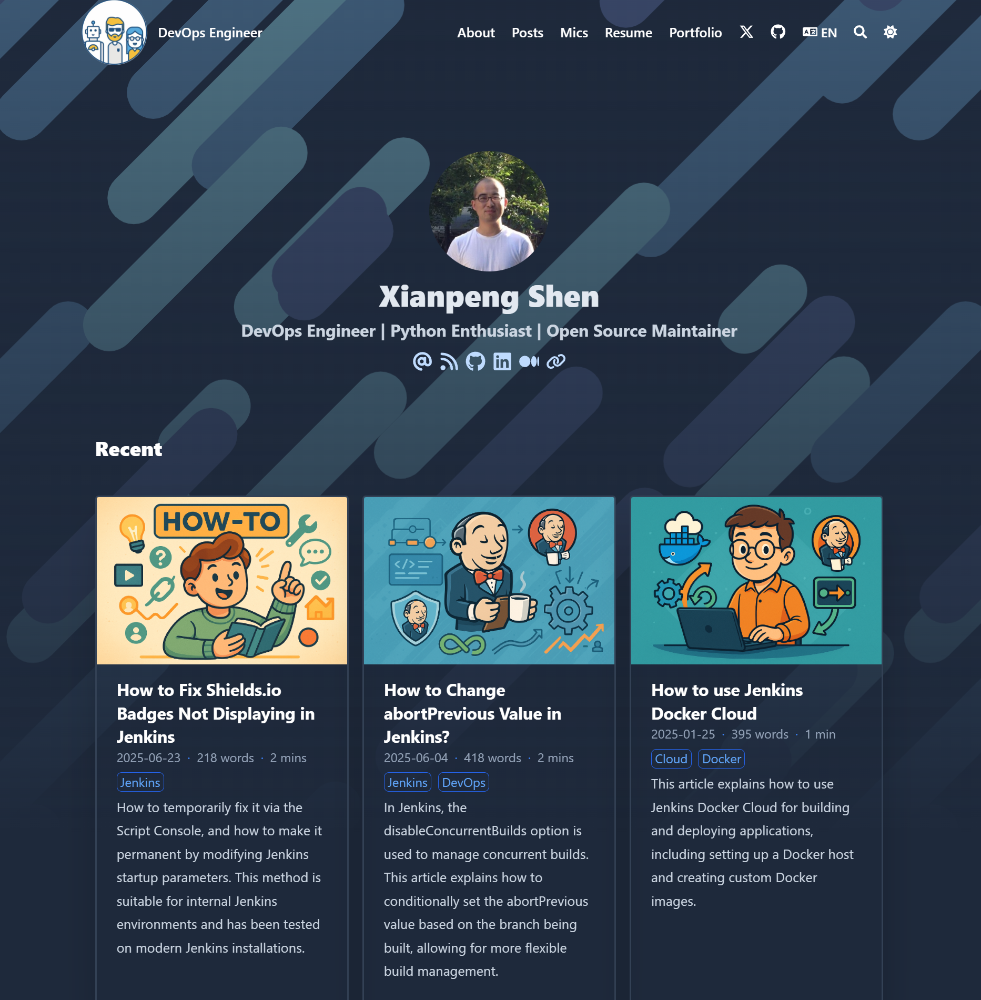
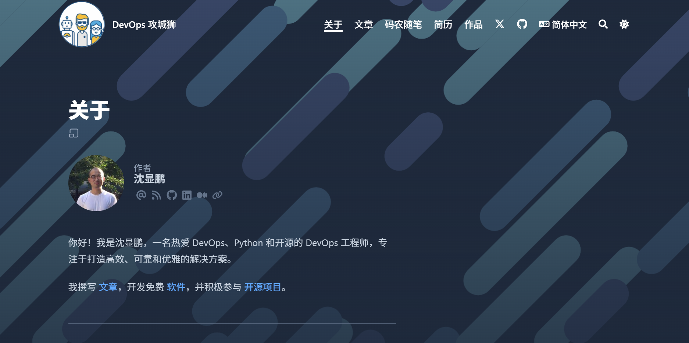
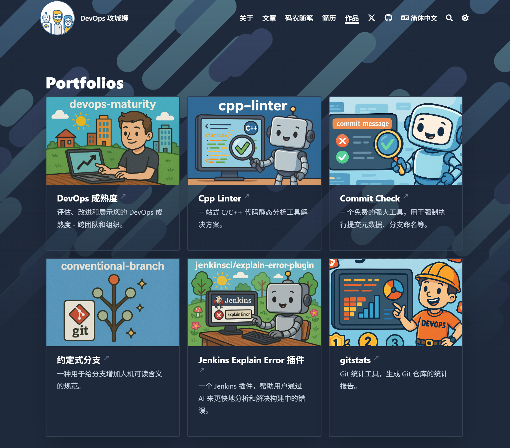

Eight years ago, I built my blog using Hexo + the landscape theme. From 2017 until today, it has hosted 236 posts, including technical articles and a small number of personal notes.

Over time, Hexo no longer seemed like the best choice, and some limitations and inconveniences became more apparent, such as:

- Poor support for multiple languages
- The current theme couldn’t meet my needs, such as listing works or a resume
- Many features required third-party plugins, such as comments, reading time, and word count
- Content and images for posts were stored in different directories, making management inconvenient

I had previously made a short-lived attempt to revamp the blog, but the results weren’t ideal, so I shelved the plan.

Recently, however, I came across Hugo with the Blowfish theme, which immediately caught my eye. Combined with GitHub Copilot and my OpenAI Plus subscription, I decided to fully revamp my blog and migrate to Hugo.

> That €30 per month AI subscription shouldn’t go to waste!

Even with so many tools and resources at my disposal, it still took me three nights to complete a migration I was satisfied with. Here’s a comparison:

### Home Page Comparison

Previous home page (no localization applied)

### About Page Comparison

### New Pages

## Upgrade Notes

1. If you have a large number of posts like I do, create a new repository (e.g., `new-blog`), set it up with Hugo + Blowfish theme first.
2. Then migrate your Hexo posts. I used Copilot to write a script to automatically convert Hexo posts into Hugo format.
3. Use ChatGPT or other AI tools to generate post cover images.
4. Use Copilot to copy the generated covers to the corresponding directories based on the post topics.

## Gains and Losses of the Upgrade

After the upgrade, my blog gained the following improvements:

1. Resolved the lack of multilingual support
2. Added built-in post search functionality
3. Provided better navigation and page layout
4. Stored post content and images in the same directory for easier management
5. The Blowfish theme offers many built-in features (comments, reading time, word count, etc.) without needing extra plugins

Of course, there were also some losses:

1. Old post URLs were not mapped to the new ones, impacting SEO (I can fix it if I want to)
2. Lost previous comment data
3. Time investment was needed for migration and adjustments

Overall, the upgrade was definitely worth it — the new theme is a huge improvement over the old one.

## Final Thoughts

Without the help of AI, this migration would have taken much more time and effort.

At the same time, with less reliance on search engines, the chances of technical articles being seen seem lower — perhaps now they exist more as training data for AI.

Regardless, for IT professionals, having a personal writing space is still valuable, whether for recording, summarizing, or reflection.

I will continue to share my learning and work experiences here, as well as record my thoughts, observations, and reflections as a programmer living in Eastern Europe. Perhaps that still holds some value.
