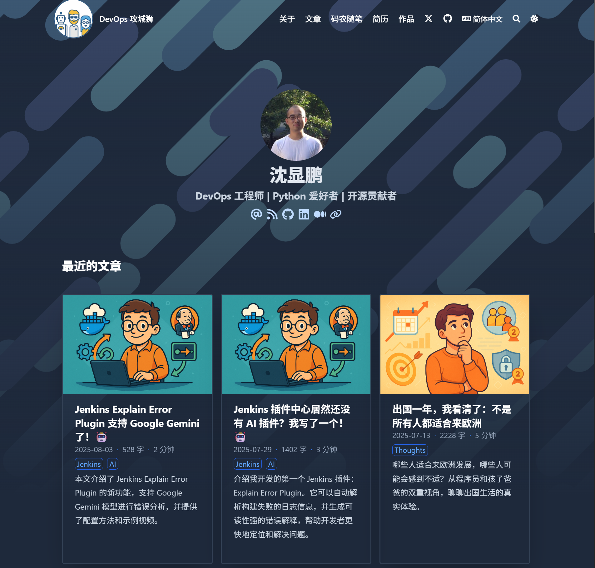
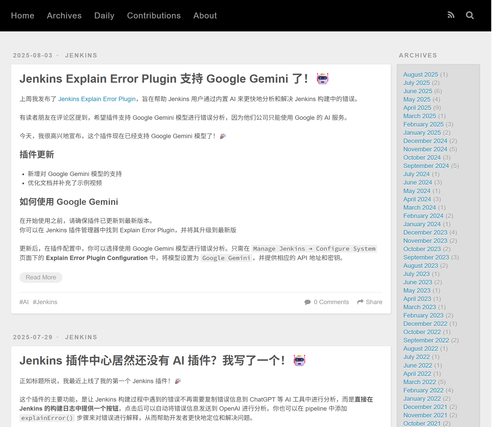
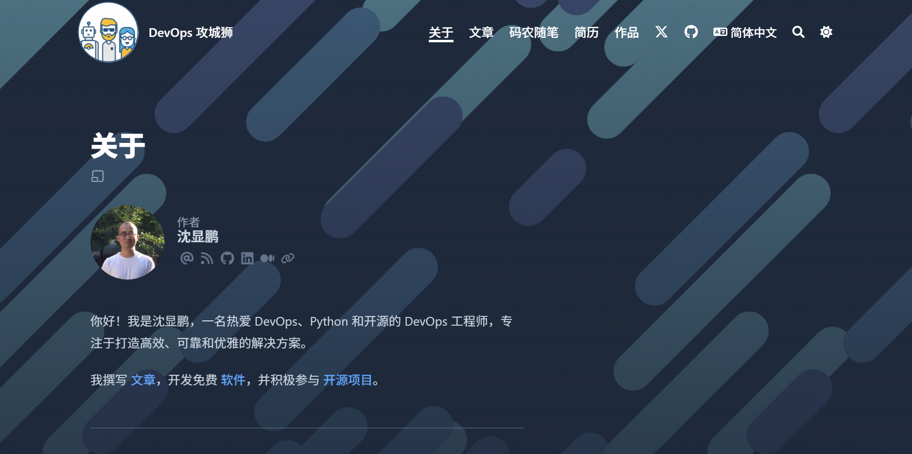
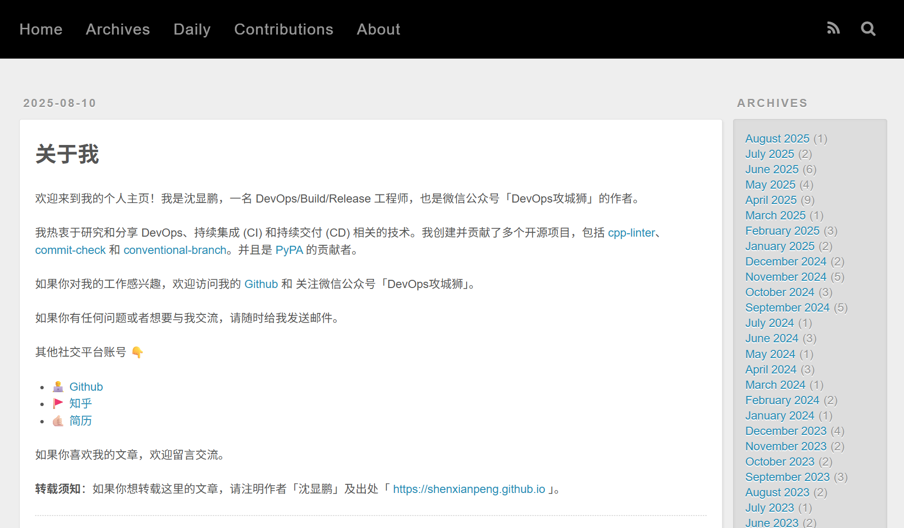
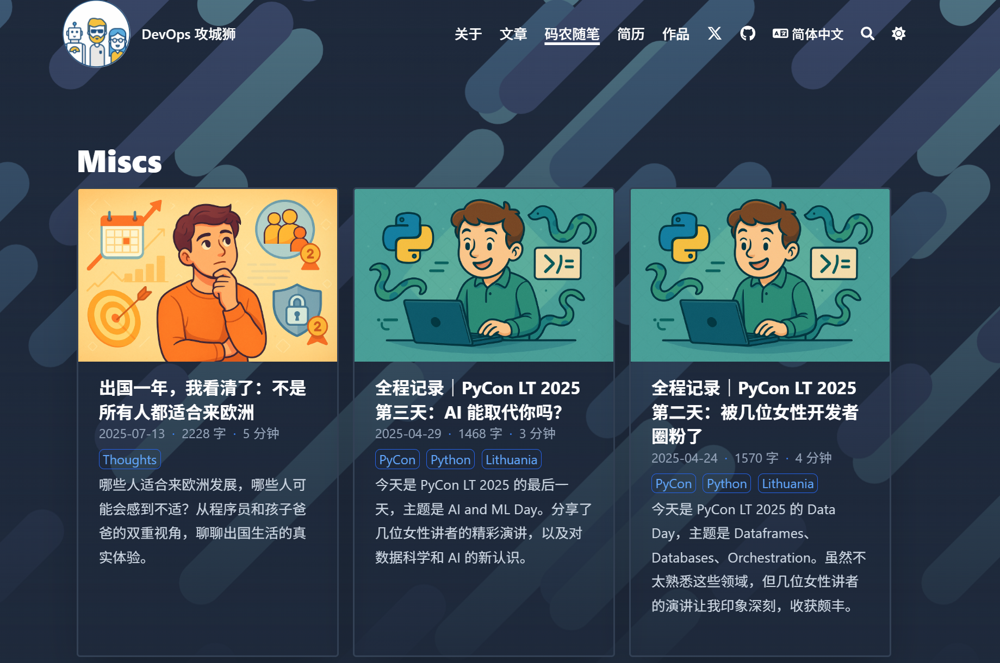

八年前，我使用了 Hexo + landscape 主题搭建了我的博客，从 2017 年一直记录到了今天的技术文章和少量的生活点滴，共计 236 篇。

随着时间的推移，Hexo 似乎已经不是最好的选择，一些限制和不便逐渐显现出来，比如：

- 对于多语言支持的不足
- 目前的主题不能满足我的需求，比如列出作品、简历等
- 很多功能需要自己找插件来实现，比如评论、阅读时间、字数等
- 文章的内容和图片不在同一个目录下面（也许是我的设置问题）

之前有过短暂的尝试翻新，但效果不是很理想，就不了了之了。

直到最近，看到 Hugo + Blowfish 的主题，让我眼前一亮，再加上有 GitHub Copilot 以及我的 OpenAI Plus 的加持，我决定彻底翻新我的博客，迁移到 Hugo 上。

虽然有这么多的工具和资源可以帮助我，但还是花了我三个晚上才基本完成了比较满意的迁移。来对比看一下效果

### 主页对比

之前的主页（没有做本地化处理）

### 关于页面对比

### 新增页面

## 升级注意事项

1. 如果你像我一样文章数量很大，建议新建一个仓库，比如 new-blog，然后使用 Hugo + Blowfish 主题，先把网站搭建起来
2. 再把 Hexo 的文章迁移过来，我让 Copilot 帮我写了一个脚本，自动把 Hexo 的文章转换成 Hugo 的格式
3. 使用 ChatGPT 等 AI 帮助生成文章封面
4. 使用 Copilot 根据不同的文章主题把生成的文章封面复制到对应的目录下面
5. 

## 最后的思考

随着 AI 的蓬勃发展，写一些技术文章似乎也没有太多必要了，现在更多地把它当作一个 IT 从业者的写作后花园。

主要还是拿来作为自己的笔记；另外再记录一下作为一个生活在东欧的程序员的所思、所见、所想，也许还有一些价值。

这次博客迁移的过程让我深刻体会到：
- **工具选择的重要性**：合适的工具能显著提升效率和体验
- **AI 辅助开发的威力**：从代码编写到内容创作，AI 工具极大地降低了技术门槛
- **持续学习的必要性**：技术在快速发展，保持好奇心和学习能力是关键

---

转载本文请注明作者与出处，禁止商业用途。欢迎关注公众号「DevOps攻城狮」。
