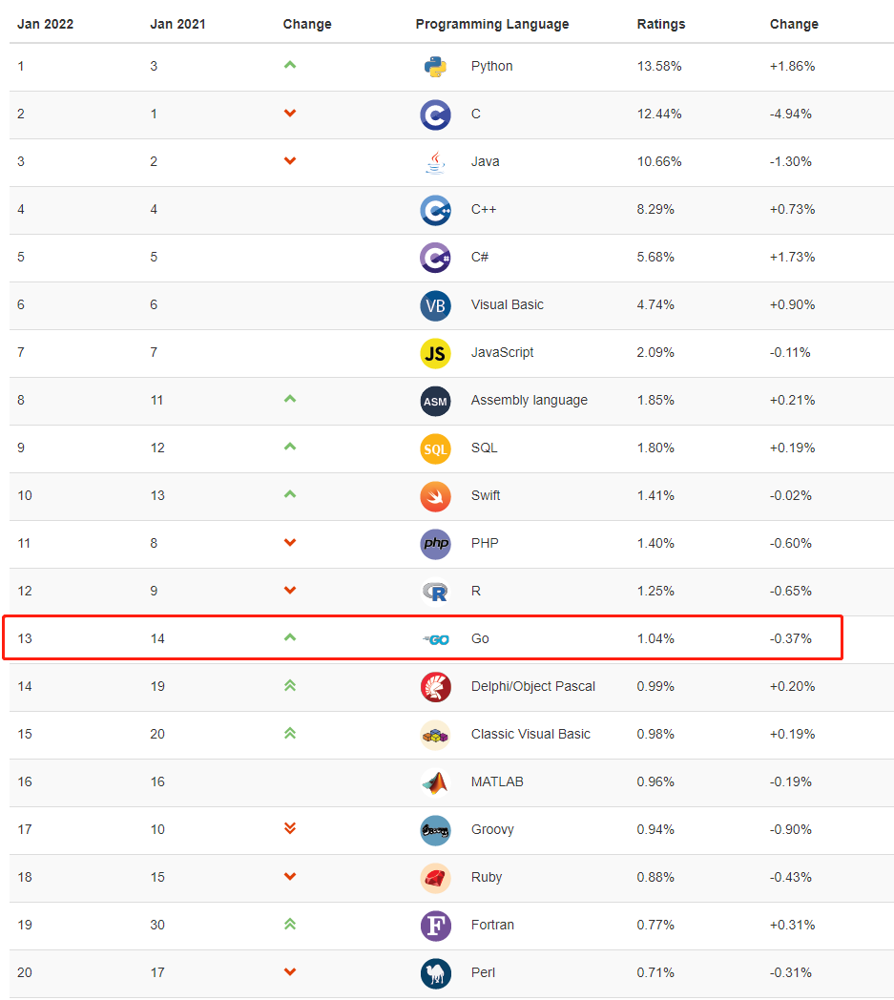

Go is an open-source programming language that makes it easy to build simple, reliable, and efficient software.

## Go or Golang

Let's start with a question most people might overlook: Is Google's open-source programming language called Go or Golang? Or both?  Three seconds to think...

Google says: It's called Go. The reason some people call it Golang is that the previous Go language website was golang.org (because go.org was already taken), so some people mixed up Golang and Go.

Now, entering golang.org will redirect you to go.dev, which is a way to officially clarify the name.

## Advantages of Go

The official website describes Go as follows:

* Go is suitable for building large-scale, reliable, and efficient software quickly.
* Go is an open-source programming language backed by Google.
* Easy to learn and get started with.
* Built-in concurrency and a powerful standard library.
* A constantly evolving ecosystem of partners, communities, and tools.

Today, Go is used in a variety of applications:

* Go is popular in cloud-based or server-side applications.
* Cloud infrastructure.  Many of today's most popular infrastructure tools are written in Go, such as Kubernetes, Docker, and Prometheus.
* Many command-line tools are written in Go.
* DevOps and web reliability automation often use Go.
* Go is also used in the fields of artificial intelligence and data science.
* It's also used in microcontroller programming, robotics, and game development.

This is why Go is becoming increasingly popular.

It was these advantages, and the need to write a CLI for work, that led me to learn Go.

## Go's Ranking

Go's popularity in China is quite high. Let's take a look at Go's current ranking.

This is the TIOBE January 2022 top 20 programming languages ranking.  Go is ranked 13th, up one position from last year.

Compared to Python, C, Java, C++, and C#, which are in the top five, do you think Go can catch up?

From my observations of non-cloud companies and colleagues, most developers use C/C++, Java, C#, and Python.  Therefore, I think this ranking is quite expected.

## Should Beginners Learn Python or Go?

Python has been around for over 30 years, but its popularity continues to grow. Python is an excellent object-oriented language, and you can also use a functional programming style to write code.  Among all programming languages, you might not find one used by more non-programmers than Python.

* Its flexibility is one reason Python is so popular.
* It's often used for scripting, web development, data science, teaching programming to children, creating animations, and more.

So how does Go compare to Python?

* Both Python and Go have simple syntax.
* Both Python and Go are easy for beginners to get started with and relatively easy to learn (Python is relatively easier).
* Python often dominates the data science field; Go is well-suited for systems programming.
* Go is much faster than Python in terms of program execution speed.
* As a high-level language, Python has a wider range of libraries and a larger community built around it.
* Go is ideal for handling large concurrent applications and supports concurrency—the ability to run multiple programs/tasks simultaneously. Python does not.

Today, Python and Go are two of the most popular and convenient programming languages. For beginners, should they learn Python or Go?

* If you're a complete beginner, it's recommended to learn Python first. Compared to Go, Python is easier to learn.
* If you're a test engineer and want to learn a programming language, learn Python.  Most automation testing positions require Python proficiency.
* If you're a software developer or DevOps engineer, you should learn both.  "Kids make choices, adults take both."

## How to Learn Go

* Read documentation or watch videos, but most importantly, get your hands dirty!!

  I first watched Go language video tutorials between 2010 and 2020, but because I didn't do much coding, I remained in a state of knowing only a little.

  For newcomers learning any programming language, tutorials only teach you about 30%. To truly learn, you must practice personally, otherwise, it will be: "Looks easy, but impossible to write".

* Choose a direction and start coding immediately.

  My direction was to write a CLI tool. Although Go's built-in `Flag` package can be used to write CLI commands, after looking at many CLI projects developed using Go, I noticed that most of them didn't use the built-in `Flag` package, but mostly used [spf13/cobra](https://github.com/spf13/cobra) or [urfave/cli](https://github.com/urfave/cli).

  * This is a list of projects using cobra [here](https://github.com/spf13/cobra/blob/master/projects_using_cobra.md), including well-known projects like Kubernetes, Hugo, Docker, and the GitHub CLI.
  * As for urfave/cli, I saw Jfrog CLI using it, but I didn't see a list of other well-known projects using urfave/cli like cobra.

  For beginners like me, the most important thing is to start immediately, so you don't need to spend too much time choosing a framework.  Cobra has so many excellent projects backing it up, just use it. The most important thing is to start coding as soon as possible. In the coding process, choose top-tier projects that also use this framework as a reference. This can help us write better code by reading other people's code.  Don't just Ctrl + C and Ctrl + V.

* Finally, here are some other excellent projects when developing CLIs:

  * github.com/AlecAivazis/survey/v2 - Build interactive command lines in the terminal.
  * github.com/enescakir/emoji - Emoji library, supports emoji output in the terminal.
  * github.com/mgutz/ansi - Create ANSI color strings.
