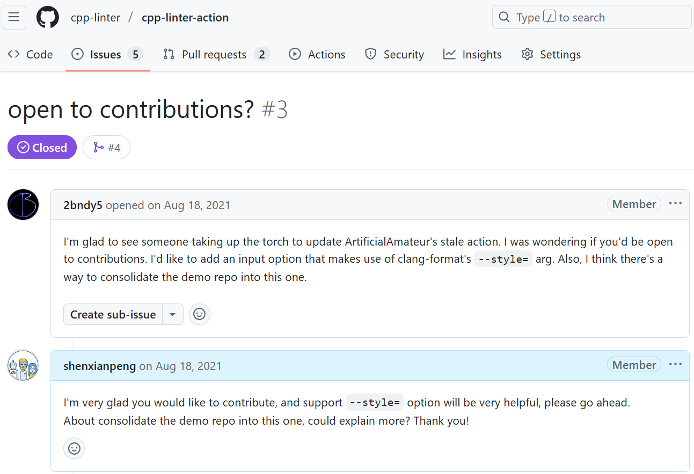

很多朋友问过我：为什么要花那么多业余时间做开源？尤其是有了孩子之后，还要牺牲休息时间坚持下去。

说实话，我在开源这条路上坚持了四年，几乎没赚到过一分钱。但它带给我的收获，远比金钱更长远。  
今天，我想分享三点：这三点不只是给开源人用的，每个开发者、甚至每个打工人，都能借鉴。

---

## 1. 让你的工作被真正看到

在公司里，你做得再好，往往只有同事或上级知道。  
换工作时，还得看面试官的心情和眼光。

但开源不同。一个公开的项目，本身就是一份活生生的简历。  
它能直接展示你的能力，比自我介绍更有说服力。

👉 借鉴方法：即使不做开源，也可以通过写博客、总结技术文档、在社区回答问题，让别人“看见”你。工作成果被看到，本身就是一份无形资产。

## 2. 接触到更优秀的人和项目

如果只在自己的一亩三分地里写 CRUD，职业生涯可能在 35 岁就停滞不前。  
而开源让我不断接触到趋势、最佳实践，认识到更优秀的开发者。

比如我经常 watch **CPython** 仓库，学习他们如何写 PR、如何提出 PEP、如何做 CI/CD。  
光是学习这些流程，就让我收获颇多。长期泡在英文社区里，也让我英语慢慢提升。

👉 借鉴方法：即使不参与开源，也可以多关注优秀项目或大厂工程实践，从中学习工作方式。很多“高手”的习惯，其实都能复制到你自己的工作中。

## 3. 一份长期的价值投资

过去四年，我创建了 4 个 GitHub 组织、十几个项目，累计上万用户、数百 star。  
这些成果，都是孩子睡着后的深夜、被压缩的周末和牺牲的睡眠换来的。

虽然几乎没赚到钱，但这就是一种**长期资产**。  
开源的经验让我在工作里更快成长，而工作的经验也反过来反哺了开源。  
更重要的是，它让我保持持续学习的状态，不至于被“躺平”心态困住。

👉 借鉴方法：无论是开源、写公众号、还是副业尝试，都可以看作是一种长期投资。也许短期没钱赚，但它能积累声誉、技能和机会。

---

## 我的开源故事（简版）

2021 年 4 月 26 日，我在 [**cpp-linter-action**](https://github.com/cpp-linter/cpp-linter-action) 上迈出了开源的第一步。之后有一天有人在 Issue 里主动提出贡献，也正是那一刻，点燃了我的开源之路。

此后，我和 Brendan (2bndy5) 一起维护了多个项目，我也从他身上学到了很多。真希望未来有机会去美国能见到他本人。

后来我们创建了 [**cpp-linter**](https://github.com/cpp-linter) 组织，项目逐渐发展成 GitHub 上最重要的 C/C++ linter 项目之一。之后又写了 [**commit-check**](https://github.com/commit-check/commit-check) 和 [**conventional-branch**](https://github.com/conventional-branch/conventional-branch) 也收获了一批用户在使用。

2024 年，AI 工具迎来爆发。我一度担心自己会被取代，但实践证明：AI 能帮人快速写出可运行的代码，真正优秀的开源项目却仍然需要人来打磨。
比如我写 [**Jenkins Explain Error Plugin**](https://github.com/jenkinsci/explain-error-plugin)，借助 AI 我很快做出了初版，但最终 Reviewer 的修改意见让我更清楚地认识到：**AI 已经成为开发中不可或缺的工具，但真正让开源有价值的，始终是人的把关与沉淀。**

---

## 最后

开源，对我来说不只是兴趣，而是一份长期的价值投资。  

它让我被看见；  
它让我接触到更优秀的人和实践；  
它让我保持价值感和竞争力。  

哪怕没有直接的经济回报，我依然觉得，这是一件值得“死磕”的事。  

至于 AI 会不会取代我们？我不确定。  
但我确定的一点是：**只要不断尝试和适应，才能在这个快速变化的时代继续被需要。**
