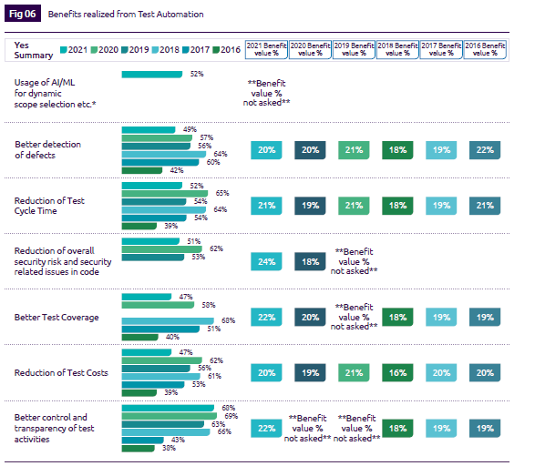

## Preface

The 2021-22 World Quality Report (WQR), a collaborative effort by Micro Focus, Capgemini, and Sogeti, is the only report analyzing software quality and testing trends globally.

This report surveyed 1750 executives and professionals.  This includes everyone from top management to QA test managers and quality engineers, spanning 10 industries across 32 countries.

The World Quality Report (WQR) is a unique global study, and this year's survey highlights the impact of evolving pandemic-influenced application demands in newly deployed methods, as well as the adoption of QA into Agile and DevOps practices, and the continued rise of AI.

Following test-focused software quality reports like this helps us quickly understand the current state and trends in the software testing industry.

## Five Key Themes

A key message from the WQR:  In the continuing COVID-19 pandemic, we've seen the convergence of digital transformation and the real-time adoption of Agile and DevOps practices.  Furthermore, QA is emerging as a leader in adopting Agile and DevOps practices, providing teams with the tools and processes to foster quality throughout the Software Development Life Cycle (SDLC).

The WQR highlights five specific themes around key findings and trends:

1. Impact of the COVID-19 pandemic on QA organizations and software testing
2. Real-time convergence of digital transformation with DevOps and Agile adoption and the increasingly crucial role of QA
3. Geographically dispersed teams focusing on business outcomes when deploying applications across environments
4. Artificial Intelligence (AI) enhancing Agile and DevOps to cultivate a growing culture of quality accountability across all teams
5. Using AI-driven continuous testing and quality management tools to address customer experience priorities and rapidly changing pandemic-influenced requirements

## Key Findings and Trends

### 1. Impact of the COVID-19 Pandemic on QA Organizations and Software Testing

The COVID-19 pandemic had a direct and tangible impact on almost all aspects of business, including QA. However, many QA organizations were able to adapt to the realities of new hybrid work environments and transition to the new reality of working in distributed teams. This was likely possible because the trend towards hybrid distributed teams was already growing, and the pandemic simply accelerated this trend.

#### Customer Experience is King

The COVID-19 pandemic refocused attention on customers and their experiences.  The top-rated aspects this year were:

* Enhanced customer experience, chosen by 63% of respondents
* Followed by enhanced security (62%)
* Then higher responsiveness to business needs (61%)
* And higher-quality software solutions (61%)

#### From Guardian to Quality Champion

Testing and QA goals have also been reordered in the past year. Last year, guardians of business outcomes and quality were clear leaders, while this year, the support rate between these metrics has narrowed.

* Quality guardians, quality speed, and quality enablement within teams led at 62%
* Business assurance, digital wellbeing, and automation came in second at 61%

QA teams are evolving from guardians of quality to champions of quality. QA teams are becoming vibrant leaders in organizational quality initiatives, empowering everyone on the team to achieve quality while contributing to business outcomes and growth.

### 2. Real-time Convergence of Digital Transformation with DevOps and Agile Adoption and the Increasingly Crucial Role of QA

#### Driving Digital Transformation

This year, digital transformation initiatives aligned with pandemic requirements. Before the pandemic began, Agile and DevOps were a growing trend. During the pandemic, we began to see QA now playing a key role in organizations' adoption of Agile and DevOps, blurring the lines between development and testing, while creating a blended approach to quality.

Let's look at the drivers of digital transformation: Improved productivity and efficiency led at 47%; followed by improved service/product quality at 46%; then speed, better agility and flexibility; customer experience directly behind speed; closely followed by cost reduction and creating innovative opportunities; competitive differentiation was last.

> Because competitive differentiation seems more like a side benefit of digital transformation, whereas digital transformation itself helps improve efficiency, quality, speed, and overall better customer experience.

#### The Growing Role of QA in DevOps and Agile Adoption – Guided by Business Priorities

This year, we saw a significant shift in business requirements, becoming more important than the demands of the technology stack. Compared to last year, the number of participants weighting the tech stack decreased by 16 percentage points, replaced by the largest increase in:

* Business priorities, now ranked number one, increased by 11 percentage points compared to last year
* Also significantly increased compared to last year is culture/agility, up 21 percentage points

### 3. Geographically Dispersed Teams Focusing on Business Outcomes When Deploying Applications Across Environments

Last year's survey, conducted at the start of the global pandemic, showed signs of the transformations needed to meet business objectives, and the new requirements of remote work and digital transformation. With this year's survey, we see that digital transformation continues, even while keeping pace with pandemic-influenced new work requirements. This accelerated company plans to migrate workloads to the cloud, partly due to planned digital transformation initiatives, and the rapid shift to remote work, fueling a need for increased security.

Due to the pandemic-influenced workplace, the top-rated focus was on remote access to testing systems and test environments (using SaaS and cloud). Supporting this remote access were secondary factors based on remote, including better team collaboration tools. To support the quality of modern applications, the test environments themselves must also be modernized. This year, we saw:

* Organizations increasingly satisfied with using cloud and containers to modernize test environments (highest satisfaction)
* Followed by improved booking and management of test environments (+16)
* Then providing visibility (+22)
* Lastly cost efficiency (+18)

### 4. Artificial Intelligence (AI) Enhancing Agile and DevOps to Cultivate a Growing Culture of Quality Accountability Across All Teams

Artificial intelligence continues to transform how test automation is built, and how testing is executed. We are seeing increasing confidence in the level of AI-based testing within organizations, with almost half of the respondents stating that they already possess the repository of test execution data needed for AI and ML, and that they are willing to act on the intelligence provided by their AI and ML platforms.

This year, we also asked respondents to predict their likelihood of leveraging a range of approaches to accelerate and optimize testing in Agile and DevOps environments. Compared to the same period last year:

* Automated quality gates integrating testing into CI/CD pipelines (+5)
* Implementing intelligent and automated dashboards to achieve continuous quality monitoring saw the largest increase (+9)
* The newly added this year, using AI to optimize test cases ranked second overall, only behind shifting testing left.

### 5. Using AI-driven Continuous Testing and Quality Management Tools to Address Customer Experience Priorities and Rapidly Changing Pandemic-Influenced Requirements

This year, we asked respondents about the benefits of test automation:

* First, all items showed a year-over-year downward trend compared to last year, showcasing the challenges faced when working in hybrid and distributed teams.
* Such as better defect detection, shorter test cycles, lower overall security risks, better test coverage, lower testing costs, and control over the transparency of testing are all evident benefits.
* AI/ML is the fourth highest benefit, also proving its potential and value.

## Key Recommendations

### QA Orchestration in Agile and DevOps

Focus on what matters most: customer experience and business objectives, meeting both with efficiency and speed.  Simultaneously, adopt an engineering mindset within your teams, and embrace multi-skilling and upskilling. A new trend rapidly becoming the new normal is the SDET (Software Development Engineer in Test). Invest in insights, especially real-time insights across your entire QA and testing function. Focus on developing intelligent dashboards with real-time KPIs, from short-term tactical plans to long-term planning and strategic direction.

### Intelligent Test Automation

Standardize the use of test automation in QA by adopting an automation-first approach to software quality delivery. Expand automation across the E2E lifecycle, incorporating automation into all QA activities.

### Artificial Intelligence and Machine Learning

Drive the use of AI – don’t be driven by it. AI and ML promise exponential improvements, but use AI as a tool, not a replacement for the business decisions you’re making. For example, use AI to illuminate what to do and when to do it. It helps not just identify failures but also helps identify the reasons those failures are happening.  Furthermore, focus AI on what matters most, identifying the most challenging areas of quality in software delivery. If you haven’t incorporated AI into quality yet, now is the best time to start.

### Test Environment Management (TEM) and Test Data Management (TDM)

Cloud adoption is continuing to show steady and consistent growth, but be mindful to ensure that the future doesn’t overshadow present needs.  The key to successfully adopting cloud is to ensure integrity with legacy applications.  Additionally, data analytics is now a key aspect of a test data management framework.

### Security and Smart Industries

Remote connectivity demands appropriate consideration of security and resilience for testing and QA organizations. Invest in innovation, in your labs, and in your teams. Whether you start with a POC to prove feasibility, securing management support is key to implementing change.

## Summary

The changes I learned from reading the entire WQR report:

1. Guided by business priorities.  Compared to last year, the weighting of the tech stack decreased by 16%, replaced by business priorities. Then culture, agility increased by 21%
2. Highest satisfaction rating for modernizing test environments using cloud and containers
3. Automated quality gates integrating testing into CI/CD pipelines (+5%)
4. Implementing intelligent and automated dashboards to achieve continuous quality monitoring saw the largest increase (+9%)
5. Using AI to optimize test cases ranked second overall, only behind shifting testing left
6. Artificial intelligence continues to transform how automation is built and how testing is executed. Almost half of the respondents stated that they possess the repository of test execution data needed for AI/ML, and that they are willing to act on what AI/ML provides.

---

> Follow the WeChat official account "DevOps攻城狮" and reply with "WQR" to download the complete version of the "2021-22 World Quality Report (WQR)".