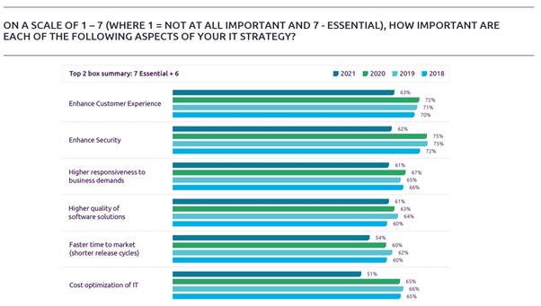

## Preface

The 2021-22 World Quality Report (WQR), a collaborative effort by Micro Focus, Capgemini, and Sogeti, is the only report analyzing software quality and testing trends globally.

This report surveyed 1750 executives and professionals.  The survey covered 10 industries from 32 countries globally, ranging from top management to QA test managers and quality engineers.

The World Quality Report (WQR) is a unique global study, this year's survey highlights the impact of evolving pandemic-influenced application demands in newly deployed methods, the adoption of QA in Agile and DevOps practices, and the continued growth of AI.

Following testing-focused software quality reports like this helps us quickly understand the current state and trends in the software testing industry.

## Five Key Themes

A key message from the WQR:  amidst the ongoing COVID-19 pandemic, we see the convergence of digital transformation and the real-time adoption of Agile and DevOps practices.  Furthermore, QA is emerging as a leader in the adoption of Agile and DevOps practices, providing teams with the tools and processes to foster quality throughout the Software Development Life Cycle (SDLC).

The WQR highlights five specific themes around key findings and trends:

1. The impact of the COVID-19 pandemic on QA organizations and software testing
2. The real-time convergence of digital transformation with DevOps and Agile adoption and the increasingly important role of QA
3. Geographically dispersed teams focusing on business outcomes when deploying applications across environments
4. Artificial Intelligence (AI) enhancing Agile and DevOps to cultivate a growing culture of quality accountability across all teams
5. Utilizing AI-driven continuous testing and quality management tools to address customer experience priorities and rapidly changing pandemic-influenced demands

## Key Findings and Trends

### 1. The impact of the COVID-19 pandemic on QA organizations and software testing

The COVID-19 pandemic had a direct and tangible impact on nearly all aspects of business, including QA. However, many QA organizations were able to adapt to the realities of new hybrid work environments and transition to the new reality of working in distributed teams. This may have occurred because the trend towards hybrid distributed teams was already growing, and the pandemic simply accelerated this trend.

#### Customer Experience is King

The COVID-19 pandemic refocused attention on the customer and their experience. The top-rated aspects this year were:

* Enhanced customer experience, chosen by 63% of respondents
* Followed by enhanced security (62%)
* Then higher responsiveness to business needs (61%)
* And higher quality software solutions (61%)

#### From Custodian to Quality Champion

Testing and QA objectives have also been reordered in the past year. Last year, the guardians of business outcomes and quality were clear leaders, while this year, the support rates between these metrics have narrowed.

* Quality custodians, quality velocity, and quality empowerment within the team lead at 62%
* Business assurance, digital wellbeing, and automation came in second at 61%

QA teams are evolving from custodians of quality to champions of quality. QA teams are becoming vibrant leaders in organizational quality programs, empowering everyone on the team to achieve quality while contributing to business outcomes and growth.

### 2. The real-time convergence of digital transformation with DevOps and Agile adoption and the increasingly important role of QA

#### Driving Digital Transformation

This year, digital transformation initiatives aligned with pandemic requirements. Before the pandemic began, Agile and DevOps were a growing trend. During the pandemic, we began to see QA now playing a key role in organizations adopting Agile and DevOps, blurring the lines between development and testing while creating a hybrid approach to quality.

Let's look at the drivers of digital transformation: improved productivity and efficiency led at 47%; followed by improved service/product quality at 46%; third was speed, better agility, and flexibility; customer experience directly followed speed; closely followed by reduced costs and the creation of innovative opportunities; competitive differentiation was last.

> Because competitive differentiation seems to be more of a side benefit of digital transformation, while digital transformation itself helps to improve efficiency, quality, speed, and an overall better customer experience.

#### The Growing Role of QA in DevOps and Agile Adoption – Guided by Business Priorities

This year we saw a significant shift in business requirements, becoming more important than the needs of the technology stack.  Compared to last year, the number of participants weighting the tech stack has decreased by 16 percentage points, replaced by the biggest increases:

* Business priorities, now ranked first, increased by 11 percentage points compared to last year
* Also significantly increasing compared to last year is culture/agility, increasing by 21 percentage points

### 3. Geographically dispersed teams focusing on business outcomes when deploying applications across environments

Last year's survey was conducted at the start of the global pandemic, showing signs of change needed to meet business objectives, and the new demands of remote work and digital transformation. Through this year's survey, we see that digital transformation continues, even while keeping pace with pandemic-influenced new work demands. This accelerated companies’ plans to move workloads to the cloud, partly due to planned digital transformation initiatives, and the rapid shift to remote work spurred the need to enhance security.

Due to the pandemic-influenced workplace, the top-rated focus was on remote access to testing systems and test environments (using SaaS and the cloud). Supporting this remote access are secondary factors based on remote, including better team collaboration tools. To support the quality of modern applications, the test environments themselves must also be modernized.  This year, we saw:

* Organizations increasingly satisfied with using cloud and containers to modernize testing environments (highest satisfaction)
* Followed by improved booking and managing test environments (+16)
* Then providing visibility (+22)
* Finally cost efficiency (+18)

### 4. Artificial Intelligence (AI) enhancing Agile and DevOps to cultivate a growing culture of quality accountability across all teams

Artificial intelligence continues to change how test automation is built, and how testing is performed. We see growing confidence in the level of AI-based testing within organizations, with nearly half of respondents stating that they already have a repository of test execution data needed for AI and ML, and stating that they are willing to act on the intelligence provided by their AI and ML platforms.

This year, we also asked respondents to predict their likelihood of utilizing a range of approaches to accelerate and optimize testing in Agile and DevOps environments. Compared to the same period last year:

* Automated quality gates integrating testing into CI/CD pipelines (+5)
* Implementing intelligent and automated dashboards for continuous quality monitoring grew the most (+9)
* Newly added this year, using AI to optimize test cases ranked second overall, only behind test left shift.

### 5. Utilizing AI-driven continuous testing and quality management tools to address customer experience priorities and rapidly changing pandemic-influenced demands

This year, we asked respondents about the benefits of test automation:

* First, all items show a year-over-year downward trend compared to last year, showing the challenges faced in working in hybrid and distributed teams.
* Benefits such as better defect detection, shorter test cycles, reduced overall security risks, better test coverage, reduced testing costs, and control over the transparency of testing are all readily apparent.
* AI/ML is the fourth highest benefit, also demonstrating its potential and value.

## Key Recommendations

### QA Orchestration in Agile and DevOps

Focus on what matters most: customer experience and business objectives, meeting both with efficiency and speed.  Simultaneously, adopt an engineering mindset within your teams, and embrace multi-skilling and upskilling. A new trend rapidly becoming the new norm is the SDET (Software Development Engineer in Test). Invest in insights, especially real-time insights across your entire QA and testing function. Focus on developing intelligent dashboards with real-time KPIs, from short-term tactical planning to long-term planning and strategic direction.

### Intelligent Test Automation

Standardize the use of test automation in QA by adopting an automation-first approach to software quality delivery. Extend automation across the E2E lifecycle, incorporating automation into all QA activities.

### Artificial Intelligence and Machine Learning

Drive the use of AI – don’t be driven by it. AI and ML promise exponential improvements, but use AI as a tool, not a replacement for the business decisions you’re making. For example, use AI to illuminate what to do and when to do it.  It not only helps identify failures but helps identify why those failures occurred.  Furthermore, focus AI on what matters most, identifying the most challenging areas of quality in software delivery. If you haven’t incorporated AI into quality yet, now is the best time to start.

### Test Environment Management (TEM) and Test Data Management (TDM)

Cloud adoption is continuing to show a sure and steady increase, but be mindful of ensuring that the future doesn’t overshadow the present needs. The key to successful cloud adoption is to ensure integrity with legacy applications.  Also, data analytics is now a key aspect of the test data management framework.

### Security and Smart Industries

Remote connectivity demands appropriate consideration for security and resilience for testing and QA organizations. Invest in innovation, in your labs and your teams. Regardless of whether you start with a POC to prove feasibility, ensuring management support is key to implementing change.

## Summary

The changes I learned from reading the entire WQR report:

1. Guided by business priorities. Compared to last year, the weight of the technology stack decreased by 16%, replaced by business priorities. Then culture, agility increased by 21%
2. Highest satisfaction rating for modernizing test environments using cloud and containers
3. Automated quality gates integrating testing into CI/CD pipelines (+5%)
4. Implementing intelligent and automated dashboards for continuous quality monitoring grew the most (+9%)
5. Using AI to optimize test cases ranked second overall, only behind test left shift
6. Artificial intelligence continues to change how automation is built and how testing is performed. Nearly half of respondents said they have the test execution repository needed for AI/ML and are willing to act on what AI/ML provides.

---

> Follow the WeChat official account "DevOps攻城狮" and reply "WQR" to download the complete version of the "2021-22 World Quality Report (WQR)".