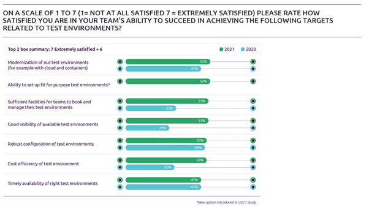

## Preface

The 2021-22 World Quality Report (WQR), a collaborative effort by Micro Focus, Capgemini, and Sogeti, is the only report analyzing software quality and testing trends globally.

This report surveyed 1750 executives and professionals.  From C-suite executives to QA test managers and quality engineers, it covers 10 industries from 32 countries worldwide.

The World Quality Report (WQR) is a unique global study, this year's survey highlights the impact of evolving pandemic-influenced application requirements in newly deployed methodologies, and the adoption of QA in Agile and DevOps practices, the continued rise of AI.

As testers, paying attention to such software quality reports helps us quickly understand the current situation and trends in the software testing industry.

## Five Key Themes

A key message from the WQR:  In the continuing COVID-19 environment, we've seen the convergence of digital transformation and the real-time adoption of Agile and DevOps practices.  Furthermore, QA is emerging as a leader in the adoption of Agile and DevOps practices, providing teams with the tools and processes to foster quality throughout the Software Development Life Cycle (SDLC).

The WQR highlights five specific themes around key findings and trends:

1. The Impact of the COVID-19 Pandemic on QA Organizations and Software Testing
2. The Real-Time Convergence of Digital Transformation with DevOps and Agile Adoption and the Increasingly Important Role of QA
3. Geographically Dispersed Teams Focusing on Business Outcomes When Deploying Applications Across Environments
4. Artificial Intelligence (AI) Augmenting Agile and DevOps to Foster a Growing Culture of Quality Accountability Across All Teams
5. Leveraging AI-Driven Continuous Testing and Quality Management Tools to Address Customer Experience Priorities and Rapidly Changing Pandemic-Influenced Requirements

## Key Findings and Trends

### 1. The Impact of the COVID-19 Pandemic on QA Organizations and Software Testing

The COVID-19 pandemic had a direct and tangible impact on nearly all aspects of business, including QA. However, many QA organizations were able to adapt to the realities of new hybrid work environments and transition to the new reality of working in distributed teams. This was likely because the trend towards hybrid distributed teams was already growing, and the pandemic simply accelerated this trend.

#### Customer Experience is King

The COVID-19 pandemic refocused attention on the customer and their experience.  The top-rated aspects this year were:

* Enhanced customer experience, selected by 63% of respondents
* Followed by enhanced security (62%)
* Then higher responsiveness to business needs (61%)
* And higher quality software solutions (61%)

#### From Custodian to Quality Champion

Testing and QA objectives have also been reordered over the past year. Last year, guardians of business outcomes and quality were clear leaders, while this year, the support rates between these metrics have narrowed.

* Quality custodians, quality speed, and quality empowerment in teams lead with 62%
* Business assurance, digital wellbeing, and automation came in second at 61%

QA teams are evolving from custodians of quality to champions of quality. QA teams are becoming vibrant leaders in organizational quality initiatives, empowering everyone in the team to achieve quality while contributing to business outcomes and growth.

### 2. The Real-Time Convergence of Digital Transformation with DevOps and Agile Adoption and the Increasingly Important Role of QA

#### Driving Digital Transformation

This year, digital transformation initiatives aligned with pandemic requirements. Before the pandemic began, Agile and DevOps were a growing trend. During the pandemic, we began to see QA now playing a key role in organizational adoption of Agile and DevOps, blurring the lines between development and testing while creating a blended approach to quality.

Let's look at what are the drivers for digital transformation: improving productivity and efficiency lead at 47%; followed by improving service/product quality at 46%; third is speed, better agility and flexibility; customer experience directly behind speed; closely followed by reducing costs and creating innovation opportunities; competitive differentiation is last.

> Because competitive differentiation seems to be more of a byproduct of digital transformation, while digital transformation itself helps improve efficiency, quality, speed, and an overall better customer experience.

#### The Growing Role of QA in DevOps and Agile Adoption – Guided by Business Priorities

This year, we witnessed a significant adjustment in business needs, becoming more important than the needs of the technology stack. Compared to last year, the number of participants weighting the technology stack has dropped by 16 percentage points, replaced by the biggest increase:

* Business priority, now ranked number one, increased by 11 percentage points from last year
* Also significantly increased compared to last year is Culture/Agility, increased by 21 percentage points

### 3. Geographically Dispersed Teams Focusing on Business Outcomes When Deploying Applications Across Environments

Last year’s survey was conducted at the onset of the global pandemic, showing signs of transformation needed to meet business objectives and the new requirements of remote work and digital transformation. Through this year’s survey, we see digital transformation continuing, even while keeping pace with pandemic-influenced new work requirements. This accelerated company plans to migrate workloads to the cloud, partly due to planned digital transformation initiatives, and the rapid shift to remote work spurred the need for increased security.

Due to the pandemic-influenced workplace, the highest-rated focus is on remote access to testing systems and test environments (using SaaS and the cloud). Supporting this remote access are secondary factors based on remote, including better team collaboration tools. To support the quality of modern applications, the testing environments themselves must also be modernized. This year we see:

* Organizations increasingly satisfied with using cloud and containers to modernize testing environments (highest satisfaction)
* Followed by improved booking and managing testing environments (+16)
* Then providing visibility (+22)
* Finally cost efficiency (+18)

### 4. Artificial Intelligence (AI) Augmenting Agile and DevOps to Foster a Growing Culture of Quality Accountability Across All Teams

Artificial intelligence continues to transform how test automation is built, and how testing is performed.  We see increasing confidence in the level of AI-based testing within organizations, with nearly half of respondents stating they already possess the repository of test execution data needed for AI and ML and indicating a willingness to act upon the intelligence provided by their AI and ML platforms.

This year, we also asked respondents to predict their likelihood of leveraging a range of approaches to accelerate and optimize testing in Agile and DevOps environments. Compared to the same period last year:

* Automated quality gates integrating testing into CI/CD pipelines (+5)
* Implementing intelligent and automated dashboards for continuous quality monitoring grew the most (+9)
* Newly added this year, using AI to optimize test cases ranked second overall, only behind shifting testing left.

### 5. Leveraging AI-Driven Continuous Testing and Quality Management Tools to Address Customer Experience Priorities and Rapidly Changing Pandemic-Influenced Requirements

This year we asked respondents about the benefits of test automation:

* First, all items showed a year-over-year trend of decline compared to last year, showing the challenges faced working in hybrid and distributed teams.
* Such as better defect detection, shorter test cycles, reduced overall security risks, better test coverage, reduced testing costs, and control of test transparency are readily apparent benefits.
* AI/ML is the fourth highest benefit, also proving its potential and value.

## Key Recommendations

### QA Orchestration in Agile and DevOps

Focus on what matters most: customer experience and business objectives, meeting both with efficiency and speed. Simultaneously, adopt engineering thinking in your teams, and embrace multi-skilling and upskilling. A new trend rapidly becoming the new normal is SDET (Software Development Engineer in Test). Invest in insights, particularly real-time insights across your entire QA and testing function. Focus on developing intelligent dashboards with real-time KPIs, from short-term tactical planning to long-term planning and strategic direction.

### Intelligent Test Automation

Standardize the use of test automation within QA by adopting an automation-first approach to software quality delivery. Extend automation across the E2E lifecycle, incorporating automation into all QA activities.

### Artificial Intelligence and Machine Learning

Drive the use of AI — don't be driven by it. AI and ML promise exponential improvements, but use AI as a tool, not a replacement for the business decisions you're making. For example, use AI to illuminate what to do and when to do it. It not only helps identify failures, but helps identify the reasons why these failures are occurring. Furthermore, focus AI on what matters most, identifying the most challenging areas of quality in software delivery. If you haven’t incorporated AI into quality yet, now is the best time to start.

### Test Environment Management (TEM) and Test Data Management (TDM)

Cloud adoption is continuing on a sure and steady growth, but be mindful of ensuring that the future doesn’t overshadow the present needs. The key to successful cloud adoption is ensuring integrity with legacy applications.  Additionally, data analytics is now a key facet of a test data management framework.

### Security and Smart Industry

Remote connectivity requires appropriate consideration of security and resilience for testing and QA organizations. Invest in innovation, in your labs and in your teams. Whether you start with a POC to prove feasibility, ensuring management buy-in is key to implementing change.

## Summary

Changes I learned from reviewing the entire WQR report:

1. Guided by business priorities. Compared to last year, the weighting of the technology stack decreased by 16%, replaced by business priorities. Then Culture, Agility increased by 21%
2. Highest satisfaction rating for modernizing testing environments using cloud and containers.
3. Automated quality gates integrating testing into CI/CD pipelines (+5%)
4. Implementing intelligent and automated dashboards for continuous quality monitoring grew the most (+9%)
5. Using AI to optimize test cases ranked second overall, only behind shifting testing left.
6. Artificial intelligence continues to transform how automation is built and how testing is performed. Nearly half of respondents stated they possess the repository of test execution data needed for AI/ML and are willing to act upon what AI/ML provides.

---

> Follow the WeChat official account "DevOps攻城狮" and reply "WQR" to download the complete version of the "2021-22 World Quality Report (WQR)".