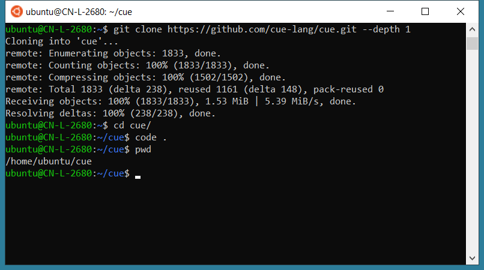

For a long time, many programmers have encountered various inconveniences in developing on Windows:

For example, setting up a development environment isn't as simple as entering a single command to install various commands and packages like on Linux and Mac.  Therefore, some programmers switched to Mac for development, while others simply used Linux as their development machine. Only those who had to use Windows as their development environment remained on Windows, making do.

Until the arrival of WSL, or more accurately, WSL2.

The combination of WSL + VS Code + Docker Desktop, these three musketeers, has made developing on Windows a truly enjoyable experience for me.

## What is WSL

WSL stands for Windows Subsystem for Linux. It's a feature of the Windows 10 operating system that allows you to run a Linux file system, Linux command-line tools, and GUI applications directly on Windows, running alongside traditional Windows desktop and applications.

> The minimum required version of WSL is Windows 10 version 1903 or later.

WSL is specifically designed for developers who need to use Linux, such as web developers, those working on open-source projects, and developers who need to deploy to Linux server environments.

WSL is suitable for those who prefer using Bash, common Linux tools (sed, awk, etc.), and Linux-first frameworks (Ruby, Python, etc.), while also enjoying using Windows as their productivity tool.

Let's take a look at the advantages of WSL compared to virtual machines.


## Advantages of Using WSL

1. Compared to a full virtual machine, WSL requires fewer resources (CPU, memory, and storage).
2. You can use Windows and Linux simultaneously and access your Windows files from Linux, providing a better interactive experience.
3. Most importantly, using WSL combined with VS Code + Docker provides the perfect Linux experience while also offering the productivity of Windows. This is something that virtual machines or Linux operating systems alone cannot achieve. Macs can, but not everyone is suitable for Macs.

Now let's talk about how to install WSL and use it with VS Code + Docker.

## Installing WSL

```powershell
wsl --install
```

This command will enable the required optional components, download the latest Linux kernel, set WSL 2 as your default, and install a Linux distribution for you (Ubuntu by default).

```powershell
# View the list of available distributions
C:\Users\xshen>wsl --list --online
The following is a list of valid distributions that can be installed.
Install using 'wsl --install -d <Distro>'.

NAME            FRIENDLY NAME
Ubuntu          Ubuntu
Debian          Debian GNU/Linux
kali-linux      Kali Linux Rolling
openSUSE-42     openSUSE Leap 42
SLES-12         SUSE Linux Enterprise Server v12
Ubuntu-16.04    Ubuntu 16.04 LTS
Ubuntu-18.04    Ubuntu 18.04 LTS
Ubuntu-20.04    Ubuntu 20.04 LTS
```

To install other distributions, such as Debian:

```powershell
wsl --install -d Debian
```

For more details, please refer to the official [documentation](https://docs.microsoft.com/en-us/windows/install)

## WSL + VS Code Demonstration

The following uses Ubuntu as an example to demonstrate downloading code and opening the code directory using VS Code.

I have already opened the installed Ubuntu operating system via WSL.



First, download the code:

```bash
ubuntu@CN-L-2680:~$ git clone https://github.com/cue-lang/cue.git --depth 1
Cloning into 'cue'...
remote: Enumerating objects: 1833, done.
remote: Counting objects: 100% (1833/1833), done.
remote: Compressing objects: 100% (1502/1502), done.
remote: Total 1833 (delta 238), reused 1161 (delta 148), pack-reused 0
Receiving objects: 100% (1833/1833), 1.53 MiB | 5.39 MiB/s, done.
Resolving deltas: 100% (238/238), done.
```

Then go to the downloaded code directory and enter `code .`

```bash
ubuntu@CN-L-2680:~$ cd cue/
ubuntu@CN-L-2680:~/cue$ code .

# The VS Code Server will only be installed the first time
Installing VS Code Server for x64 (dfd34e8260c270da74b5c2d86d61aee4b6d56977)
Downloading: 100%
Unpacking: 100%
Unpacked 2341 files and folders to /home/ubuntu/.vscode-server/bin/dfd34e8260c270da74b5c2d86d61aee4b6d56977.
```

The first time, it will automatically download and install the VS Code Server. After installation, it will automatically launch the VS Code on your local machine and open the code directory on Ubuntu. The whole process is very smooth.

After that, you can use the command-line `apt-get` command in VS Code to install any software you need. It's really awesome!


> You need to install the Microsoft-made [Remote - WSL](https://marketplace.visualstudio.com/items?itemName=ms-vscode-remote.remote-wsl) extension on your local VS Code; \
> Additionally, if you need to use Docker in WSL, you need to pre-install [Docker Desktop](https://www.docker.com/products/docker-desktop/) on Windows.

---

Please indicate the author and source when reprinting this article. Please do not use it for any commercial purposes. Welcome to follow the WeChat official account "DevOps攻城狮"