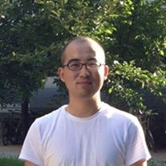

**DevOps Engineer**  
📧 [xianpeng.shen@gmail.com](mailto:xianpeng.shen@gmail.com)  
🌐 [shenxianpeng.github.io](https://shenxianpeng.github.io)  
🔗 [LinkedIn](https://www.linkedin.com/in/xianpeng-shen) | [GitHub](https://github.com/shenxianpeng)

## Languages
- **Chinese** — Native
- **English** — Professional Working Proficiency
- **Lithuanian** — A1 (Beginner)

---

## About
- Lead DevOps and Build/Release Management, driving efficient delivery processes.
- Design and optimize CI/CD pipelines, promoting best practices across teams.
- Address gaps in automation and streamline DevSecOps workflows.
- Creator of popular open-source tools: [cpp-linter](https://github.com/cpp-linter), [commit-check](https://github.com/commit-check), [conventional-branch](https://github.com/conventional-branch), and [devops-maturity](https://github.com/devops-maturity) — with `cpp-linter-action` adopted by Microsoft, Apache, NASA.
- Share technical insights through hundreds of blog posts and the WeChat account **“DevOps Engineer”**, reaching a wide developer audience.

---

## Work Experience

### Senior DevOps Engineer  
**Rocket Software, Lithuania**  
Jul 2024 – Present  
- Leading advanced DevOps initiatives and scalable delivery practices.

### DevOps Engineer  
**Rocket Software, Dalian**  
2015 – Jun 2024  
Responsible for MultiValue product CI/CD, infrastructure management, and DevOps automation.  
**Key contributions:**
- Led CaC adoption: migrated manual/Bamboo builds to Jenkins with shared libraries.
- Built IaC with Ansible for provisioning Jenkins, build/dev environments.
- Dockerized MVAS products using buildx, health checks, CI/CD, and Kubernetes.
- Proposed and scaled DevOps maturity badge and conventional commits.
- Automated VM management with Jira + Python, used BU-wide.
- Enabled code coverage reports for U2, jBASE, and others.
- Award-winning projects in Rocket Build (RB-218, RB-544).
- Previously led Rocket Discover automation effort from scratch.

### Software Engineer in Test  
**JD.COM, Beijing**  
2012 – 2014  
- Developed automated test scripts and maintained continuous integration.

### QA Engineer  
**SIMCOM (Shanghai) & Neusoft (Beijing)**  
2009 – 2011  
- Designed and executed test cases; led small QA teams and shared testing practices.

---

## Projects

- **pipeline-library**  Jenkins shared library for MVAS to implement CI/CD as code and improve SDLC consistency.

- **docker-images**  Dockerized MVAS products with advanced DevOps practices: buildx, pytest, health checks, and Kubernetes deployments.

- **ansible-playbooks**  Managed MVAS build/dev infrastructure as code, enabling fast recovery and provisioning.

- **U2Box CLI**  Go-based CLI tool to rapidly set up MV development/testing environments.

- **MV Intelligent Terminal**  Built CLI interface with auto-completion and highlighting via UOPY API.  
  *Won Rocket Build 2019 First Prize & CPO Award.*

- **VM Management with JIRA**  Automated VM lifecycle via Jira dashboards and Python scripts, improving resource tracking across teams.

- **[cpp-linter](https://github.com/cpp-linter)**  CI solution for C/C++ formatting and static analysis. Widely used across the industry.

- **[Commit Check](https://github.com/commit-check)**  Alternative to YACC, checks commit messages, branch names, authorship, and more.

- **[Conventional Branch](https://github.com/conventional-branch)**  Standardized Git branch naming; maintained the specification and tooling.

- **[DevOps Maturity](https://github.com/devops-maturity)**  Provides DevOps maturity assessments and badges to guide engineering evolution.

- **[gitstats](https://github.com/shenxianpeng/gitstats/)**  Visualize Git repo insights and contribution analytics.

- **[atlassian-api-py](https://github.com/shenxianpeng/atlassian-api-py/)**  Python library for easy CI integration with Jira and Bitbucket REST APIs.

---

## Skills
- **DevOps**: ★★★★★ 95%
- **CI/CD**: ★★★★★ 95%
- **Python**: ★★★★★ 95%
- **Shell**: ★★★★☆ 90%
- **Go**: ★★★★☆ 80%
- **Groovy**: ★★★★☆ 80%

## Interests
- Football, Swimming, Writing

---

## Education
- 2006 – 2009 **College Degree, Software Technology** — Liaoning Provincial College of Communications